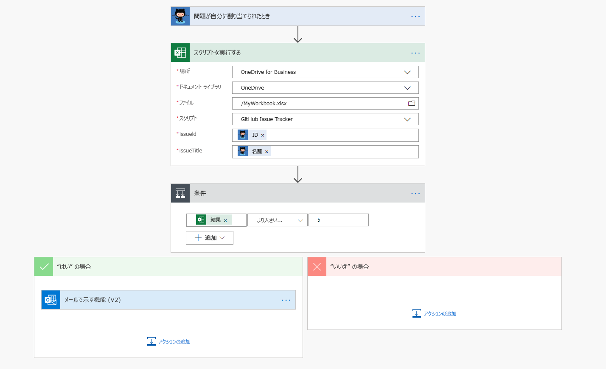

# <a name="integrate-office-scripts-with-power-automate"></a><span data-ttu-id="da986-103">Office スクリプトとパワー自動化を統合する</span><span class="sxs-lookup"><span data-stu-id="da986-103">Integrate Office Scripts with Power Automate</span></span>

<span data-ttu-id="da986-104">[パワー自動](https://flow.microsoft.com)では、スクリプトをより大きなワークフローに統合します。</span><span class="sxs-lookup"><span data-stu-id="da986-104">[Power Automate](https://flow.microsoft.com) integrates your script into a larger workflow.</span></span> <span data-ttu-id="da986-105">Power オートメーションでは、ワークシートのテーブルに電子メールの内容を追加したり、ブックのコメントに基づいてプロジェクト管理ツールでアクションを作成したりするなどの操作を実行できます。</span><span class="sxs-lookup"><span data-stu-id="da986-105">You can use Power Automate do things like add the contents of an email to a worksheet's table or create actions in your project management tools based on workbook comments.</span></span> <span data-ttu-id="da986-106">電力を自動自動化することが初めての場合は、「 [Power オートメーションの使用を開始](/power-automate/getting-started)する」を参照することをお勧めします。</span><span class="sxs-lookup"><span data-stu-id="da986-106">If you are new to Power Automate, we recommend visiting [Get started with Power Automate](/power-automate/getting-started).</span></span> <span data-ttu-id="da986-107">ここでは、複数のサービス間でワークフローを自動化する方法について詳しく知ることができます。</span><span class="sxs-lookup"><span data-stu-id="da986-107">There, you can learn more about automating your workflows across multiple services.</span></span>

> [!IMPORTANT]
> <span data-ttu-id="da986-108">現時点では、[共有フロー](/power-automate/share-buttons)から Office スクリプトを実行することはできません。</span><span class="sxs-lookup"><span data-stu-id="da986-108">Currently, you can't run Office Scripts from a [shared flow](/power-automate/share-buttons).</span></span> <span data-ttu-id="da986-109">パワー自動化を使用しても、スクリプトを作成したユーザーのみが実行できます。</span><span class="sxs-lookup"><span data-stu-id="da986-109">Only the user who created a script can run it, even through Power Automate.</span></span>

## <a name="getting-started"></a><span data-ttu-id="da986-110">はじめに</span><span class="sxs-lookup"><span data-stu-id="da986-110">Getting started</span></span>

<span data-ttu-id="da986-111">Power オートメーションと Office のスクリプトの組み合わせを開始するには、チュートリアルの次の手順を実行し[て、Power 自動化を使用したスクリプトの使用を開始](../tutorials/excel-power-automate-manual.md)します。</span><span class="sxs-lookup"><span data-stu-id="da986-111">To begin combining Power Automate and Office Scripts, follow the tutorial [Start using scripts with Power Automate](../tutorials/excel-power-automate-manual.md).</span></span> <span data-ttu-id="da986-112">これにより、簡単なスクリプトを呼び出すフローを作成する方法を学習できます。</span><span class="sxs-lookup"><span data-stu-id="da986-112">This will teach you how to create a flow that calls a simple script.</span></span> <span data-ttu-id="da986-113">そのチュートリアルを完了し、Power オートメーションチュートリアルを使用して[自動的にスクリプトを実行](../tutorials/excel-power-automate-trigger.md)すると、プラットフォームの統合の詳細については、こちらを参照してください。</span><span class="sxs-lookup"><span data-stu-id="da986-113">After you've completed that tutorial and the [Automatically run scripts with Power Automate](../tutorials/excel-power-automate-trigger.md) tutorial, return here to learn details about the platform integrations.</span></span>

## <a name="excel-online-business-connector"></a><span data-ttu-id="da986-114">Excel Online (Business) コネクタ</span><span class="sxs-lookup"><span data-stu-id="da986-114">Excel Online (Business) connector</span></span>

<span data-ttu-id="da986-115">[コネクタ](/connectors/connectors)は、電力の自動化とアプリケーションの間のブリッジです。</span><span class="sxs-lookup"><span data-stu-id="da986-115">[Connectors](/connectors/connectors) are the bridges between Power Automate and applications.</span></span> <span data-ttu-id="da986-116">[Excel Online (Business) コネクタ](/connectors/excelonlinebusiness)を使用すると、excel ブックへのアクセスがフローに付与されます。</span><span class="sxs-lookup"><span data-stu-id="da986-116">The [Excel Online (Business) connector](/connectors/excelonlinebusiness) gives your flows access to Excel workbooks.</span></span> <span data-ttu-id="da986-117">"スクリプトを実行する" アクションを使用すると、選択したブックからアクセス可能な Office スクリプトを呼び出すことができます。</span><span class="sxs-lookup"><span data-stu-id="da986-117">The "Run script" action lets you call any Office Script accessible through the selected workbook.</span></span> <span data-ttu-id="da986-118">フローを使用してスクリプトを実行できるだけでなく、スクリプト内のフローを使用して、ブックとの間でデータをやり取りすることもできます。</span><span class="sxs-lookup"><span data-stu-id="da986-118">Not only can you run scripts through a flow, you can pass data to and from the workbook with the flow through the scripts.</span></span>

> [!IMPORTANT]
> <span data-ttu-id="da986-119">"スクリプトを実行する" アクションを実行すると、Excel コネクタを使用するユーザーに、ブックとそのデータに対して重要なアクセス権が与えられます。</span><span class="sxs-lookup"><span data-stu-id="da986-119">The "Run script" action gives people who use the Excel connector significant access to your workbook and its data.</span></span> <span data-ttu-id="da986-120">また、外部の[呼び出しからの外部呼び出し](external-calls.md)について説明するように、外部 API を呼び出すスクリプトにはセキュリティリスクがあります。</span><span class="sxs-lookup"><span data-stu-id="da986-120">Additionally, there are security risks with scripts that make external API calls, as explained in [External calls from Power Automate](external-calls.md).</span></span> <span data-ttu-id="da986-121">管理者が非常に機密性の高いデータの公開を懸念している場合は、Excel Online コネクタをオフにするか、 [Office スクリプト管理者コントロール](https://support.microsoft.com/office/19d3c51a-6ca2-40ab-978d-60fa49554dcf)を使用して office スクリプトへのアクセスを制限することができます。</span><span class="sxs-lookup"><span data-stu-id="da986-121">If your admin is concerned with the exposure of highly sensitive data, they can either turn off the Excel Online connector or restrict access to Office Scripts through the [Office Scripts administrator controls](https://support.microsoft.com/office/19d3c51a-6ca2-40ab-978d-60fa49554dcf).</span></span>

## <a name="passing-data-from-power-automate-into-a-script"></a><span data-ttu-id="da986-122">Power オートメーションからスクリプトにデータを渡す</span><span class="sxs-lookup"><span data-stu-id="da986-122">Passing data from Power Automate into a script</span></span>

<span data-ttu-id="da986-123">すべてのスクリプトの入力は、関数の追加パラメーターとして指定され `main` ます。</span><span class="sxs-lookup"><span data-stu-id="da986-123">All script input is specified as additional parameters for the `main` function.</span></span> <span data-ttu-id="da986-124">たとえば、入力として名前を表すを受け入れるスクリプトが必要な場合は、 `string` `main` 署名をに変更し `function main(workbook: ExcelScript.Workbook, name: string)` ます。</span><span class="sxs-lookup"><span data-stu-id="da986-124">For example, if you wanted a script to accept a `string` that represents a name as input, you would change the `main` signature to `function main(workbook: ExcelScript.Workbook, name: string)`.</span></span>

<span data-ttu-id="da986-125">Power 自動化でフローを構成するときは、スクリプトの入力を静的な値、[式](/power-automate/use-expressions-in-conditions)、または動的コンテンツとして指定できます。</span><span class="sxs-lookup"><span data-stu-id="da986-125">When you're configuring a flow in Power Automate, you can specify script input as static values, [expressions](/power-automate/use-expressions-in-conditions), or dynamic content.</span></span> <span data-ttu-id="da986-126">個々のサービスのコネクタの詳細については、「[電源自動化コネクタ](/connectors/)」のドキュメントを参照してください。</span><span class="sxs-lookup"><span data-stu-id="da986-126">Details on an individual service's connector can be found in the [Power Automate Connector documentation](/connectors/).</span></span>

<span data-ttu-id="da986-127">入力パラメーターをスクリプトの関数に追加するときは `main` 、次の制限と制限事項を考慮してください。</span><span class="sxs-lookup"><span data-stu-id="da986-127">When adding input parameters to a script's `main` function, consider the following allowances and restrictions.</span></span>

1. <span data-ttu-id="da986-128">最初のパラメーターの型はでなければなりません `ExcelScript.Workbook` 。</span><span class="sxs-lookup"><span data-stu-id="da986-128">The first parameter must be of type `ExcelScript.Workbook`.</span></span> <span data-ttu-id="da986-129">そのパラメーター名は重要ではありません。</span><span class="sxs-lookup"><span data-stu-id="da986-129">Its parameter name does not matter.</span></span>

2. <span data-ttu-id="da986-130">すべてのパラメーターには、型を指定する必要があります。</span><span class="sxs-lookup"><span data-stu-id="da986-130">Every parameter must have a type.</span></span>

3. <span data-ttu-id="da986-131">基本的な型、、、、、、 `string` `number` `boolean` `any` `unknown` `object` 、 `undefined` がサポートされています。</span><span class="sxs-lookup"><span data-stu-id="da986-131">The basic types `string`, `number`, `boolean`, `any`, `unknown`, `object`, and `undefined` are supported.</span></span>

4. <span data-ttu-id="da986-132">前にリストされていた基本的な種類の配列がサポートされています。</span><span class="sxs-lookup"><span data-stu-id="da986-132">Arrays of the previously listed basic types are supported.</span></span>

5. <span data-ttu-id="da986-133">入れ子になった配列は、パラメーターとしてサポートされます (戻り値の型としてではありません)。</span><span class="sxs-lookup"><span data-stu-id="da986-133">Nested arrays are supported as parameters (but not as return types).</span></span>

6. <span data-ttu-id="da986-134">共用体型は、1つの型 ( `string` 、 `number` 、または) に属するリテラルの和集合である場合に使用でき `boolean` ます。</span><span class="sxs-lookup"><span data-stu-id="da986-134">Union types are allowed if they are a union of literals belonging to a single type (`string`, `number`, or `boolean`).</span></span> <span data-ttu-id="da986-135">サポートされている型と未定義の共用体もサポートされています。</span><span class="sxs-lookup"><span data-stu-id="da986-135">Unions of a supported type with undefined are also supported.</span></span>

7. <span data-ttu-id="da986-136">オブジェクトの種類は、型 `string` 、 `number` 、、 `boolean` サポートされている配列、またはその他のサポートされているオブジェクトのプロパティが含まれている場合に許可されます。</span><span class="sxs-lookup"><span data-stu-id="da986-136">Object types are allowed if they contain properties of type `string`, `number`, `boolean`, supported arrays, or other supported objects.</span></span> <span data-ttu-id="da986-137">次の例は、パラメータタイプとしてサポートされているネストされたオブジェクトを示しています。</span><span class="sxs-lookup"><span data-stu-id="da986-137">The following example shows nested objects that are supported as parameter types:</span></span>

    ```TypeScript
    // Office Scripts can return an Employee object because Position only contains strings and numbers.
    interface Employee {
        name: string;
        job: Position;
    }

    interface Position {
        id: number;
        title: string;
    }
    ```

8. <span data-ttu-id="da986-138">オブジェクトのインターフェイスまたはクラス定義は、スクリプトで定義されている必要があります。</span><span class="sxs-lookup"><span data-stu-id="da986-138">Objects must have their interface or class definition defined in the script.</span></span> <span data-ttu-id="da986-139">また、次の例に示すように、オブジェクトを匿名でインラインで定義することもできます。</span><span class="sxs-lookup"><span data-stu-id="da986-139">An object can also be defined anonymously inline, as in the following example:</span></span>

    ```TypeScript
    function main(workbook: ExcelScript.Workbook): {name: string, email: string}
    ```

9. <span data-ttu-id="da986-140">省略可能なパラメーターを指定できます。オプションの修飾子 (たとえば、) を使用することもでき `?` `function main(workbook: ExcelScript.Workbook, Name?: string)` ます。</span><span class="sxs-lookup"><span data-stu-id="da986-140">Optional parameters are allowed and can be denoted as such by using the optional modifier `?` (for example, `function main(workbook: ExcelScript.Workbook, Name?: string)`).</span></span>

10. <span data-ttu-id="da986-141">既定のパラメーター値を使用できます (例 `async function main(workbook: ExcelScript.Workbook, Name: string = 'Jane Doe')` :</span><span class="sxs-lookup"><span data-stu-id="da986-141">Default parameter values are allowed (for example `async function main(workbook: ExcelScript.Workbook, Name: string = 'Jane Doe')`.</span></span>

## <a name="returning-data-from-a-script-back-to-power-automate"></a><span data-ttu-id="da986-142">スクリプトからのデータを Power 自動化に戻す</span><span class="sxs-lookup"><span data-stu-id="da986-142">Returning data from a script back to Power Automate</span></span>

<span data-ttu-id="da986-143">スクリプトは、Power オートメーションフローで動的コンテンツとして使用するブックからのデータを返すことができます。</span><span class="sxs-lookup"><span data-stu-id="da986-143">Scripts can return data from the workbook to be used as dynamic content in a Power Automate flow.</span></span> <span data-ttu-id="da986-144">入力パラメーターと同様に、Power オートメーションでは戻り値の型にいくつかの制限が課されます。</span><span class="sxs-lookup"><span data-stu-id="da986-144">As with input parameters, Power Automate places some restrictions on the return type.</span></span>

1. <span data-ttu-id="da986-145">基本的な型、、、、、 `string` `number` がサポートされてい `boolean` `void` `undefined` ます。</span><span class="sxs-lookup"><span data-stu-id="da986-145">The basic types `string`, `number`, `boolean`, `void`, and `undefined` are supported.</span></span>

2. <span data-ttu-id="da986-146">戻り値の型として使用される共用体型は、スクリプトパラメーターとして使用する場合と同じ制限に従います。</span><span class="sxs-lookup"><span data-stu-id="da986-146">Union types used as return types follow the same restrictions as they do when used as script parameters.</span></span>

3. <span data-ttu-id="da986-147">配列型は `string` 、型、、またはのいずれかである場合に使用でき `number` `boolean` ます。</span><span class="sxs-lookup"><span data-stu-id="da986-147">Array types are allowed if they are of type `string`, `number`, or `boolean`.</span></span> <span data-ttu-id="da986-148">また、型がサポートされている共用体型またはサポートされているリテラル型の場合にも使用できます。</span><span class="sxs-lookup"><span data-stu-id="da986-148">They are also allowed if the type is a supported union or supported literal type.</span></span>

4. <span data-ttu-id="da986-149">戻り値の型として使用されるオブジェクトの種類は、スクリプトパラメーターとして使用する場合と同じ制限に従います。</span><span class="sxs-lookup"><span data-stu-id="da986-149">Object types used as return types follow the same restrictions as they do when used as script parameters.</span></span>

5. <span data-ttu-id="da986-150">暗黙的な入力はサポートされていますが、定義された型と同じルールに従う必要があります。</span><span class="sxs-lookup"><span data-stu-id="da986-150">Implicit typing is supported, though it must follow the same rules as a defined type.</span></span>

## <a name="avoid-using-relative-references"></a><span data-ttu-id="da986-151">相対参照の使用を避ける</span><span class="sxs-lookup"><span data-stu-id="da986-151">Avoid using relative references</span></span>

<span data-ttu-id="da986-152">Power オートメーションは、ユーザーの代わりに、選択した Excel ブックでスクリプトを実行します。</span><span class="sxs-lookup"><span data-stu-id="da986-152">Power Automate runs your script in the chosen Excel workbook on your behalf.</span></span> <span data-ttu-id="da986-153">これが発生すると、ブックが閉じられる場合があります。</span><span class="sxs-lookup"><span data-stu-id="da986-153">The workbook might be closed when this happens.</span></span> <span data-ttu-id="da986-154">など、ユーザーの現在の状態に依存する API は、 `Workbook.getActiveWorksheet` 電力の自動処理によって実行されると失敗します。</span><span class="sxs-lookup"><span data-stu-id="da986-154">Any API that relies on the user's current state, such as `Workbook.getActiveWorksheet`, will fail when run through Power Automate.</span></span> <span data-ttu-id="da986-155">スクリプトを設計するときは、必ずワークシートおよび範囲の絶対参照を使用してください。</span><span class="sxs-lookup"><span data-stu-id="da986-155">When designing your scripts, be sure to use absolute references for worksheets and ranges.</span></span>

<span data-ttu-id="da986-156">次の関数は、Power オートメーションフローでスクリプトから呼び出されたときにエラーをスローして失敗します。</span><span class="sxs-lookup"><span data-stu-id="da986-156">The following functions will throw an error and fail when called from a script in a Power Automate flow.</span></span>

- `Chart.activate`
- `Range.select`
- `Workbook.getActiveCell`
- `Workbook.getActiveChart`
- `Workbook.getActiveChartOrNullObject`
- `Workbook.getActiveSlicer`
- `Workbook.getActiveSlicerOrNullObject`
- `Workbook.getActiveWorksheet`
- `Workbook.getSelectedRange`
- `Workbook.getSelectedRanges`
- `Worksheet.activate`

## <a name="example"></a><span data-ttu-id="da986-157">例</span><span class="sxs-lookup"><span data-stu-id="da986-157">Example</span></span>

<span data-ttu-id="da986-158">次のスクリーンショットは、 [GitHub](https://github.com/)の問題がユーザーに割り当てられたときにトリガーされる電源自動化フローを示しています。</span><span class="sxs-lookup"><span data-stu-id="da986-158">The following screenshot shows a Power Automate flow that's triggered whenever a [GitHub](https://github.com/) issue is assigned to you.</span></span> <span data-ttu-id="da986-159">このフローは、Excel ブックのテーブルに問題を追加するスクリプトを実行します。</span><span class="sxs-lookup"><span data-stu-id="da986-159">The flow runs a script that adds the issue to a table in an Excel workbook.</span></span> <span data-ttu-id="da986-160">そのテーブルに5つ以上の問題がある場合、フローはメール事前通知を送信します。</span><span class="sxs-lookup"><span data-stu-id="da986-160">If there are five or more issues in that table, the flow sends an email reminder.</span></span>



<span data-ttu-id="da986-162">`main`スクリプトの関数は、[案件 ID] と [issue title] を入力パラメーターとして指定し、スクリプトは issue テーブル内の行数を返します。</span><span class="sxs-lookup"><span data-stu-id="da986-162">The `main` function of the script specifies the issue ID and issue title as input parameters, and the script returns the number of rows in the issue table.</span></span>

```TypeScript
function main(
  workbook: ExcelScript.Workbook,
  issueId: string,
  issueTitle: string): number {
  // Get the "GitHub" worksheet.
  let worksheet = workbook.getWorksheet("GitHub");

  // Get the first table in this worksheet, which contains the table of GitHub issues.
  let issueTable = worksheet.getTables()[0];

  // Add the issue ID and issue title as a row.
  issueTable.addRow(-1, [issueId, issueTitle]);

  // Return the number of rows in the table, which represents how many issues are assigned to this user.
  return issueTable.getRangeBetweenHeaderAndTotal().getRowCount();
}
```

## <a name="see-also"></a><span data-ttu-id="da986-163">関連項目</span><span class="sxs-lookup"><span data-stu-id="da986-163">See also</span></span>

- [<span data-ttu-id="da986-164">Power オートメーションを使用して web 上の Excel で Office スクリプトを実行する</span><span class="sxs-lookup"><span data-stu-id="da986-164">Run Office Scripts in Excel on the web with Power Automate</span></span>](../tutorials/excel-power-automate-manual.md)
- [<span data-ttu-id="da986-165">パワー自動化を使用してスクリプトを自動的に実行する</span><span class="sxs-lookup"><span data-stu-id="da986-165">Automatically run scripts with Power Automate</span></span>](../tutorials/excel-power-automate-trigger.md)
- [<span data-ttu-id="da986-166">Excel on the web での Office スクリプトのスクリプトの基本事項</span><span class="sxs-lookup"><span data-stu-id="da986-166">Scripting fundamentals for Office Scripts in Excel on the web</span></span>](scripting-fundamentals.md)
- [<span data-ttu-id="da986-167">Power Automate の使用を開始する</span><span class="sxs-lookup"><span data-stu-id="da986-167">Get started with Power Automate</span></span>](/power-automate/getting-started)
- [<span data-ttu-id="da986-168">Excel Online (ビジネス向け) コネクタのリファレンスドキュメント</span><span class="sxs-lookup"><span data-stu-id="da986-168">Excel Online (Business) connector reference documentation</span></span>](/connectors/excelonlinebusiness/)
