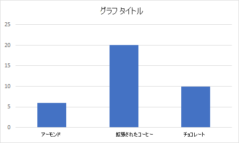

# <a name="scripting-fundamentals-for-office-scripts-in-excel-on-the-web-preview"></a><span data-ttu-id="84090-103">Excel on the web での Office スクリプトのスクリプトの基本事項 (プレビュー)</span><span class="sxs-lookup"><span data-stu-id="84090-103">Scripting fundamentals for Office Scripts in Excel on the web (preview)</span></span>

<span data-ttu-id="84090-104">この記事では、Office スクリプトの技術的な側面について説明します。</span><span class="sxs-lookup"><span data-stu-id="84090-104">This article will introduce you to the technical aspects of Office Scripts.</span></span> <span data-ttu-id="84090-105">Excel オブジェクトどうしが連携する仕組みや、コード エディターがブックと同期する仕組みについて説明します。</span><span class="sxs-lookup"><span data-stu-id="84090-105">You'll learn how the Excel objects work together and how the Code Editor synchronizes with a workbook.</span></span>

[!INCLUDE [Preview note](../includes/preview-note.md)]

## <a name="main-function"></a><span data-ttu-id="84090-106">`main` 関数</span><span class="sxs-lookup"><span data-stu-id="84090-106">`main` function</span></span>

<span data-ttu-id="84090-107">各 Office スクリプトには、最初のパラメーターとして `ExcelScript.Workbook` 型を持つ `main` 関数を含める必要があります。</span><span class="sxs-lookup"><span data-stu-id="84090-107">Each Office Script must contain the `main` function with the `ExcelScript.Workbook` type as its first parameter.</span></span> <span data-ttu-id="84090-108">関数が実行されると、Excel アプリケーションはブックを最初のパラメーターとして指定して、この `main` 関数を呼び出します。</span><span class="sxs-lookup"><span data-stu-id="84090-108">When the function is executed, Excel application invokes this `main` function by providing the workbook as its first parameter.</span></span> <span data-ttu-id="84090-109">そのため、スクリプトを記録した後、またはコード エディターで新しいスクリプトを作成した後に、`main` 関数の基本シグネチャを変更しないようにすることが重要です。</span><span class="sxs-lookup"><span data-stu-id="84090-109">Hence, it is important to not modify the basic signature of the `main` function once you have either recorded the script or created a new script from the code editor.</span></span>

```typescript
function main(workbook: ExcelScript.Workbook) {
// Your code goes here
}
```

<span data-ttu-id="84090-110">スクリプトを実行すると、`main` 関数の内部のコードが実行されます。</span><span class="sxs-lookup"><span data-stu-id="84090-110">The code inside the `main` function runs when the script is run.</span></span> <span data-ttu-id="84090-111">`main` は、スクリプト内の他の関数を呼び出すことができますが、関数に含まれていないコードは実行されません。</span><span class="sxs-lookup"><span data-stu-id="84090-111">`main` can call other functions in your script, but code that's not contained in a function will not run.</span></span>

> [!CAUTION]
> <span data-ttu-id="84090-112">`main` の関数が `async function main(context: Excel.RequestContext)` のように表示されている場合、スクリプトは従来の非同期 API モデルを使用しています。</span><span class="sxs-lookup"><span data-stu-id="84090-112">If your `main` function looks like `async function main(context: Excel.RequestContext)`, then your script is using the legacy, async API model.</span></span> <span data-ttu-id="84090-113">前のスクリプトを現在の API モデルに変換する方法など、詳細については、[「Office スクリプトの非同期 API を使用して以前のスクリプトをサポートする」](excel-async-model.md) を参照してください。</span><span class="sxs-lookup"><span data-stu-id="84090-113">Please refer to [Using the Office Scripts Async APIs to support legacy scripts](excel-async-model.md) for more information, including how to convert your older script to the current API model.</span></span>

## <a name="object-model"></a><span data-ttu-id="84090-114">オブジェクト モデル</span><span class="sxs-lookup"><span data-stu-id="84090-114">Object model</span></span>

<span data-ttu-id="84090-115">スクリプトを作成するには、Office スクリプト API がどのように連携しているかを理解する必要があります。</span><span class="sxs-lookup"><span data-stu-id="84090-115">To write a script, you need to understand how the Office Script APIs fit together.</span></span> <span data-ttu-id="84090-116">ブックのコンポーネントには、相互に特定の関係があります。</span><span class="sxs-lookup"><span data-stu-id="84090-116">The components of a workbook have specific relations to one another.</span></span> <span data-ttu-id="84090-117">多くの点で、これらの関係は Excel UI の関係と一致しています。</span><span class="sxs-lookup"><span data-stu-id="84090-117">In many ways, these relations match those of the Excel UI.</span></span>

- <span data-ttu-id="84090-118">**ブック** には、1 つ以上の **ワークシート** が含まれます。</span><span class="sxs-lookup"><span data-stu-id="84090-118">A **Workbook** contains one or more **Worksheets**.</span></span>
- <span data-ttu-id="84090-119">**ワークシート** では、**Range** オブジェクトを介してセルにアクセスできます。</span><span class="sxs-lookup"><span data-stu-id="84090-119">A **Worksheet** gives access to cells through **Range** objects.</span></span>
- <span data-ttu-id="84090-120">**Range** は、連続したセルのグループを表します。</span><span class="sxs-lookup"><span data-stu-id="84090-120">A **Range** represents a group of contiguous cells.</span></span>
- <span data-ttu-id="84090-121">**Range** は、**表**、**グラフ**、**図形**、およびその他のデータ可視化や組織オブジェクトを作成して配置するために使用されます。</span><span class="sxs-lookup"><span data-stu-id="84090-121">**Ranges** are used to create and place **Tables**, **Charts**, **Shapes**, and other data visualization or organization objects.</span></span>
- <span data-ttu-id="84090-122">**ワークシート** には、個々のシートに存在するデータ オブジェクトのコレクションが含まれます。</span><span class="sxs-lookup"><span data-stu-id="84090-122">A **Worksheet** contains collections of those data objects that are present in the individual sheet.</span></span>
- <span data-ttu-id="84090-123">**ブック** には、**ブック** 全体のデータ オブジェクト (**表** など) の一部のコレクションが含まれます。</span><span class="sxs-lookup"><span data-stu-id="84090-123">**Workbooks** contain collections of some of those data objects (such as **Tables**) for the entire **Workbook**.</span></span>

### <a name="workbook"></a><span data-ttu-id="84090-124">ブック</span><span class="sxs-lookup"><span data-stu-id="84090-124">Workbook</span></span>

<span data-ttu-id="84090-125">すべてのスクリプトには、`main` 関数によって `Workbook` 型の `workbook` オブジェクトが提供されています。</span><span class="sxs-lookup"><span data-stu-id="84090-125">Every script is provided a `workbook` object of type `Workbook` by the `main` function.</span></span> <span data-ttu-id="84090-126">これは、スクリプトが Excel ブックを操作するための最上位レベルのオブジェクトを表します。</span><span class="sxs-lookup"><span data-stu-id="84090-126">This represents the top level object through which your script interacts with the Excel workbook.</span></span>

<span data-ttu-id="84090-127">次のスクリプトは、アクティブなワークシートをブックから取得し、その名前を記録します。</span><span class="sxs-lookup"><span data-stu-id="84090-127">The following script gets the active worksheet from the workbook and logs its name.</span></span>

```typescript
function main(workbook: ExcelScript.Workbook) {
    // Get the active worksheet.
    let sheet = workbook.getActiveWorksheet();

    // Display the current worksheet's name.
    console.log(sheet.getName());
}
```

### <a name="ranges"></a><span data-ttu-id="84090-128">範囲</span><span class="sxs-lookup"><span data-stu-id="84090-128">Ranges</span></span>

<span data-ttu-id="84090-129">範囲とは、ブック内の連続したセルのグループのことです。</span><span class="sxs-lookup"><span data-stu-id="84090-129">A range is a group of contiguous cells in the workbook.</span></span> <span data-ttu-id="84090-130">スクリプトでは、範囲を定義するのに通常 A1 形式の表記が使用されます (例: **B3** は、列 **B**、行 **3** の単一のセルで、**C2:F4** は、列 **C** から **F**、行 **2** から **4** までのセル)。</span><span class="sxs-lookup"><span data-stu-id="84090-130">Scripts typically use A1-style notation (e.g. **B3** for the single cell in column **B** and row **3** or **C2:F4** for the cells from columns **C** through **F** and rows **2** through **4**) to define ranges.</span></span>

<span data-ttu-id="84090-131">範囲には、値、数式、書式の 3 つの主要プロパティがあります。</span><span class="sxs-lookup"><span data-stu-id="84090-131">Ranges have three core properties: values, formulas, and format.</span></span> <span data-ttu-id="84090-132">これらのプロパティで、セルの値、評価する数式、およびセルの視覚的な書式設定を取得または設定します。</span><span class="sxs-lookup"><span data-stu-id="84090-132">These properties get or set the cell values, formulas to be evaluated, and the visual formatting of the cells.</span></span> <span data-ttu-id="84090-133">`getValues`、`getFormulas`、`getFormat` を介してアクセスします。</span><span class="sxs-lookup"><span data-stu-id="84090-133">They are accessed through `getValues`, `getFormulas`, and `getFormat`.</span></span> <span data-ttu-id="84090-134">値と数式は、`setValues` と `setFormulas` で変更できますが、書式は、個別に設定されている複数の小さなオブジェクトから構成されている `RangeFormat` オブジェクトです。</span><span class="sxs-lookup"><span data-stu-id="84090-134">Values and formulas can be changed with `setValues` and `setFormulas`, while the format is a `RangeFormat` object that's comprised of several smaller objects that are individually set.</span></span>

<span data-ttu-id="84090-135">範囲は、2 次元配列を使用して情報を管理します。</span><span class="sxs-lookup"><span data-stu-id="84090-135">Ranges use two-dimensional arrays to manage information.</span></span> <span data-ttu-id="84090-136">Office スクリプト フレームワークでこれらの配列を処理する方法の詳細については、[「Office スクリプトでの組み込み JavaScript オブジェクトの使用の範囲操作のセクション」](javascript-objects.md#working-with-ranges) を参照してください。</span><span class="sxs-lookup"><span data-stu-id="84090-136">Read the [Working with ranges section of Using built-in JavaScript objects in Office Scripts](javascript-objects.md#working-with-ranges) for more information on handling those arrays in the Office Scripts framework.</span></span>

#### <a name="range-sample"></a><span data-ttu-id="84090-137">サンプル範囲</span><span class="sxs-lookup"><span data-stu-id="84090-137">Range sample</span></span>

<span data-ttu-id="84090-138">次のサンプルで、売上記録の作成方法を示します。</span><span class="sxs-lookup"><span data-stu-id="84090-138">The following sample shows how to create sales records.</span></span> <span data-ttu-id="84090-139">このスクリプトは、`Range` オブジェクトを使用して、値、数式、書式の一部を設定しています。</span><span class="sxs-lookup"><span data-stu-id="84090-139">This script uses `Range` objects to set the values, formulas, and parts of the format.</span></span>

```TypeScript
function main(workbook: ExcelScript.Workbook) {
    // Get the active worksheet.
    let sheet = workbook.getActiveWorksheet();

    // Create the headers and format them to stand out.
    let headers = [["Product", "Quantity", "Unit Price", "Totals"]];
    let headerRange = sheet.getRange("B2:E2");
    headerRange.setValues(headers);
    headerRange.getFormat().getFill().setColor("#4472C4");
    headerRange.getFormat().getFont().setColor("white");

    // Create the product data rows.
    let productData = [
        ["Almonds", 6, 7.5],
        ["Coffee", 20, 34.5],
        ["Chocolate", 10, 9.56],
    ];
    let dataRange = sheet.getRange("B3:D5");
    dataRange.setValues(productData);

    // Create the formulas to total the amounts sold.
    let totalFormulas = [
        ["=C3 * D3"],
        ["=C4 * D4"],
        ["=C5 * D5"],
        ["=SUM(E3:E5)"],
    ];
    let totalRange = sheet.getRange("E3:E6");
    totalRange.setFormulas(totalFormulas);
    totalRange.getFormat().getFont().setBold(true);

    // Display the totals as US dollar amounts.
    totalRange.setNumberFormat("$0.00");
}
```

<span data-ttu-id="84090-140">このスクリプトを実行すると、現在のワークシートに次のデータが作成されます。</span><span class="sxs-lookup"><span data-stu-id="84090-140">Running this script creates the following data in the current worksheet:</span></span>


### <a name="charts-tables-and-other-data-objects"></a><span data-ttu-id="84090-142">グラフ、表、およびその他のデータ オブジェクト</span><span class="sxs-lookup"><span data-stu-id="84090-142">Charts, tables, and other data objects</span></span>

<span data-ttu-id="84090-143">スクリプトを使用することにより、Excel 内でデータ構造やビジュアル化を作成および操作できます。</span><span class="sxs-lookup"><span data-stu-id="84090-143">Scripts can create and manipulate the data structures and visualizations within Excel.</span></span> <span data-ttu-id="84090-144">表とグラフの 2 つのオブジェクトが頻繁に使用されますが、API はピボットテーブル、図形、画像などもサポートしています。</span><span class="sxs-lookup"><span data-stu-id="84090-144">Tables and charts are two of the more commonly used objects, but the APIs support PivotTables, shapes, images, and more.</span></span> <span data-ttu-id="84090-145">これらはコレクションに格納され、この記事の後半で説明します。</span><span class="sxs-lookup"><span data-stu-id="84090-145">These are stored in collections, which will be discussed later in this article.</span></span>

#### <a name="creating-a-table"></a><span data-ttu-id="84090-146">表の作成</span><span class="sxs-lookup"><span data-stu-id="84090-146">Creating a table</span></span>

<span data-ttu-id="84090-147">データが入力された範囲を使用することにより、表を作成します。</span><span class="sxs-lookup"><span data-stu-id="84090-147">Create tables by using data-filled ranges.</span></span> <span data-ttu-id="84090-148">書式設定とテーブル コントロール (フィルターなど) が自動的に範囲に適用されます。</span><span class="sxs-lookup"><span data-stu-id="84090-148">Formatting and table controls (such as filters) are automatically applied to the range.</span></span>

<span data-ttu-id="84090-149">次のスクリプトでは、前のサンプルの範囲を使用して表を作成します。</span><span class="sxs-lookup"><span data-stu-id="84090-149">The following script creates a table using the ranges from the previous sample.</span></span>

```TypeScript
function main(workbook: ExcelScript.Workbook) {
    // Get the active worksheet.
    let sheet = workbook.getActiveWorksheet();

    // Add a table that has headers using the data from B2:E5.
    sheet.addTable("B2:E5", true);
}
```

<span data-ttu-id="84090-150">前のデータを含むワークシート上でこのスクリプトを実行すると、次のテーブルが作成されます。</span><span class="sxs-lookup"><span data-stu-id="84090-150">Running this script on the worksheet with the previous data creates the following table:</span></span>


#### <a name="creating-a-chart"></a><span data-ttu-id="84090-152">グラフの作成</span><span class="sxs-lookup"><span data-stu-id="84090-152">Creating a chart</span></span>

<span data-ttu-id="84090-153">グラフを作成すると、範囲内のデータを視覚化できます。</span><span class="sxs-lookup"><span data-stu-id="84090-153">Create charts to visualize the data in a range.</span></span> <span data-ttu-id="84090-154">スクリプトでさまざまな種類のグラフを作成できます。いずれのグラフも、必要に応じてカスタマイズできます。</span><span class="sxs-lookup"><span data-stu-id="84090-154">Scripts allow for dozens of chart varieties, each of which can be customized to suit your needs.</span></span>

<span data-ttu-id="84090-155">次のスクリプトで、3 つの品目の簡単な縦棒グラフが作成され、ワークシートの上端から 100 ピクセル下に配置されます。</span><span class="sxs-lookup"><span data-stu-id="84090-155">The following script creates a simple column chart for three items and places it 100 pixels below the top of the worksheet.</span></span>

```TypeScript
function main(workbook: ExcelScript.Workbook) {
    // Get the active worksheet.
    let sheet = workbook.getActiveWorksheet();

    // Create a column chart using the data from B3:C5.
    let chart = sheet.addChart(
        ExcelScript.ChartType.columnStacked,
        sheet.getRange("B3:C5")
    );

    // Set the margin of the chart to be 100 pixels from the top of the screen.
    chart.setTop(100);
}
```

<span data-ttu-id="84090-156">前の表を含むワークシート上でこのスクリプトを実行すると、次のグラフが作成されます。</span><span class="sxs-lookup"><span data-stu-id="84090-156">Running this script on the worksheet with the previous table creates the following chart:</span></span>



### <a name="collections-and-other-object-relations"></a><span data-ttu-id="84090-158">コレクションとその他のオブジェクトの関係</span><span class="sxs-lookup"><span data-stu-id="84090-158">Collections and other object relations</span></span>

<span data-ttu-id="84090-159">子オブジェクトには、その親オブジェクトを通じてアクセスできます。</span><span class="sxs-lookup"><span data-stu-id="84090-159">Any child object can be accessed through its parent object.</span></span> <span data-ttu-id="84090-160">たとえば、`Workbook` オブジェクトから `Worksheets` を読み取ることができます。</span><span class="sxs-lookup"><span data-stu-id="84090-160">For example, you can read `Worksheets` from the `Workbook` object.</span></span> <span data-ttu-id="84090-161">親クラスには、(`Workbook.getWorksheets()` や `Workbook.getWorksheet(name)` など) 関連する `get` メソッドがあります。</span><span class="sxs-lookup"><span data-stu-id="84090-161">There will be a related `get` method on the parent class that (e.g. `Workbook.getWorksheets()` or `Workbook.getWorksheet(name)`).</span></span> <span data-ttu-id="84090-162">単一の `get` メソッドは、単一のオブジェクトを返し、特定のオブジェクト (ワークシート名など) の ID または名前を要求します。</span><span class="sxs-lookup"><span data-stu-id="84090-162">`get` methods that are singular return a single object and require an ID or name for the specific object (such as the name of a worksheet).</span></span> <span data-ttu-id="84090-163">複数の `get` メソッドは、オブジェクト コレクション全体を配列として返します。</span><span class="sxs-lookup"><span data-stu-id="84090-163">`get` methods that are plural return the entire object collection as an array.</span></span> <span data-ttu-id="84090-164">コレクションが空の場合、空の配列 (`[]`) が返されます。</span><span class="sxs-lookup"><span data-stu-id="84090-164">If the collection is empty, you'll get an empty array (`[]`).</span></span>

<span data-ttu-id="84090-165">コレクションを取得したら、`length` を取得したり、`for`、`for..of`、`while` ループを使用して反復処理を行ったり、`map`や `forEach` などの TypeScript 配列メソッドを使用したりするなど、通常の配列操作を利用できます。</span><span class="sxs-lookup"><span data-stu-id="84090-165">Once the collection is retrieved, you can use regular array operations such as getting its `length` or use `for`, `for..of`, `while` loops for iteration or use TypeScript array methods such as `map`, `forEach` on them.</span></span> <span data-ttu-id="84090-166">配列のインデックス値を使用して、コレクション内の個々のオブジェクトにアクセスすることもできます。</span><span class="sxs-lookup"><span data-stu-id="84090-166">You can also access individual objects within the collection using the array index value.</span></span> <span data-ttu-id="84090-167">たとえば、`workbook.getTables()[0]` はコレクション内の最初のテーブルを返します。</span><span class="sxs-lookup"><span data-stu-id="84090-167">For example, `workbook.getTables()[0]` returns the first table in the collection.</span></span> <span data-ttu-id="84090-168">Office スクリプト フレームワークで組み込みの配列機能を使用する方法の詳細については、[「Office スクリプトでの組み込み JavaScript オブジェクトの使用のコレクション操作のセクション」](javascript-objects.md#working-with-collections) を参照してください。</span><span class="sxs-lookup"><span data-stu-id="84090-168">Read the [Working with collections section of Using built-in JavaScript objects in Office Scripts](javascript-objects.md#working-with-collections) to learn more about using built-in array functionality with the Office Scripts framework.</span></span>

<span data-ttu-id="84090-169">次のスクリプトは、ブック内のすべてのテーブルを取得します。</span><span class="sxs-lookup"><span data-stu-id="84090-169">The following script gets all tables in the workbook.</span></span> <span data-ttu-id="84090-170">これにより、ヘッダーが表示され、フィルター ボタンが表示され、テーブル スタイルが「TableStyleLight1」に設定されていることを確認します。</span><span class="sxs-lookup"><span data-stu-id="84090-170">It then ensures the headers are displays, the filter buttons are visible, and the table style is set to "TableStyleLight1".</span></span>

```typescript
function main(workbook: ExcelScript.Workbook) {
  /* Get table collection */
  const tables = workbook.getTables();
  /* Set table formatting properties */
  tables.forEach(table => {
    table.setShowHeaders(true);
    table.setShowFilterButton(true);
    table.setPredefinedTableStyle("TableStyleLight1");
  })
}
```

#### <a name="adding-excel-objects-with-a-script"></a><span data-ttu-id="84090-171">スクリプトを使用して Excel オブジェクトを追加する</span><span class="sxs-lookup"><span data-stu-id="84090-171">Adding Excel objects with a script</span></span>

<span data-ttu-id="84090-172">親オブジェクトで使用可能な対応する `add` メソッドを呼び出すことにより、プログラムでテーブルやグラフなどのドキュメント オブジェクトを追加できます。</span><span class="sxs-lookup"><span data-stu-id="84090-172">You can programmatically add document objects, such as tables or charts, by calling the corresponding `add` method available on the parent object.</span></span>

> [!NOTE]
> <span data-ttu-id="84090-173">コレクション配列にオブジェクトを手動で追加しないでください。</span><span class="sxs-lookup"><span data-stu-id="84090-173">Do not manually add objects to collection arrays.</span></span> <span data-ttu-id="84090-174">親オブジェクトに `add` メソッドを使用します。たとえば、`Worksheet.addTable` メソッドを使用して、`Worksheet` に `Table` を追加します。</span><span class="sxs-lookup"><span data-stu-id="84090-174">Use the `add` methods on the parent objects For example, add a `Table` to a `Worksheet` with the `Worksheet.addTable` method.</span></span>

<span data-ttu-id="84090-175">次のスクリプトは、ブック内の最初のワークシートに Excel のテーブルを作成します。</span><span class="sxs-lookup"><span data-stu-id="84090-175">The following script creates a table in Excel on the first worksheet in the workbook.</span></span> <span data-ttu-id="84090-176">作成されたテーブルは、`addTable` メソッドによって返されます。</span><span class="sxs-lookup"><span data-stu-id="84090-176">Note that the created table is returned by the `addTable` method.</span></span>

```typescript
function main(workbook: ExcelScript.Workbook) {
    // Get the first worksheet.
    let sheet = workbook.getWorksheets()[0];

    // Add a table that uses the data in C3:G10.
    let table = sheet.addTable(
      "C3:G10",
       true /* True because the table has headers. */
    );
}
```

## <a name="removing-excel-objects-with-a-script"></a><span data-ttu-id="84090-177">スクリプトを使用して Excel オブジェクトを削除する</span><span class="sxs-lookup"><span data-stu-id="84090-177">Removing Excel objects with a script</span></span>

<span data-ttu-id="84090-178">オブジェクトを削除するには、オブジェクトの `delete` メソッドを呼び出します。</span><span class="sxs-lookup"><span data-stu-id="84090-178">To delete an object, call the object's `delete` method.</span></span>

> [!NOTE]
> <span data-ttu-id="84090-179">オブジェクトを追加する場合と同様に、コレクション配列からオブジェクトを手動で削除しないでください。</span><span class="sxs-lookup"><span data-stu-id="84090-179">As with adding objects, do not manually remove objects from collection arrays.</span></span> <span data-ttu-id="84090-180">コレクション型のオブジェクトの `delete` メソッドを使用します。</span><span class="sxs-lookup"><span data-stu-id="84090-180">Use the `delete` methods on the collection-type objects.</span></span> <span data-ttu-id="84090-181">たとえば、`Table.delete` を使用して `Worksheet` から `Table` を削除します。</span><span class="sxs-lookup"><span data-stu-id="84090-181">For example, remove a `Table` from a `Worksheet` using `Table.delete`.</span></span>

<span data-ttu-id="84090-182">次のスクリプトは、ブック内の最初のワークシートを削除します。</span><span class="sxs-lookup"><span data-stu-id="84090-182">The following script removes the first worksheet in the workbook.</span></span>

```typescript
function main(workbook: ExcelScript.Workbook) {
    // Get first worksheet.
    let sheet = workbook.getWorksheets()[0];

    // Remove that worksheet from the workbook.
    sheet.delete();
}
```

### <a name="further-reading-on-the-object-model"></a><span data-ttu-id="84090-183">オブジェクト モデルに関する参考資料</span><span class="sxs-lookup"><span data-stu-id="84090-183">Further reading on the object model</span></span>

<span data-ttu-id="84090-184">「[Office スクリプト API リファレンス](/javascript/api/office-scripts/overview)」に、Office スクリプトで使用されるオブジェクトが包括的にまとめられています。</span><span class="sxs-lookup"><span data-stu-id="84090-184">The [Office Scripts API reference documentation](/javascript/api/office-scripts/overview) is a comprehensive listing of the objects used in Office Scripts.</span></span> <span data-ttu-id="84090-185">目次を使用して、詳細を確認したいクラスに移動できます。</span><span class="sxs-lookup"><span data-stu-id="84090-185">There, you can use the table of contents to navigate to any class you'd like to learn more about.</span></span> <span data-ttu-id="84090-186">よく参照されているページのいくつかを次に示します。</span><span class="sxs-lookup"><span data-stu-id="84090-186">The following are several commonly viewed pages.</span></span>

- [<span data-ttu-id="84090-187">グラフ</span><span class="sxs-lookup"><span data-stu-id="84090-187">Chart</span></span>](/javascript/api/office-scripts/excelscript/excelscript.chart)
- [<span data-ttu-id="84090-188">コメント</span><span class="sxs-lookup"><span data-stu-id="84090-188">Comment</span></span>](/javascript/api/office-scripts/excelscript/excelscript.comment)
- [<span data-ttu-id="84090-189">PivotTable</span><span class="sxs-lookup"><span data-stu-id="84090-189">PivotTable</span></span>](/javascript/api/office-scripts/excelscript/excelscript.pivottable)
- [<span data-ttu-id="84090-190">Range</span><span class="sxs-lookup"><span data-stu-id="84090-190">Range</span></span>](/javascript/api/office-scripts/excelscript/excelscript.range)
- [<span data-ttu-id="84090-191">範囲の形式</span><span class="sxs-lookup"><span data-stu-id="84090-191">RangeFormat</span></span>](/javascript/api/office-scripts/excelscript/excelscript.rangeformat)
- [<span data-ttu-id="84090-192">図形</span><span class="sxs-lookup"><span data-stu-id="84090-192">Shape</span></span>](/javascript/api/office-scripts/excelscript/excelscript.shape)
- [<span data-ttu-id="84090-193">表</span><span class="sxs-lookup"><span data-stu-id="84090-193">Table</span></span>](/javascript/api/office-scripts/excelscript/excelscript.table)
- [<span data-ttu-id="84090-194">ブック</span><span class="sxs-lookup"><span data-stu-id="84090-194">Workbook</span></span>](/javascript/api/office-scripts/excelscript/excelscript.workbook)
- [<span data-ttu-id="84090-195">ワークシート</span><span class="sxs-lookup"><span data-stu-id="84090-195">Worksheet</span></span>](/javascript/api/office-scripts/excelscript/excelscript.worksheet)

## <a name="see-also"></a><span data-ttu-id="84090-196">関連項目</span><span class="sxs-lookup"><span data-stu-id="84090-196">See also</span></span>

- [<span data-ttu-id="84090-197">Excel on the web で Office スクリプトを記録、編集、作成する</span><span class="sxs-lookup"><span data-stu-id="84090-197">Record, edit, and create Office Scripts in Excel on the web</span></span>](../tutorials/excel-tutorial.md)
- [<span data-ttu-id="84090-198">Excel on the web で Office スクリプトを使用してブックのデータを読み取る</span><span class="sxs-lookup"><span data-stu-id="84090-198">Read workbook data with Office Scripts in Excel on the web</span></span>](../tutorials/excel-read-tutorial.md)
- [<span data-ttu-id="84090-199">Office スクリプト API リファレンス</span><span class="sxs-lookup"><span data-stu-id="84090-199">Office Scripts API reference</span></span>](/javascript/api/office-scripts/overview)
- [<span data-ttu-id="84090-200">Office スクリプトでの組み込みの JavaScript オブジェクトの使用</span><span class="sxs-lookup"><span data-stu-id="84090-200">Using built-in JavaScript objects in Office Scripts</span></span>](javascript-objects.md)
