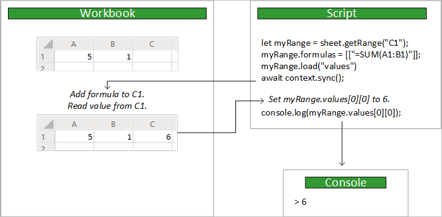

# <a name="scripting-fundamentals-for-office-scripts-in-excel-on-the-web-preview"></a>Web 上の Excel での Office スクリプトのスクリプトの基本事項 (プレビュー)

この記事では、Office スクリプトの技術的な側面について紹介します。 Excel オブジェクトがどのように連携するか、およびコードエディターがブックとどのように同期されるかについて説明します。

[!INCLUDE [Preview note](../includes/preview-note.md)]

## <a name="object-model"></a>オブジェクト モデル

Excel Api について理解するには、ブックの各コンポーネントが互いにどのように関係しているかを理解する必要があります。

- **ブック**に1つ以上の**ワークシート**が含まれています。
- **ワークシート**は、 **Range**オブジェクトを通じてセルへのアクセスを提供します。
- **範囲**は、連続したセルのグループを表します。
- **範囲**は、**表**、**グラフ**、**図形**、およびその他のデータビジュアライゼーションまたは組織オブジェクトを作成して配置するために使用されます。
- **ワークシート**には、個々のシートに存在するデータオブジェクトのコレクションが含まれています。
- **ブック全体**のデータオブジェクト (**テーブル**など) のコレクションが含まれ**ています**。

### <a name="ranges"></a>Ranges

範囲は、ブック内の連続したセルのグループです。 通常、スクリプトでは、A1 形式の表記を使用します (たとえば **、行** **B**の1つのセルの場合は**B3** **、列**2 から**F**は**2** ~ **4**の範囲を定義**するため)** 。

範囲には、、、 `values`および`formulas` `format`の3つの主要なプロパティがあります。 これらのプロパティは、セルの値、評価する数式、およびセルの視覚的な書式設定を取得または設定します。

#### <a name="range-sample"></a>範囲のサンプル

次の例は、sales レコードを作成する方法を示しています。 このスクリプトは`Range` 、オブジェクトを使用して、値、式、および書式を設定します。

```TypeScript
async function main(context: Excel.RequestContext) {
  // Get the active worksheet.
  let sheet = context.workbook.worksheets.getActiveWorksheet();

  // Create the headers and format them to stand out.
  let headers = [
    ["Product", "Quantity", "Unit Price", "Totals"]
  ];
  let headerRange = sheet.getRange("B2:E2");
  headerRange.values = headers;
  headerRange.format.fill.color = "#4472C4";
  headerRange.format.font.color = "white";

  // Create the product data rows.
  let productData = [
    ["Almonds", 6, 7.5],
    ["Coffee", 20, 34.5],
    ["Chocolate", 10, 9.56],
  ];
  let dataRange = sheet.getRange("B3:D5");
  dataRange.values = productData;

  // Create the formulas to total the amounts sold.
  let totalFormulas = [
    ["=C3 * D3"],
    ["=C4 * D4"],
    ["=C5 * D5"],
    ["=SUM(E3:E5)"]
  ];
  let totalRange = sheet.getRange("E3:E6");
  totalRange.formulas = totalFormulas;
  totalRange.format.font.bold = true;

  // Display the totals as US dollar amounts.
  totalRange.numberFormat = [["$0.00"]];
}
```

このスクリプトを実行すると、現在のワークシートに次のデータが作成されます。


### <a name="charts-tables-and-other-data-objects"></a>グラフ、表、およびその他のデータオブジェクト

スクリプトは、Excel 内でデータ構造と視覚エフェクトを作成して操作できます。 表とグラフは、よく使用されるオブジェクトの2つですが、Api はピボットテーブル、図形、画像などをサポートしています。

#### <a name="creating-a-table"></a>テーブルを作成する

データの埋め込まれた範囲を使用してテーブルを作成します。 書式設定とテーブルコントロール (フィルターなど) が範囲に自動的に適用されます。

次のスクリプトは、前の例の範囲を使用してテーブルを作成します。

```TypeScript
async function main(context: Excel.RequestContext) {
   let sheet = context.workbook.worksheets.getActiveWorksheet();
   sheet.tables.add("B2:E5", true);
}
```

以前のデータを含むワークシートでこのスクリプトを実行すると、次のテーブルが作成されます。


#### <a name="creating-a-chart"></a>グラフの作成

範囲内のデータを視覚化するためのグラフを作成します。 スクリプトを使用すると、さまざまなグラフをさまざまな方法で使用できます。これらはそれぞれのニーズに合わせてカスタマイズできます。

次のスクリプトは、3つのアイテムの簡単な縦棒グラフを作成し、それをワークシートの一番上の100ピクセルの下に配置します。

```TypeScript
async function main(context: Excel.RequestContext) {
  let sheet = context.workbook.worksheets.getActiveWorksheet();
  let chart = sheet.charts.add(Excel.ChartType.columnStacked, sheet.getRange("B3:C5"));
  chart.top = 100;
}
```

前の表を使用して、このスクリプトをワークシートで実行すると、次のグラフが作成されます。


### <a name="further-reading-on-the-object-model"></a>オブジェクトモデルについてのさらなる閲覧

[Office SCRIPTS API リファレンスドキュメント](/javascript/api/office-scripts/overview)は、office スクリプトで使用されるオブジェクトの包括的な一覧です。 そこで、目次を使用して、詳細について知りたいクラスに移動できます。 一般的に表示されるページをいくつか次に示します。

- [Chart](/javascript/api/office-scripts/excel/excel.chart)
- [Comment](/javascript/api/office-scripts/excel/excel.comment)
- [PivotTable](/javascript/api/office-scripts/excel/excel.pivottable)
- [Range](/javascript/api/office-scripts/excel/excel.range)
- [RangeFormat](/javascript/api/office-scripts/excel/excel.rangeformat)
- [Shape](/javascript/api/office-scripts/excel/excel.shape)
- [Table](/javascript/api/office-scripts/excel/excel.table)
- [Workbook](/javascript/api/office-scripts/excel/excel.workbook)
- [Worksheet](/javascript/api/office-scripts/excel/excel.worksheet)

## <a name="main-function"></a>`main`関数

すべての Office スクリプトには`main` 、 `Excel.RequestContext`型定義を含む次のシグネチャを持つ関数が含まれている必要があります。

```TypeScript
async function main(context: Excel.RequestContext) {
    // Your Excel Script
}
```

スクリプトの実行時`main`に関数内のコードが実行されます。 `main`スクリプトで他の関数を呼び出すことはできますが、関数に含まれていないコードは実行されません。

## <a name="context"></a>[Context/文脈に従う]

関数`main`は、と`Excel.RequestContext`いう名前`context`のパラメーターを受け入れます。 スクリプトと`context`ブックの間のブリッジと考えることができます。 スクリプトは、 `context`オブジェクトを使用してブックにアクセス`context`し、それを使用してデータをやり取りします。

スクリプト`context`と Excel が異なるプロセスと場所で実行されているため、オブジェクトが必要です。 このスクリプトでは、クラウド内のブックに対して変更を加えるか、データを照会する必要があります。 オブジェクト`context`はこれらのトランザクションを管理します。

## <a name="sync-and-load"></a>同期と読み込み

スクリプトとブックは異なる場所で実行されるので、2つの間のデータ転送には時間がかかります。 スクリプトのパフォーマンスを向上させるために、スクリプトとブックを同期`sync`する操作をスクリプトが明示的に呼び出すまで、コマンドはキューに入れられます。 スクリプトは、次のいずれかが必要になるまで、独立して動作することができます。

- ブックからデータを読み取ります (操作`load`の後)。
- ブックにデータを書き込みます (通常はスクリプトが完了したため)。

次の図は、スクリプトとブックの間の制御フローの例を示しています。



### <a name="sync"></a>同期

スクリプトでブックのデータの読み取りまたは書き込みを行う必要がある場合は`RequestContext.sync` 、次のようにメソッドを呼び出します。

```TypeScript
await context.sync();
```

> [!NOTE]
> `context.sync()`は、スクリプトの終了時に暗黙的に呼び出されます。

操作が`sync`完了すると、ブックは、スクリプトが指定した書き込み操作を反映するように更新されます。 書き込み操作は、Excel オブジェクト (たとえば`range.format.fill.color = "red"`、 `range.format.autoFitColumns()`) にプロパティを設定するか、またはプロパティを変更するメソッドを呼び出しています (例:)。 また`sync` 、操作を使用`load`して、スクリプトが要求したブックの値を読み取ります (次のセクションで説明します)。

ネットワークによっては、スクリプトとブックを同期するときに時間がかかる場合があります。 スクリプトの実行速度を速く`sync`するには、呼び出しの数を最小限に抑える必要があります。  

### <a name="load"></a>読み込め

スクリプトを読み取る前に、ブックからデータを読み込む必要があります。 ただし、多くの場合、ブック全体からデータを読み込むと、スクリプトの速度が大幅に低下します。 代わりに、この`load`メソッドを使用すると、スクリプトの状態を特定し、ブックから取得するデータを指定できます。

この`load`メソッドは、すべての Excel オブジェクトで使用できます。 スクリプトは、オブジェクトのプロパティを読み取れるように読み込む必要があります。 そうしないと、エラーが発生します。

次の例では`Range` 、オブジェクトを使用して、 `load`メソッドがデータを読み込むために使用できる3つの方法を示します。

|Intent |コマンドの例 | 効果 |
|:--|:--|:--|
|1つのプロパティを読み込む |`myRange.load("values");` | この例では、1つのプロパティ (この場合は、この範囲内の値の2次元配列) を読み込みます。 |
|複数のプロパティを読み込む |`myRange.load("values, rowCount, columnCount");`| コンマで区切られたリストからすべてのプロパティを読み込みます。この例では、値、行の数、および列の数を指定します。 |
|すべてを読み込む | `myRange.load();`|範囲のすべてのプロパティを読み込みます。 これは、不要なデータを取得してスクリプトを低速にするために推奨されるソリューションではありません。 この値は、スクリプトのテスト時、またはオブジェクトのすべてのプロパティが必要な場合にのみ使用してください。 |

スクリプトは、読み込ま`context.sync()`れた値を読み取る前に呼び出す必要があります。

```TypeScript
let range = selectedSheet.getRange("A1:B3");
range.load ("rowCount"); // Load the property.
await context.sync(); // Synchronize with the workbook to get the property.
console.log(range.rowCount); // Read and log the property value (3).
```

また、コレクション全体に対してプロパティを読み込むこともできます。 すべての collection オブジェクトに`items`は、そのコレクション内のオブジェクトを含む配列であるプロパティがあります。 を`items`階層呼び出し`items\myProperty`の開始として使用し、 `load`各アイテムの指定されたプロパティを読み込みます。 次の使用例は`resolved` 、ワークシート`Comment`の`CommentCollection`オブジェクト内のすべてのオブジェクトのプロパティを読み込みます。

```TypeScript
let comments = selectedSheet.comments;
comments.load("items/resolved"); // Load the `resolved` property from every comment in this collection.
await context.sync(); // Synchronize with the workbook to get the properties.
```

> [!TIP]
> Office スクリプトでのコレクションの使用の詳細については、「 [Office スクリプトの組み込み JavaScript オブジェクトの使用」の記事の「Array」セクション](javascript-objects.md#array)を参照してください。

## <a name="see-also"></a>関連項目

- [Web 上の Excel で Office スクリプトを記録、編集、および作成する](../tutorials/excel-tutorial.md)
- [Excel on the web で Office スクリプトを使用してブックのデータを読み取る](../tutorials/excel-read-tutorial.md)
- [Office スクリプト API リファレンス](/javascript/api/office-scripts/overview)
- [Office スクリプトでの組み込みの JavaScript オブジェクトの使用](javascript-objects.md)
