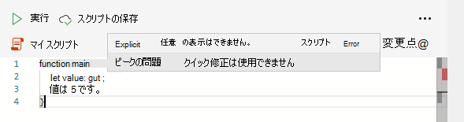

# <a name="typescript-restrictions-in-office-scripts"></a>Office スクリプトでの TypeScript の制限

Officeは TypeScript 言語を使用します。 ほとんどの場合、TypeScript または JavaScript のコードは、Officeされます。 ただし、スクリプトが Excel ブックで一貫して意図した方法で動作することを保証するために、コード エディターによっていくつかの制限が適用されます。

## <a name="no-any-type-in-office-scripts"></a>スクリプトに 'any' 型Officeはありません

[TypeScript](https://www.typescriptlang.org/docs/handbook/typescript-in-5-minutes.html)では型を推測できるので、書き込み型は省略可能です。 ただし、Officeスクリプトでは、変数の型を指定できない [必要があります](https://www.typescriptlang.org/docs/handbook/basic-types.html#any)。 スクリプトでは、明示的と暗黙的 `any` の両方Office使用できます。 これらのケースは、エラーとして報告されます。

### <a name="explicit-any"></a>Explicit `any`

スクリプト (つまり) で変数を型として `any` 明示的Office宣言することはできません `let someVariable: any;` 。 この `any` 型は、Excel によって処理される際に問題を引き起こします。 たとえば、値が a , , または `Range` `string` . `number` `boolean` スクリプト内の型として変数が明示的に定義されている場合は、コンパイル時エラー (スクリプトを実行する前にエラー) `any` が表示されます。




上のスクリーンショットでは `[5, 16] Explicit Any is not allowed` 、行の種類が#5列#16示 `any` しています。 これにより、エラーを見つけるのに役立ちます。

この問題を回避するには、変数の型を必ず定義してください。 変数の型が不明な場合は、ユニオン型を [使用できます](https://www.typescriptlang.org/docs/handbook/unions-and-intersections.html)。 これは、値を保持する変数 (型、または値の型が次の値のユニオン) に `Range` `string` `number` `boolean` `Range` 役立ちます `string | number | boolean` 。

### <a name="implicit-any"></a>暗黙的 `any`

TypeScript 変数型は暗黙的 [に定義](https://www.typescriptlang.org/docs/handbook/type-inference.html) できます。 TypeScript コンパイラが変数の型を特定できない場合 (型が明示的に定義されていないか、型の推論ができない場合)、暗黙的な値であり、コンパイル時エラーが発生します。 `any`

暗黙的な変数宣言の中で最も一般的なケースは `any` 、次に例を示します `let value;` 。 これを回避する方法は 2 種類あります。

* 変数を暗黙的に識別可能な型 (または) に割り当 `let value = 5;` てる `let value = workbook.getWorksheet();` 。
* 変数 ( ) を明示的に入力 `let value: number;` します。

## <a name="no-inheriting-office-script-classes-or-interfaces"></a>スクリプト クラスOffice継承なし

スクリプトで作成されたクラスとインターフェイスは、Office Scripts [の](https://www.typescriptlang.org/docs/handbook/classes.html#inheritance) クラスまたはインターフェイスOffice拡張または実装できません。 つまり、名前空間内のサブクラス `ExcelScript` やサブインターフェイスを持つものは何もありません。

## <a name="incompatible-typescript-functions"></a>互換性のない TypeScript 関数

Officeスクリプト API は、以下では使用できません。

* [ジェネレーター関数](https://developer.mozilla.org/docs/Web/JavaScript/Guide/Iterators_and_Generators#generator_functions)
* [Array.sort](https://developer.mozilla.org/docs/Web/JavaScript/Reference/Global_Objects/Array/sort)

## <a name="eval-is-not-supported"></a>`eval` サポートされていません

JavaScript [eval 関数](https://developer.mozilla.org/docs/Web/JavaScript/Reference/Global_Objects/eval) は、セキュリティ上の理由からサポートされていません。

## <a name="restricted-identifers"></a>制限付き身元

次の単語は、スクリプト内の識別子として使用できません。 予約された用語です。

* `Excel`
* `ExcelScript`
* `console`

## <a name="only-arrow-functions-in-array-callbacks"></a>配列コールバックの方向キー関数のみ

スクリプトで使用できるのは [、Array](https://developer.mozilla.org/docs/Web/JavaScript/Reference/Functions/Arrow_functions) メソッドにコールバック引数を指定する場合 [のみです](https://developer.mozilla.org/docs/Web/JavaScript/Reference/Global_Objects/Array) 。 これらのメソッドには、任意の種類の識別子や "従来の" 関数を渡す必要があります。

```typescript
const myArray = [1, 2, 3, 4, 5, 6];
let filteredArray = myArray.filter((x) => {
  return x % 2 === 0;
});
/*
  The following code generates a compiler error in the Office Scripts Code Editor.
  filteredArray = myArray.filter(function (x) {
    return x % 2 === 0;
  });
*/
```

## <a name="performance-warnings"></a>パフォーマンスの警告

スクリプトにパフォーマンスの問題 [がある可能性](https://wikipedia.org/wiki/Lint_(software)) がある場合は、コード エディターの linter が警告を表示します。 ケースとその回避方法については、「スクリプトのパフォーマンスを向上させる [」Officeされています](web-client-performance.md)。

## <a name="external-api-calls"></a>外部 API 呼び出し

詳細 [については、「Office Scripts」の](external-calls.md) 「外部 API 呼び出しのサポート」を参照してください。

## <a name="see-also"></a>関連項目

* [Excel on the web での Office スクリプトのスクリプトの基本事項](scripting-fundamentals.md)
* [スクリプトのパフォーマンスをOfficeする](web-client-performance.md)
