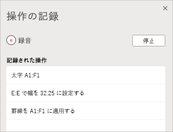
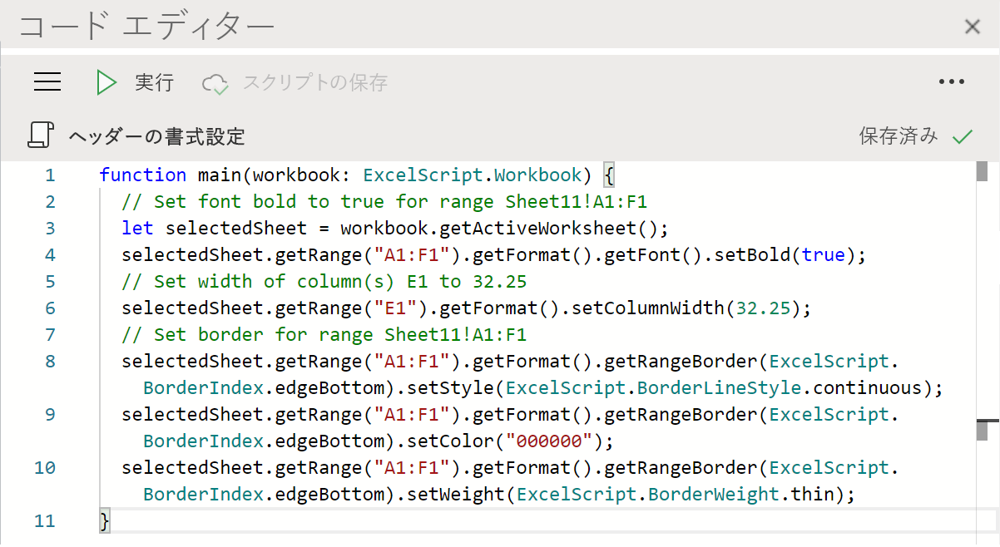

# Excel on the web の Office スクリプト (プレビュー)

Excel on the web の Office スクリプトを使用すると、日常のタスクを自動化できます。 Excel で行う操作を操作レコーダーで記録すると、スクリプトが作成されます。 さらに、コード エディターでスクリプトの作成や編集をすることもできます。 スクリプトは組織全体で共有できるため、同僚もワークフローを自動化できます。

この一連のドキュメントで、これらのツールの使用方法について説明します。 操作レコーダーの紹介では、頻繁に実行する Excel 操作の記録方法を説明します。 また、コード エディターを使用して、独自のスクリプトを作成したり更新したりする方法についても説明します。

 

> [!VIDEO https://www.microsoft.com/videoplayer/embed/RE4qdFF]

## 要件

[!INCLUDE [Preview note](../includes/preview-note.md)]

Office スクリプトを使用するには、以下が必要です。

1. [Excel on the web](https://www.office.com/launch/excel) (デスクトップなどのその他のプラットフォームは、サポートされていません)。
1. [管理者によって有効にされた](/microsoft-365/admin/manage/manage-office-scripts-settings) Office スクリプト。
1. Microsoft 365 Office デスクトップ アプリにアクセスできる、次のような商用または教育機関向けの Microsoft 365 ライセンス。

    - Office 365 Business
    - Office 365 Business Premium
    - Office 365 ProPlus
    - Office 365 ProPlus デバイス用
    - Office 365 Enterprise E3
    - Office 365 Enterprise E5
    - Office 365 A3
    - Office 365 A5

## Office スクリプトの使用に適した状況

スクリプトを使用すると、自分が行った Excel の操作を記録して、さまざまなブックやワークシートに対してその操作を再現できます。 同じ操作を何度も繰り返し行っている場合は、そのすべての作業を簡単に実行できる Office スクリプトに変換することができます。 Excel でボタンを押してスクリプトを実行するか、Power Automate と組み合わせてワークフロー全体を効率化します。

たとえば、毎日仕事の始めに Excel で会計サイトから .csv ファイルを開いているとします。 それから数分かけて、不要な列を削除し、テーブルの書式を設定し、数式を追加し、新しいワークシートにピボットテーブルを作成します。 毎日繰り返しているこのような操作を、操作レコーダーで 1 回記録できます。 それ以降は、スクリプトを実行するだけで、.csv の変換処理すべてが自動的に実行されます。 手順を忘れる危険がなくなるだけでなく、特に操作を教えなくても他の人とプロセスを共有することもできます。 Office スクリプトを使用すると一般的なタスクを自動化できるので、自分自身と職場の作業効率や生産性を向上できます。

## 操作レコーダー

操作レコーダーは、ユーザーが Excel で実行した操作を記録して、スクリプトとして保存します。 操作レコーダーを実行すると、セルの編集、書式の変更、テーブルの作成などの Excel の操作をキャプチャできます。 作成されたスクリプトは、他のワークシートやブックで実行して、ユーザーが実行した元の操作を再現することもできます。

## コード エディター

操作レコーダーで記録したすべてのスクリプトは、コード エディターで編集できます。 これにより、ニーズにぴったり合うようにスクリプトを微調整したり、カスタマイズしたりできます。 また、条件付きステートメント (if/else) やループなど、Excel の UI からでは直接アクセスできないロジックや機能を追加することもできます。

Office スクリプトの機能を学習する簡単な方法の 1 つは、Excel on the web でスクリプトを記録し、作成されたコードを表示することです。 別の方法としては、用意されている[チュートリアル](../tutorials/excel-tutorial.md)に従うと、詳しいガイド付きで、より体系的に学習できます。

## スクリプトの共有

![[このブックで他のユーザーと共有する] オプションを表示するスクリプトの詳細ページ。](../images/script-sharing.png)

Office スクリプトは、Excel ブックの他のユーザーと共有できます。 スクリプトをブック内の他のユーザーと共有すると、スクリプトはブックに添付されます。 スクリプトは、OneDrive に保存され、共有すると、開いているブックにリンクが作成されます。

共有および共有解除スクリプトの詳細については、「[Excel for the Web で Office スクリプトを共有する](https://support.microsoft.com/office/sharing-office-scripts-in-excel-for-the-web-226eddbc-3a44-4540-acfe-fccda3d1122b?storagetype=live&ui=en-US&rs=en-US&ad=US)」の記事を参照してください。

## Office スクリプトを Power Automate に接続する

[Power Automate](https://flow.microsoft.com/) は、複数のアプリとサービスの間のワークフローを自動化するためのサービスです。 これらのワークフローでは、Office スクリプトを使用して、ブック外のスクリプトを制御できます。 スケジュールに基づいてスクリプトを実行したり、メールに応じてスクリプトをトリガーしたりできます。 この自動化サービスに接続するための基本的な方法については、「[Power Automate を使用して Excel on the web で Office スクリプトを実行する](../tutorials/excel-power-automate-manual.md)」チュートリアルにアクセスします。

## 次の手順

[Excel on the web の Office スクリプトに関するチュートリアル](../tutorials/excel-tutorial.md)を完了すると、Office スクリプトを初めて作成する方法を理解できます。

## 関連項目

- [Excel on the web での Office スクリプトのスクリプトの基本事項](../develop/scripting-fundamentals.md)
- [Office スクリプト API リファレンス](/javascript/api/office-scripts/overview)
- [Office スクリプトのトラブルシューティング](../testing/troubleshooting.md)
- [M365 での Office スクリプトの設定](https://support.office.com/article/office-scripts-settings-in-m365-19d3c51a-6ca2-40ab-978d-60fa49554dcf)
- [Excel の Office スクリプトの概要 (support.office.com)](https://support.office.com/article/introduction-to-office-scripts-in-excel-9fbe283d-adb8-4f13-a75b-a81c6baf163a)
- [Excel on the web での Office スクリプトの共有](https://support.microsoft.com/office/sharing-office-scripts-in-excel-for-the-web-226eddbc-3a44-4540-acfe-fccda3d1122b?storagetype=live&ui=en-US&rs=en-US&ad=US)
