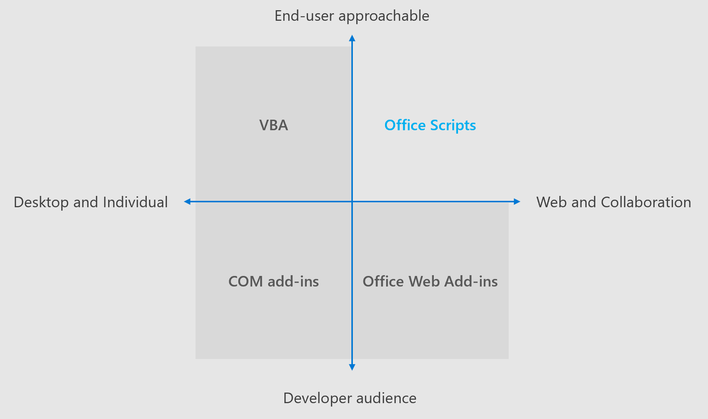

# Office スクリプトと Office アドインの違いDifferences between Office Scripts and Office Add-ins

Office アドインと Office スクリプトには、多くの共通点があります。Office Add-ins and Office Scripts have a lot in common. どちらも、Excel ブックの JavaScript API の自動制御を提供します。They both offer automated control of an Excel workbook a JavaScript API. ただし、Office スクリプト Api は、Office JavaScript API の特殊な同期バージョンです。However, the Office Scripts APIs are a specialized, synchronous version of the Office JavaScript API.

Office スクリプトは、作業ウィンドウが開いている間は Office アドインが保持されるのに対して、手動ボタンを押すか、 [電源自動化](https://flow.microsoft.com/)で手順として、完了するために実行します。Office Scripts run to completion with a manual button press or as a step in [Power Automate](https://flow.microsoft.com/), whereas Office Add-ins persist while their task panes are open. これは、アドインがセッション中に状態を維持できることを意味しますが、Office スクリプトでは実行の間に内部状態は保持されません。This means the add-ins can maintain state during a session, whereas Office Scripts do not maintain an internal state between runs. Excel 拡張機能がスクリプトプラットフォームの機能を超える必要がある場合は、office アドインの [ドキュメント](/office/dev/add-ins) にアクセスして、office アドインの詳細を確認してください。If you find that your Excel extension needs to exceed the scripting platform's capabilities, visit the [Office Add-ins documentation](/office/dev/add-ins) to learn more about Office Add-ins.

この記事の残りの部分では、Office アドインと Office スクリプトの主な違いについて説明します。The rest of this article describes on the main differences between Office Add-ins and Office Scripts.

## プラットフォームのサポートPlatform Support

Office アドインはプラットフォーム間で機能します。Office Add-ins are cross-platform. これらは、Windows デスクトップ、Mac、iOS、および web プラットフォーム間で機能し、それぞれに同じ操作を提供します。They work across Windows desktop, Mac, iOS, and web platforms and provide the same experience on each. この点については、個々の API のドキュメントに記載されている例外を参照してください。Any exception to this is noted in the documentation of the individual API.

Office スクリプトは、現在 web 上の Excel でのみサポートされています。Office Scripts are currently only supported by for Excel on the web. すべての記録、編集、実行は、web プラットフォーム上で実行されます。All recording, editing, and running is done on the web platform.

## APIAPIs

Office アドイン用の Office JavaScript Api の同期バージョンはありません。標準の Office スクリプト api はプラットフォームに固有のものであり、パラダイムの使用を避けるために多くの最適化と変更が行われてい `load` / `sync` ます。There is no synchronous version of the Office JavaScript APIs for Office Add-ins. The standard Office Scripts APIs are unique to the platform and have numerous optimizations and alterations to avoid the usage of the `load`/`sync` paradigm.

[Excel JavaScript api](/javascript/api/excel?view=excel-js-preview&preserve-view=true)の一部は、 [Office スクリプト非同期 api](../develop/excel-async-model.md)と互換性があります。Some of the [Excel JavaScript APIs](/javascript/api/excel?view=excel-js-preview&preserve-view=true) are compatible with the [Office Scripts Async APIs](../develop/excel-async-model.md). 一部のサンプルおよびアドインコードブロックは、 `Excel.run` 最小限の翻訳でブロックに移植できます。Some samples and add-in code blocks could be ported to `Excel.run` blocks with minimal translation. 2つのプラットフォームは機能を共有していますが、ギャップがあります。While the two platforms share functionality, there are gaps. Office アドインには、office アドインには含まれませんが、イベントと共通 Api はない2つの主要な API セットがあります。The two major API sets that Office Add-ins have but Office Scripts do not are events and the Common APIs.

### イベントEvents

Office スクリプトは [イベント](/office/dev/add-ins/excel/excel-add-ins-events)をサポートしていません。Office Scripts do not support [events](/office/dev/add-ins/excel/excel-add-ins-events). すべてのスクリプトは、コードを1つのメソッドで実行し `main` 、終了します。Every script runs the code in a single `main` method, then ends. イベントがトリガーされると再アクティブ化されないため、イベントを登録できません。It does not reactivate when events are triggered, and thus, cannot register events.

### 共通 APICommon APIs

Office スクリプトでは、 [共通 api](/javascript/api/office)を使用できません。Office Scripts cannot use [Common APIs](/javascript/api/office). 一般的な Api でのみサポートされている認証、ダイアログウィンドウ、またはその他の機能が必要な場合は、Office のスクリプトではなく、Office アドインを作成する必要があります。If you need authentication, dialog windows, or other features that are only supported by Common APIs, you'll likely need to create an Office Add-in instead of an Office Script.

## 関連項目See also

- [Excel on the web の Office スクリプトOffice Scripts in Excel on the web](../overview/excel.md)
- [Office スクリプトと VBA マクロの相違点Differences between Office Scripts and VBA macros](vba-differences.md)
- [Office スクリプトのトラブルシューティングTroubleshooting Office Scripts](../testing/troubleshooting.md)
- [Excel 作業ウィンドウ アドインを作成するBuild an Excel task pane add-in](/office/dev/add-ins/quickstarts/excel-quickstart-jquery)
