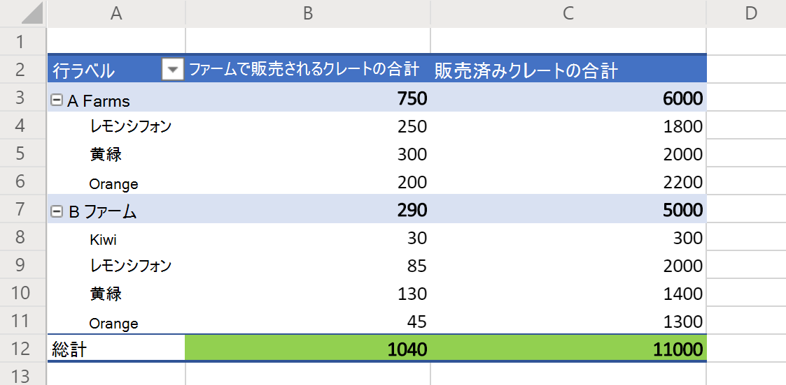

# <a name="sample-scripts-for-office-scripts-in-excel-on-the-web-preview"></a><span data-ttu-id="26309-103">Web 上の Excel での Office スクリプトのサンプルスクリプト (プレビュー)</span><span class="sxs-lookup"><span data-stu-id="26309-103">Sample scripts for Office Scripts in Excel on the web (preview)</span></span>

<span data-ttu-id="26309-104">次のサンプルは、独自のブックで試すことができる簡単なスクリプトです。</span><span class="sxs-lookup"><span data-stu-id="26309-104">The following samples are simple scripts for you to try on your own workbooks.</span></span> <span data-ttu-id="26309-105">Web 上の Excel で使用するには、次のようにします。</span><span class="sxs-lookup"><span data-stu-id="26309-105">To use them in Excel on the web:</span></span>

1. <span data-ttu-id="26309-106">**[自動化]** タブを開きます。</span><span class="sxs-lookup"><span data-stu-id="26309-106">Open the **Automate** tab.</span></span>
2. <span data-ttu-id="26309-107">**コードエディター**を押します。</span><span class="sxs-lookup"><span data-stu-id="26309-107">Press **Code Editor**.</span></span>
3. <span data-ttu-id="26309-108">コードエディターの作業ウィンドウで、[**新しいスクリプト**] をクリックします。</span><span class="sxs-lookup"><span data-stu-id="26309-108">Press **New Script** in the Code Editor's task pane.</span></span>
4. <span data-ttu-id="26309-109">スクリプト全体を、選択したサンプルに置き換えます。</span><span class="sxs-lookup"><span data-stu-id="26309-109">Replace the entire script with the sample of your choice.</span></span>
5. <span data-ttu-id="26309-110">コードエディターの作業ウィンドウで、[**実行**] をクリックします。</span><span class="sxs-lookup"><span data-stu-id="26309-110">Press **Run** in the Code Editor's task pane.</span></span>

[!INCLUDE [Preview note](../includes/preview-note.md)]

## <a name="scripting-basics"></a><span data-ttu-id="26309-111">スクリプトの基礎</span><span class="sxs-lookup"><span data-stu-id="26309-111">Scripting basics</span></span>

<span data-ttu-id="26309-112">これらのサンプルでは、Office スクリプトの基本的な構成要素を示します。</span><span class="sxs-lookup"><span data-stu-id="26309-112">These samples demonstrate fundamental building blocks for Office Scripts.</span></span> <span data-ttu-id="26309-113">これらをスクリプトに追加して、ソリューションを拡張し、一般的な問題を解決します。</span><span class="sxs-lookup"><span data-stu-id="26309-113">Add these to your scripts to extend your solution and solve common problems.</span></span>

### <a name="read-and-log-one-cell"></a><span data-ttu-id="26309-114">1つのセルを読み取り、ログに記録する</span><span class="sxs-lookup"><span data-stu-id="26309-114">Read and log one cell</span></span>

<span data-ttu-id="26309-115">この例では、 **A1**の値を読み取り、コンソールに出力します。</span><span class="sxs-lookup"><span data-stu-id="26309-115">This sample reads the value of **A1** and prints it to the console.</span></span>

```typescript
function main(workbook: ExcelScript.Workbook) {
  // Get the current worksheet.
  let selectedSheet = workbook.getActiveWorksheet();

  // Get the value of cell A1.
  let range = selectedSheet.getRange("A1");
  
  // Print the value of A1.
  console.log(range.getValue());
}
```

### <a name="read-the-active-cell"></a><span data-ttu-id="26309-116">アクティブセルを読み取る</span><span class="sxs-lookup"><span data-stu-id="26309-116">Read the active cell</span></span>

<span data-ttu-id="26309-117">このスクリプトは、現在アクティブなセルの値を記録します。</span><span class="sxs-lookup"><span data-stu-id="26309-117">This script logs the value of the current active cell.</span></span> <span data-ttu-id="26309-118">複数のセルが選択されている場合は、一番左側のセルがログに記録されます。</span><span class="sxs-lookup"><span data-stu-id="26309-118">If multiple cells are selected, the top-leftmost cell will be logged.</span></span>

```typescript
function main(workbook: ExcelScript.Workbook) {
  // Get the current active cell in the workbook.
  let cell = workbook.getActiveCell();

  // Log that cell's value.
  console.log(`The current cell's value is ${cell.getValue()}`);
}
```

### <a name="change-an-adjacent-cell"></a><span data-ttu-id="26309-119">隣接するセルを変更する</span><span class="sxs-lookup"><span data-stu-id="26309-119">Change an adjacent cell</span></span>

<span data-ttu-id="26309-120">このスクリプトは、相対参照を使用して隣接するセルを取得します。</span><span class="sxs-lookup"><span data-stu-id="26309-120">This script gets adjacent cells using relative references.</span></span> <span data-ttu-id="26309-121">アクティブセルが一番上の行にある場合は、現在選択されているセルを参照しているため、スクリプトの一部が失敗することに注意してください。</span><span class="sxs-lookup"><span data-stu-id="26309-121">Note that if the active cell is on the top row, part of the script fails, because it references the cell above the currently selected one.</span></span>

```typescript
function main(workbook: ExcelScript.Workbook) {
  // Get the currently active cell in the workbook.
  let activeCell = workbook.getActiveCell();
  console.log(`The active cell's address is: ${activeCell.getAddress()}`);

  // Get the cell to the right of the active cell and set its value and color.
  let rightCell = activeCell.getOffsetRange(0,1);
  rightCell.setValue("Right cell");
  console.log(`The right cell's address is: ${rightCell.getAddress()}`);
  rightCell.getFormat().getFont().setColor("Magenta");
  rightCell.getFormat().getFill().setColor("Cyan");

  // Get the cell to the above of the active cell and set its value and color.
  // Note that this operation will fail if the active cell is in the top row.
  let aboveCell = activeCell.getOffsetRange(-1, 0);
  aboveCell.setValue("Above cell");
  console.log(`The above cell's address is: ${aboveCell.getAddress()}`);
  aboveCell.getFormat().getFont().setColor("White");
  aboveCell.getFormat().getFill().setColor("Black");
}
```

### <a name="change-all-adjacent-cells"></a><span data-ttu-id="26309-122">隣接するすべてのセルを変更する</span><span class="sxs-lookup"><span data-stu-id="26309-122">Change all adjacent cells</span></span>

<span data-ttu-id="26309-123">このスクリプトは、アクティブセルの書式を隣接するセルにコピーします。</span><span class="sxs-lookup"><span data-stu-id="26309-123">This script copies the formatting in the active cell to the neighboring cells.</span></span> <span data-ttu-id="26309-124">このスクリプトは、アクティブセルがワークシートの端にない場合にのみ機能することに注意してください。</span><span class="sxs-lookup"><span data-stu-id="26309-124">Note that this script only works when the active cell isn't on an edge of the worksheet.</span></span>

```typescript
function main(workbook: ExcelScript.Workbook) {
  // Get the active cell.
  let activeCell = workbook.getActiveCell();

  // Get the cell that's one row above and one column to the left of the active cell.
  let cornerCell = activeCell.getOffsetRange(-1,-1);

  // Get a range that includes all the cells surrounding the active cell.
  let surroundingRange = cornerCell.getResizedRange(2, 2)

  // Copy the formatting from the active cell to the new range.
  surroundingRange.copyFrom(
    activeCell, /* The source range. */
    ExcelScript.RangeCopyType.formats /* What to copy. */
    );
}
```

### <a name="change-each-individual-cell-in-a-range"></a><span data-ttu-id="26309-125">範囲内の各セルを変更する</span><span class="sxs-lookup"><span data-stu-id="26309-125">Change each individual cell in a range</span></span>

<span data-ttu-id="26309-126">このスクリプトは、現在の選択範囲をループします。</span><span class="sxs-lookup"><span data-stu-id="26309-126">This script loops over the currently select range.</span></span> <span data-ttu-id="26309-127">現在の書式をクリアし、各セルの塗りつぶしの色をランダムな色に設定します。</span><span class="sxs-lookup"><span data-stu-id="26309-127">It clears the current formatting and sets the fill color in each cell to a random color.</span></span>

```typescript
function main(workbook: ExcelScript.Workbook) {
  // Get the currently selected range.
  let range = workbook.getSelectedRange();

  // Get the size boundaries of the range.
  let rows = range.getRowCount();
  let cols = range.getColumnCount();

  // Clear any existing formatting
  range.clear(ExcelScript.ClearApplyTo.formats);

  // Iterate over the range.
  for (let row = 0; row < rows; row++) {
    for (let col = 0; col < cols; col++) {
      // Generate a random color hex-code.
      let colorString = `#${Math.random().toString(16).substr(-6)}`;

      // Set the color of the current cell to that random hex-code.
      range.getCell(row, col).getFormat().getFill().setColor(colorString);
    }
  }
}
```

## <a name="collections"></a><span data-ttu-id="26309-128">コレクション</span><span class="sxs-lookup"><span data-stu-id="26309-128">Collections</span></span>

<span data-ttu-id="26309-129">これらのサンプルは、ブック内のオブジェクトのコレクションに対して機能します。</span><span class="sxs-lookup"><span data-stu-id="26309-129">These samples work with collections of objects in the workbook.</span></span>

### <a name="iterating-over-collections"></a><span data-ttu-id="26309-130">コレクションの反復処理</span><span class="sxs-lookup"><span data-stu-id="26309-130">Iterating over collections</span></span>

<span data-ttu-id="26309-131">このスクリプトは、ブック内のすべてのワークシートの名前を取得してログ記録します。</span><span class="sxs-lookup"><span data-stu-id="26309-131">This script gets and logs the names of all the worksheets in the workbook.</span></span> <span data-ttu-id="26309-132">また、タブの色をランダムな色に設定します。</span><span class="sxs-lookup"><span data-stu-id="26309-132">It also sets the their tab colors to a random color.</span></span>

```typescript
function main(workbook: ExcelScript.Workbook) {
  // Get all the worksheets in the workbook.
  let sheets = workbook.getWorksheets();

  // Get a list of all the worksheet names.
  let names = sheets.map ((sheet) => sheet.getName());

  // Write in the console all the worksheet names and the total count.
  console.log(names);
  console.log(`Total worksheets inside of this workbook: ${sheets.length}`);
  
  // Set the tab color each worksheet to a random color
  for (let sheet of sheets) {
    // Generate a random color hex-code.
    let colorString = `#${Math.random().toString(16).substr(-6)}`;

    // Set the color of the current worksheet's tab to that random hex-code.
    sheet.setTabColor(colorString);
  }
}
```

## <a name="dates"></a><span data-ttu-id="26309-133">日付</span><span class="sxs-lookup"><span data-stu-id="26309-133">Dates</span></span>

<span data-ttu-id="26309-134">このセクションのサンプルは、JavaScript の[Date](https://developer.mozilla.org/docs/web/javascript/reference/global_objects/date)オブジェクトを使用する方法を示しています。</span><span class="sxs-lookup"><span data-stu-id="26309-134">The samples in this section show how to use the JavaScript [Date](https://developer.mozilla.org/docs/web/javascript/reference/global_objects/date) object.</span></span>

<span data-ttu-id="26309-135">次の例では、現在の日付と時刻を取得し、アクティブなワークシート内の2つのセルにこれらの値を書き込みます。</span><span class="sxs-lookup"><span data-stu-id="26309-135">The following sample gets the current date and time and then writes those values to two cells in the active worksheet.</span></span>

```TypeScript
function main(workbook: ExcelScript.Workbook) {
  // Get the cells at A1 and B1.
  let dateRange = workbook.getActiveWorksheet().getRange("A1");
  let timeRange = workbook.getActiveWorksheet().getRange("B1");

  // Get the current date and time with the JavaScript Date object.
  let date = new Date(Date.now());

  // Add the date string to A1.
  dateRange.setValue(date.toLocaleDateString());

  // Add the time string to B1.
  timeRange.setValue(date.toLocaleTimeString());
}
```

<span data-ttu-id="26309-136">次の例では、Excel に保存されている日付を読み取って、JavaScript の Date オブジェクトに変換します。</span><span class="sxs-lookup"><span data-stu-id="26309-136">The next sample reads a date that's stored in Excel and translates it to a JavaScript Date object.</span></span> <span data-ttu-id="26309-137">[日付のシリアル番号](https://support.office.com/article/now-function-3337fd29-145a-4347-b2e6-20c904739c46)は、JavaScript 日付の入力として使用されます。</span><span class="sxs-lookup"><span data-stu-id="26309-137">It uses the [date's numeric serial number](https://support.office.com/article/now-function-3337fd29-145a-4347-b2e6-20c904739c46) as input for the JavaScript Date.</span></span>

```TypeScript
function main(workbook: ExcelScript.Workbook) {
  // Read a date at cell A1 from Excel.
  let dateRange = workbook.getActiveWorksheet().getRange("A1");

  // Convert the Excel date to a JavaScript Date object.
  let excelDateValue = dateRange.getValue();
  let javaScriptDate = new Date(Math.round((excelDateValue - 25569) * 86400 * 1000));
  console.log(javaScriptDate);
}
```

## <a name="display-data"></a><span data-ttu-id="26309-138">データの表示</span><span class="sxs-lookup"><span data-stu-id="26309-138">Display data</span></span>

<span data-ttu-id="26309-139">これらのサンプルは、ワークシートデータを操作し、ユーザーにより良い表示や組織を提供する方法を示しています。</span><span class="sxs-lookup"><span data-stu-id="26309-139">These samples demonstrate how to work with worksheet data and provide users with a better view or organization.</span></span>

### <a name="apply-conditional-formatting"></a><span data-ttu-id="26309-140">条件付き書式の適用</span><span class="sxs-lookup"><span data-stu-id="26309-140">Apply conditional formatting</span></span>

<span data-ttu-id="26309-141">この例では、ワークシートで現在使用されている範囲に条件付き書式を適用します。</span><span class="sxs-lookup"><span data-stu-id="26309-141">This sample applies conditional formatting to the currently used range in the worksheet.</span></span> <span data-ttu-id="26309-142">条件付き書式は、値の上位10% の緑の塗りつぶしです。</span><span class="sxs-lookup"><span data-stu-id="26309-142">The conditional formatting is a green fill for the top 10% of values.</span></span>

```TypeScript
function main(workbook: ExcelScript.Workbook) {
  // Get the current worksheet.
  let selectedSheet = workbook.getActiveWorksheet();

  // Get the used range in the worksheet.
  let range = selectedSheet.getUsedRange();

  // Set the fill color to green for the top 10% of values in the range.
  let conditionalFormat = range.addConditionalFormat(ExcelScript.ConditionalFormatType.topBottom)
  conditionalFormat.getTopBottom().getFormat().getFill().setColor("green");
  conditionalFormat.getTopBottom().setRule({
    rank: 10, // The percentage threshold.
    type: ExcelScript.ConditionalTopBottomCriterionType.topPercent // The type of the top/bottom condition.
  });
}
```

### <a name="create-a-sorted-table"></a><span data-ttu-id="26309-143">並べ替えられたテーブルを作成する</span><span class="sxs-lookup"><span data-stu-id="26309-143">Create a sorted table</span></span>

<span data-ttu-id="26309-144">次の使用例は、現在のワークシートの使用範囲から表を作成し、最初の列に基づいて並べ替えます。</span><span class="sxs-lookup"><span data-stu-id="26309-144">This sample creates a table from the current worksheet's used range, then sorts it based on the first column.</span></span>

```TypeScript
function main(workbook: ExcelScript.Workbook) {
  // Get the current worksheet.
  let selectedSheet = workbook.getActiveWorksheet();

  // Create a table with the used cells.
  let usedRange = selectedSheet.getUsedRange();
  let newTable = selectedSheet.addTable(usedRange, true);

  // Sort the table using the first column.
  newTable.getSort().apply([{ key: 0, ascending: true }]);
}
```

### <a name="log-the-grand-total-values-from-a-pivottable"></a><span data-ttu-id="26309-145">ピボットテーブルから "総計" 値を記録する</span><span class="sxs-lookup"><span data-stu-id="26309-145">Log the "Grand Total" values from a PivotTable</span></span>

<span data-ttu-id="26309-146">次の例では、ブックの最初のピボットテーブルを検索し、次の図のように、[総計] セル (緑で強調表示されている) に値を記録します。</span><span class="sxs-lookup"><span data-stu-id="26309-146">This sample finds the first PivotTable in the workbook and logs the values in the "Grand Total" cells (as highlighted in green in the image below).</span></span>



```TypeScript
function main(workbook: ExcelScript.Workbook) {
  // Get the first PivotTable in the workbook.
  let pivotTable = workbook.getPivotTables()[0];

  // Get the names of each data column in the PivotTable.
  let pivotColumnLabelRange = pivotTable.getLayout().getColumnLabelRange();

  // Get the range displaying the pivoted data.
  let pivotDataRange = pivotTable.getLayout().getRangeBetweenHeaderAndTotal();

  // Get the range with the "grand totals" for the PivotTable columns.
  let grandTotalRange = pivotDataRange.getLastRow();

  // Print each of the "Grand Totals" to the console.
  grandTotalRange.getValues()[0].forEach((column, columnIndex) => {
    console.log(`Grand total of ${pivotColumnLabelRange.getValues()[0][columnIndex]}: ${grandTotalRange.getValues()[0][columnIndex]}`);
    // Example log: "Grand total of Sum of Crates Sold Wholesale: 11000"
  });
}
```

## <a name="scenario-samples"></a><span data-ttu-id="26309-148">シナリオサンプル</span><span class="sxs-lookup"><span data-stu-id="26309-148">Scenario samples</span></span>

<span data-ttu-id="26309-149">大規模な現実世界のソリューションを紹介するサンプルについては、「 [Office スクリプトのサンプルシナリオ](scenarios/sample-scenario-overview.md)」を参照してください。</span><span class="sxs-lookup"><span data-stu-id="26309-149">For samples showcasing larger, real-world solutions, visit [Sample scenarios for Office Scripts](scenarios/sample-scenario-overview.md).</span></span>

## <a name="suggest-new-samples"></a><span data-ttu-id="26309-150">新しいサンプルを提案する</span><span class="sxs-lookup"><span data-stu-id="26309-150">Suggest new samples</span></span>

<span data-ttu-id="26309-151">新しいサンプルの提案を歓迎します。</span><span class="sxs-lookup"><span data-stu-id="26309-151">We welcome suggestions for new samples.</span></span> <span data-ttu-id="26309-152">他のスクリプト開発者を支援する一般的なシナリオがある場合は、以下のフィードバックセクションでご連絡ください。</span><span class="sxs-lookup"><span data-stu-id="26309-152">If there is a common scenario that would help other script developers, please tell us in the feedback section below.</span></span>
