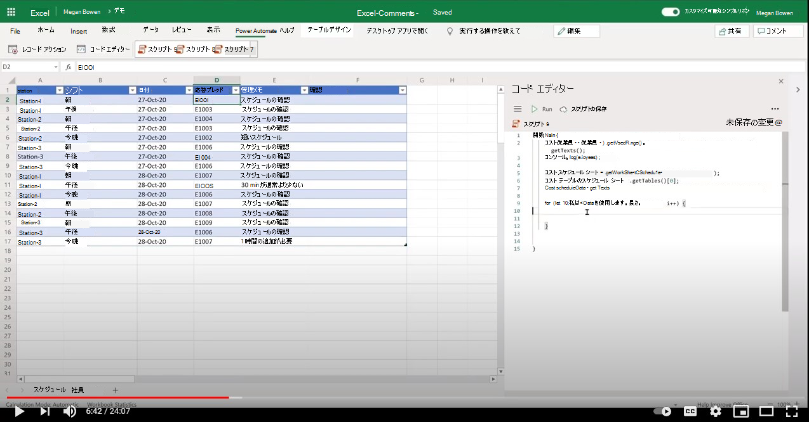

# <a name="add-comments-in-excel"></a>Excel でコメントを追加する

このサンプルでは、同僚のコメントを含むセルに [コメント@mentioning](https://support.microsoft.com/office/90701709-5dc1-41c7-aa48-b01d4a46e8c7) 示します。

## <a name="example-scenario"></a>シナリオ例

* チーム リードはシフト スケジュールを維持します。 チーム リードは、シフト レコードに従業員 ID を割り当てる。
* チーム リードは、従業員に通知する必要があります。 従業員にコメントを@mentionsすると、ワークシートからカスタム メッセージが送信されます。
* その後、従業員はブックを表示し、都合の良い時点でコメントに応答できます。

## <a name="solution"></a>ソリューション

1. スクリプトは、従業員ワークシートから従業員情報を抽出します。
1. スクリプトは、シフト レコードの適切なセルにコメント (関連する従業員の電子メールを含む) を追加します。
1. セル内の既存のコメントは、新しいコメントを追加する前に削除されます。

## <a name="sample-code-add-comments"></a>サンプル コード: コメントの追加

このサンプルで <a href="excel-comments.xlsx">excel-comments.xlsx</a> ファイルをダウンロードして、自分で試してみてください。

```TypeScript
function main(workbook: ExcelScript.Workbook) {
    const employees = workbook.getWorksheet('Employees').getUsedRange().getTexts();
    console.log(employees); 

    const scheduleSheet = workbook.getWorksheet('Schedule');
    const table = scheduleSheet.getTables()[0];
    const range = table.getRangeBetweenHeaderAndTotal();
    const scheduleData = range.getTexts();

    for (let i=0; i < scheduleData.length; i++) {
      let eId = scheduleData[i][3];

      let employeeInfo = employees.find(e => e[0] === eId);
      if (employeeInfo) {
        console.log("Found a match " + employeeInfo);
        let adminNotes = scheduleData[i][4];
        try { 
          let comment = workbook.getCommentByCell(range.getCell(i, 5));
          comment.delete();
        } catch {
            console.log("Ignore if there is no existing comment in the cell");
        }
        workbook.addComment(range.getCell(i,5), {
          mentions: [{
            email: employeeInfo[1],
            id: 0,
            name: employeeInfo[2]
          }],
          richContent: `<at id=\"0\">${employeeInfo[2]}</at> ${adminNotes}`
        }, ExcelScript.ContentType.mention);        
        
      } else {
        console.log("No match for: " + eId);
      }
    }
    return;
}
```

## <a name="training-video-add-comments"></a>トレーニング ビデオ: コメントの追加

[](https://youtu.be/CpR78nkaOFw "Excel ファイルにコメントを追加する方法に関するステップバイステップのビデオ")
