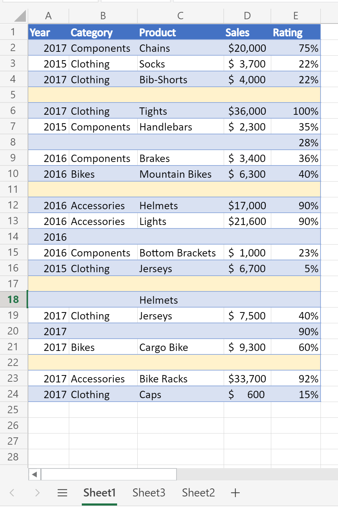
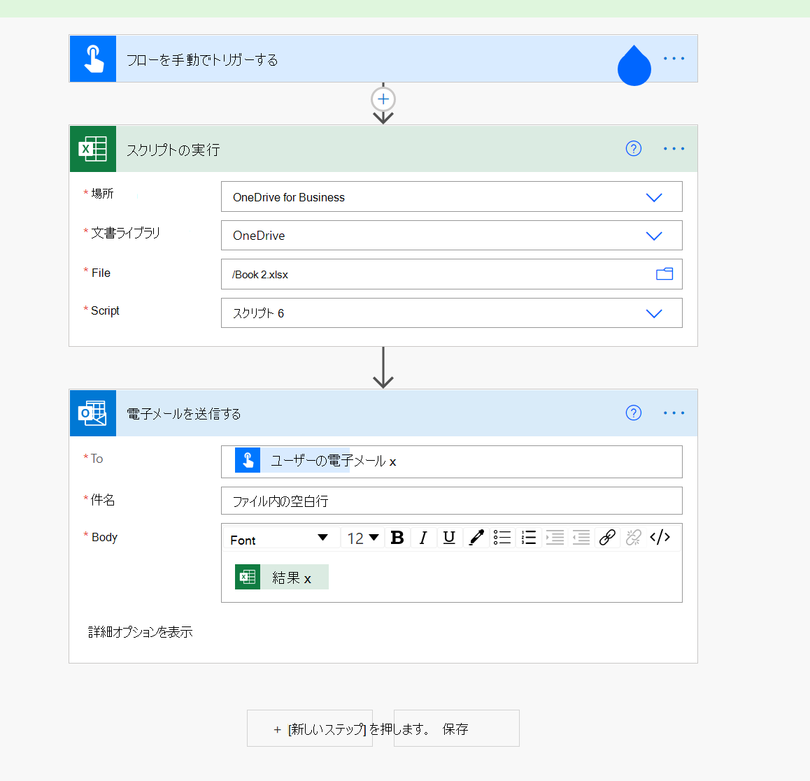

# <a name="count-blank-rows-on-sheets"></a>シートの空白行を数える

このプロジェクトには、次の 2 つのスクリプトが含まれています。

* [指定したシートの空白行を](#sample-code-count-blank-rows-on-a-given-sheet)数える: 指定したワークシートの使用範囲を走査し、空白の行数を返します。
* [すべてのシートで空白行](#sample-code-count-blank-rows-on-all-sheets)を数える : すべてのワークシートの使用範囲を走査し、空白の行数を返します。

> [!NOTE]
> スクリプトの場合、空白の行はデータがない任意の行です。 行には書式設定を指定できます。

_このシートは、4 つの空白行の数を返します_



_このシートは、0 行の数を返します (すべての行にいくつかのデータがあります)_


## <a name="sample-code-count-blank-rows-on-a-given-sheet"></a>サンプル コード: 特定のシートの空白行を数える

```TypeScript
function main(workbook: ExcelScript.Workbook): number
{
  const sheet = workbook.getWorksheet('Sheet1'); 
  // Getting the active worksheet is not suitable for a script used by Power Automate.
  // const sheet = workbook.getActiveWorksheet();
  
  const range = sheet.getUsedRange(true); // Get value only.
  if (!range) {
    console.log(`No data on this sheet. `);
    return;
  }
  console.log(`Used range for the worksheet: ${range.getAddress()}`);
  const values = range.getValues();
  let emptyRows = 0;
  for (let row of values) {
    let len = 0; 
    for (let cell of row) {
      len = len + cell.toString().length;
    }
    if (len === 0) { 
      emptyRows++;
    }
  }
  console.log(`Total empty row: ` + emptyRows);
  return emptyRows;
}
```

## <a name="sample-code-count-blank-rows-on-all-sheets"></a>サンプル コード: すべてのシートで空白行をカウントする

```TypeScript
function main(workbook: ExcelScript.Workbook): number
{
  const sheets = workbook.getWorksheets();
  let emptyRows = 0;
  for (let sheet of sheets) { 
    const range = sheet.getUsedRange(true); // Get value only.
    if (!range) {
      console.log(`No data on this sheet. `);
      continue;
    }
    console.log(`Used range for the worksheet ${sheet.getName()}: ${range.getAddress()}`);
    const values = range.getValues();

    for (let row of values) {
      let len = 0;
      for (let cell of row) {
        len = len + cell.toString().length;
      }
      if (len === 0) {
        emptyRows++;
      }
    }
  }
  console.log(`Total empty row: ` + emptyRows);
  return emptyRows;
}
```

## <a name="use-with-power-automate"></a>Power Automate での使用


