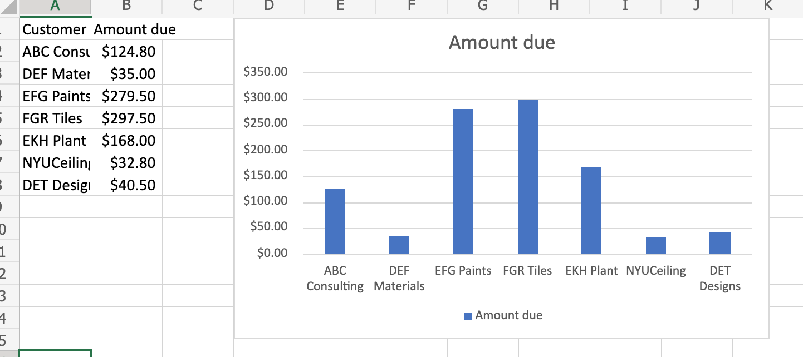
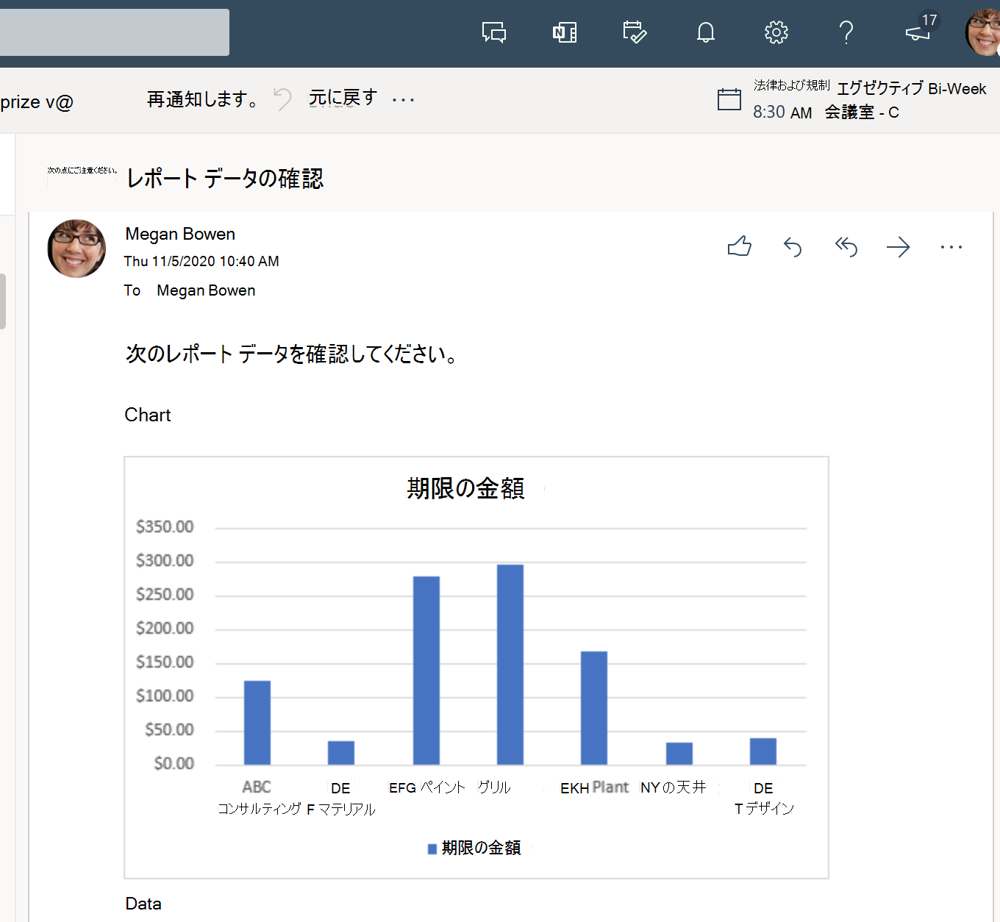

# <a name="use-office-scripts-and-power-automate-to-email-images-of-a-chart-and-table"></a>グラフOffice表の画像を電子メールで送信するには、スクリプトと Power Automate を使用します。

このサンプルでは、Officeスクリプトと Power Automate を使用してグラフを作成します。 次に、グラフとその基本テーブルの画像を電子メールで送信します。

## <a name="example-scenario"></a>シナリオ例

* 最新の結果を取得するために計算します。
* グラフを作成します。
* グラフと表の画像を取得します。
* Power Automate を使用して画像にメールを送信します。

_入力データ_


_出力グラフ_



_Power Automate フローを通じて受信された電子メール_



## <a name="solution"></a>ソリューション

このソリューションには、次の 2 つの部分があります。

1. [Excel Officeテーブルを計算して抽出するためのスクリプト](#sample-code-calculate-and-extract-excel-chart-and-table)
1. スクリプトを呼び出して結果を電子メールで送信する Power Automate フロー。 これを行う方法の例については、「Power Automat を使用して自動化された [ワークフローを作成する」を参照してください](../../tutorials/excel-power-automate-returns.md#create-an-automated-workflow-with-power-automate)。

## <a name="sample-code-calculate-and-extract-excel-chart-and-table"></a>サンプル コード: Excel グラフとテーブルを計算して抽出する

次のスクリプトは、Excel のグラフとテーブルを計算して抽出します。

サンプル ファイルをダウンロード <a href="email-chart-table.xlsx">email-chart-table.xlsx</a> このスクリプトで使用して、自分で試してみてください。

```TypeScript
function main(workbook: ExcelScript.Workbook): ReportImages {

  workbook.getApplication().calculate(ExcelScript.CalculationType.full);
  
  let sheet1 = workbook.getWorksheet("Sheet1");
  const table = workbook.getWorksheet('InvoiceAmounts').getTables()[0];
  const rows = table.getRange().getTexts();

  const selectColumns = rows.map((row) => {
    return [row[2], row[5]];
  });
  table.setShowTotals(true);
  selectColumns.splice(selectColumns.length-1, 1);
  console.log(selectColumns);

  workbook.getWorksheet('ChartSheet')?.delete();
  const chartSheet = workbook.addWorksheet('ChartSheet');
  const targetRange = updateRange(chartSheet, selectColumns);

  // Insert chart on sheet 'Sheet1'.
  let chart_2 = chartSheet.addChart(ExcelScript.ChartType.columnClustered, targetRange);
  chart_2.setPosition('D1');
  const chartImage = chart_2.getImage();
  const tableImage = table.getRange().getImage();
  return {
    chartImage,
    tableImage
  }
}

function updateRange(sheet: ExcelScript.Worksheet, data: string[][]): ExcelScript.Range {
  const targetRange = sheet.getRange('A1').getResizedRange(data.length-1, data[0].length-1);
  targetRange.setValues(data);
  return targetRange;
}

interface ReportImages {
  chartImage: string
  tableImage: string
}
```

## <a name="training-video-extract-and-email-images-of-chart-and-table"></a>トレーニング ビデオ: グラフとテーブルの画像を抽出して電子メールで送信する

[](https://youtu.be/152GJyqc-Kw "グラフとテーブルの画像を抽出して電子メールで送信する方法に関するステップバイステップのビデオ")
