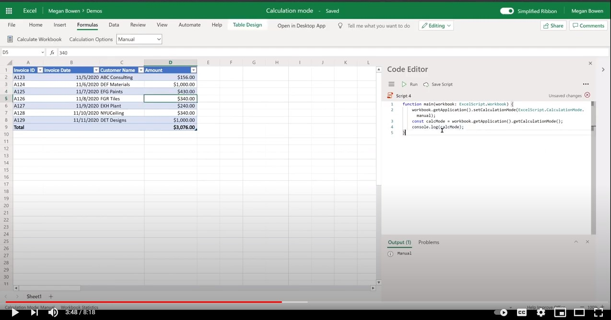

# <a name="manage-calculation-mode-in-excel"></a>Excel で計算モードを管理する

このサンプルでは、スクリプトを使用[](/javascript/api/office-scripts/excelscript/excelscript.calculationmode)して、計算モードを使用し、Web 上の Excel でメソッドOfficeします。 任意の Excel ファイルでスクリプトを試してみてください。

## <a name="scenario"></a>シナリオ

Web 上の Excel では、API を使用してファイルの計算モードをプログラムで制御できます。 次のアクションは、スクリプトを使用Officeできます。

1. 計算モードを取得します。
1. 計算モードを設定します。
1. 手動モード (再計算とも呼ばれます) に設定されているファイルの Excel 数式を計算します。

## <a name="sample-code-control-calculation-mode"></a>サンプル コード: コントロールの計算モード

```TypeScript
function main(workbook: ExcelScript.Workbook) {
    // Set calculation mode.
    workbook.getApplication().setCalculationMode(ExcelScript.CalculationMode.manual);
    // Get calculation mode.
    const calcMode = workbook.getApplication().getCalculationMode();    
    console.log(calcMode);
    // Calculate (for manual mode files).
    workbook.getApplication().calculate(ExcelScript.CalculationType.full);
}
```

## <a name="training-video-manage-calculation-mode"></a>トレーニング ビデオ: 計算モードの管理

[](https://youtu.be/iw6O8QH01CI "Web 上の Excel で計算モードを管理する方法に関するステップバイステップのビデオ")
