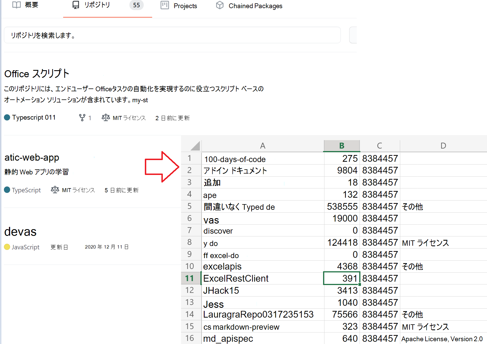

# <a name="use-external-fetch-calls-in-office-scripts"></a>Office スクリプトで外部取得呼び出しを使用する

このスクリプトは、ユーザーのリポジトリに関するGitHub取得します。 単純なシナリオでの使 `fetch` い方を示します。 使用または他の外部呼び出しの詳細については、「外部 API 呼び出しのサポート」を参照 `fetch` [Officeしてください。](../../develop/external-calls.md)

使用されている GItHub API の詳細については、「API リファレンス[」GitHub参照してください](https://docs.github.com/rest/reference/repos#list-repositories-for-a-user)。 Web ブラウザーにアクセスして、生の API 呼び出しの出力を確認することもできます ({USERNAME} プレースホルダーをユーザー ID に置き `https://api.github.com/users/{USERNAME}/repos` 換GitHubしてください)。



## <a name="sample-code-get-basic-information-about-users-github-repositories"></a>サンプル コード: ユーザーのリポジトリに関するGitHub取得する

```TypeScript
async function main(workbook: ExcelScript.Workbook) {
  // Call the GitHub REST API.
  // Replace the {USERNAME} placeholder with your GitHub username.
  const response = await fetch('https://api.github.com/users/{USERNAME}/repos');
  const repos: Repository[] = await response.json();
  
  // Create an array to hold the returned values.
  const rows: (string | boolean | number)[][] = [];

  // Convert each repository block into a row.
  for (let repo of repos){ 
    rows.push([repo.id, repo.name, repo.license?.name, repo.license?.url])
  }

  // Add the data to the current worksheet, starting at "A2".
  const sheet = workbook.getActiveWorksheet();
  const range = sheet.getRange('A2').getResizedRange(rows.length - 1, rows[0].length - 1);
  range.setValues(rows);
}

// An interface matching the returned JSON for a GitHub repository.
interface Repository {
  name: string,
  id: string,
  license?: License 
}

// An interface matching the returned JSON for a GitHub repo license.
interface License {
  name: string,
  url: string
}
```

## <a name="training-video-how-to-make-external-api-calls"></a>トレーニング ビデオ: 外部 API 呼び出しを行う方法

[Sudhi Ramamurthy が YouTube でこのサンプルを歩くのを見る](https://youtu.be/fulP29J418E).
