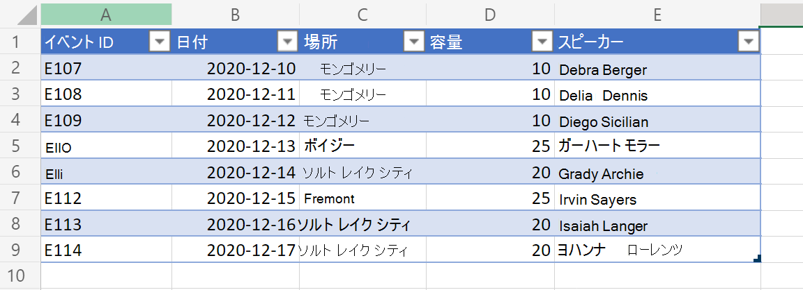
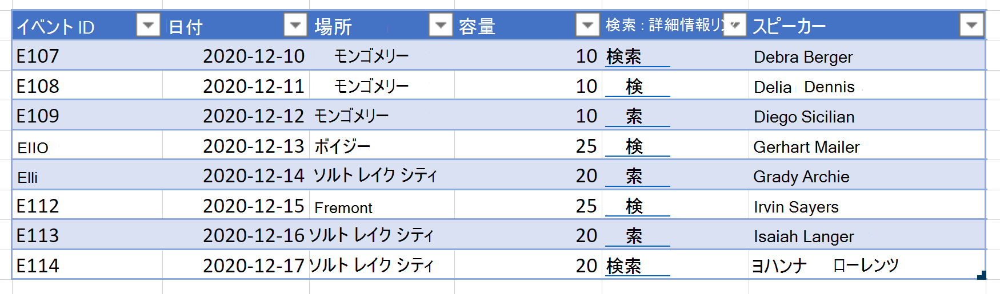

# <a name="output-excel-table-data-as-json-for-usage-in-power-automate"></a>Power Automate で使用するための JSON として Excel テーブル データを出力する

Excel テーブル データは、JSON 形式のオブジェクトの配列として表されます。 各オブジェクトは、テーブル内の行を表します。 これにより、ユーザーに表示される一貫性のある形式で Excel からデータを抽出できます。 その後、Power Automate フローを使用して他のシステムにデータを与えできます。

_入力テーブル のデータ_



このサンプルのバリエーションには、表の列の 1 つにもハイパーリンクが含まれています。 これにより、追加レベルのセル データを JSON に表示できます。

_ハイパーリンクを含む入力テーブル データ_



_ハイパーリンクを編集するダイアログ_


## <a name="sample-excel-file"></a>サンプル Excel ファイル

これらのサンプルで <a href="table-data-with-hyperlinks.xlsx">table-data-with-hyperlinks.xlsx</a> ファイルをダウンロードして、自分で試してみてください。

## <a name="sample-code-return-table-data-as-json"></a>サンプル コード: JSON としてテーブル データを返す

> [!NOTE]
> テーブル列に一致 `interface TableData` する構造を変更できます。 スペースを含む列名の場合は、サンプルに含まれているなど、キーを二重引用符で囲んでください `"Event ID"` 。

```TypeScript
function main(workbook: ExcelScript.Workbook): TableData[] {
  const table = workbook.getWorksheet('PlainTable').getTables()[0];
  // If you know the table name, you can also do the following:
  // const table = workbook.getTable('Table13436');
  const texts = table.getRange().getTexts();
  let returnObjects: TableData[] = [];
  if (table.getRowCount() > 0)  {
    returnObjects = returnObjectFromValues(texts);
  } 
  console.log(JSON.stringify(returnObjects));  
  return returnObjects
}

function returnObjectFromValues(values: string[][]): TableData[] {
  let objArray = [];
  let objKeys: string[] = [];
  for (let i = 0; i < values.length; i++) {
    if (i === 0) {
      objKeys = values[i]
      continue;
    }
    let obj = {}
    for (let j = 0; j < values[i].length; j++) {
      obj[objKeys[j]] = values[i][j]
    }
    objArray.push(obj);
  }
  return objArray as TableData[];
}

interface BasicObj {
  [key: string]: string
}

interface TableData {
  "Event ID": string
  Date: string
  Location: string
  Capacity: string
  Speakers: string
}
```

### <a name="sample-output"></a>サンプル出力

```json
[{
    "Event ID": "E107",
    "Date": "2020-12-10",
    "Location": "Montgomery",
    "Capacity": "10",
    "Speakers": "Debra Berger"
}, {
    "Event ID": "E108",
    "Date": "2020-12-11",
    "Location": "Montgomery",
    "Capacity": "10",
    "Speakers": "Delia Dennis"
}, {
    "Event ID": "E109",
    "Date": "2020-12-12",
    "Location": "Montgomery",
    "Capacity": "10",
    "Speakers": "Diego Siciliani"
}, {
    "Event ID": "E110",
    "Date": "2020-12-13",
    "Location": "Boise",
    "Capacity": "25",
    "Speakers": "Gerhart Moller"
}, {
    "Event ID": "E111",
    "Date": "2020-12-14",
    "Location": "Salt Lake City",
    "Capacity": "20",
    "Speakers": "Grady Archie"
}, {
    "Event ID": "E112",
    "Date": "2020-12-15",
    "Location": "Fremont",
    "Capacity": "25",
    "Speakers": "Irvin Sayers"
}, {
    "Event ID": "E113",
    "Date": "2020-12-16",
    "Location": "Salt Lake City",
    "Capacity": "20",
    "Speakers": "Isaiah Langer"
}, {
    "Event ID": "E114",
    "Date": "2020-12-17",
    "Location": "Salt Lake City",
    "Capacity": "20",
    "Speakers": "Johanna Lorenz"
}]
```

## <a name="sample-code-return-table-data-as-json-with-hyperlink-text"></a>サンプル コード: ハイパーリンク テキストを含む JSON としてテーブル データを返す

> [!NOTE]
> スクリプトは常に、テーブルの 4 列目 (インデックス 0) からハイパーリンクを抽出します。 コメントの下のコードを変更することで、その順序を変更したり、複数の列をハイパーリンク データとして含めすることができます。 `// For the 4th column (0 index), extract the hyperlink and use that instead of text.`

```TypeScript
function main(workbook: ExcelScript.Workbook): TableData[] {
  const table = workbook.getWorksheet('WithHyperLink').getTables()[0];
  const range = table.getRange();
  // If you know the table name, you can also do the following:
  // const table = workbook.getTable('Table13436');
  const texts = table.getRange().getTexts();
  let returnObjects: TableData[] = [];
  if (table.getRowCount() > 0)  {
    returnObjects = returnObjectFromValues(texts, range);
  } 
  console.log(JSON.stringify(returnObjects));  
  return returnObjects
}

function returnObjectFromValues(values: string[][], range: ExcelScript.Range): TableData[] {
  let objArray = [];
  let objKeys: string[] = [];
  for (let i = 0; i < values.length; i++) {
    if (i === 0) {
      objKeys = values[i]
      continue;
    }
    let obj = {}
    for (let j = 0; j < values[i].length; j++) {
      // For the 4th column (0 index), extract the hyperlink and use that instead of text. 
      if (j === 4) {
        obj[objKeys[j]] = range.getCell(i, j).getHyperlink().address;
      } else {
        obj[objKeys[j]] = values[i][j];
      }
    }
    objArray.push(obj);
  }
  return objArray as TableData[];
}

interface BasicObj {
  [key: string]: string
}

interface TableData {
  "Event ID": string
  Date: string
  Location: string
  Capacity: string
  "Search link": string
  Speakers: string
}
```

### <a name="sample-output"></a>サンプル出力

```json
[{
    "Event ID": "E107",
    "Date": "2020-12-10",
    "Location": "Montgomery",
    "Capacity": "10",
    "Search link": "https://www.google.com/search?q=Montgomery",
    "Speakers": "Debra Berger"
}, {
    "Event ID": "E108",
    "Date": "2020-12-11",
    "Location": "Montgomery",
    "Capacity": "10",
    "Search link": "https://www.google.com/search?q=Montgomery",
    "Speakers": "Delia Dennis"
}, {
    "Event ID": "E109",
    "Date": "2020-12-12",
    "Location": "Montgomery",
    "Capacity": "10",
    "Search link": "https://www.google.com/search?q=Montgomery",
    "Speakers": "Diego Siciliani"
}, {
    "Event ID": "E110",
    "Date": "2020-12-13",
    "Location": "Boise",
    "Capacity": "25",
    "Search link": "https://www.google.com/search?q=Boise",
    "Speakers": "Gerhart Moller"
}, {
    "Event ID": "E111",
    "Date": "2020-12-14",
    "Location": "Salt Lake City",
    "Capacity": "20",
    "Search link": "https://www.google.com/search?q=salt+lake+city",
    "Speakers": "Grady Archie"
}, {
    "Event ID": "E112",
    "Date": "2020-12-15",
    "Location": "Fremont",
    "Capacity": "25",
    "Search link": "https://www.google.com/search?q=Fremont",
    "Speakers": "Irvin Sayers"
}, {
    "Event ID": "E113",
    "Date": "2020-12-16",
    "Location": "Salt Lake City",
    "Capacity": "20",
    "Search link": "https://www.google.com/search?q=salt+lake+city",
    "Speakers": "Isaiah Langer"
}, {
    "Event ID": "E114",
    "Date": "2020-12-17",
    "Location": "Salt Lake City",
    "Capacity": "20",
    "Search link": "https://www.google.com/search?q=salt+lake+city",
    "Speakers": "Johanna Lorenz"
}]
```

## <a name="use-in-power-automate"></a>Power Automate での使用

Power Automate でこのようなスクリプトを使用する方法については、「Power Automate を使用して自動化されたワークフローを作成する [」を参照してください](../../tutorials/excel-power-automate-returns.md#create-an-automated-workflow-with-power-automate)。
