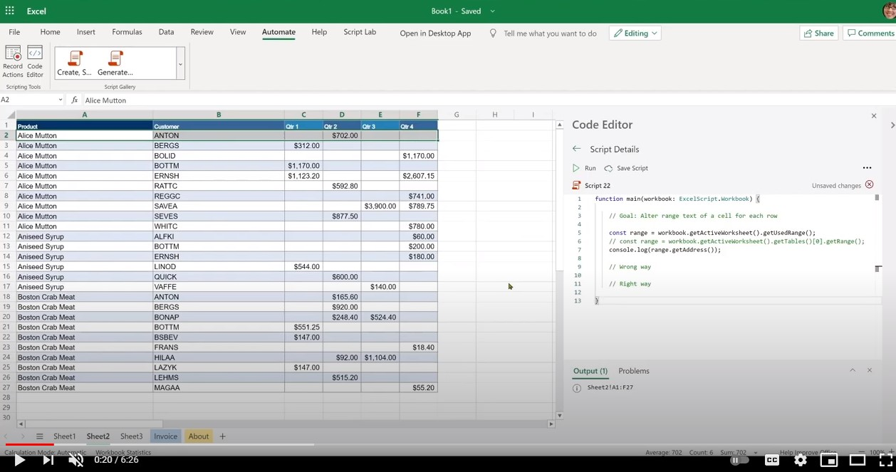

# <a name="getting-started"></a>はじめに

このセクションでは、アクセス、環境、スクリプトの基本Office、いくつかの基本的なスクリプト パターンなど、さまざまなスクリプトの基本について説明します。

## <a name="environment-setup"></a>環境のセットアップ

アクセス、環境、スクリプト エディターの基本について説明します。

[](https://youtu.be/vvCtxsjPxo8 "スクリプト アプリケーションOffice基本")

### <a name="access"></a>Access

Officeでは、[設定] [組織の設定] および [スクリプト]の下にある Microsoft 365 管理者が使用できる管理者Office  >    >  **必要があります**。 既定では、すべてのユーザーに対して有効になっています。 2 つのサブ設定があります。管理者はオンとオフを切り替えます。

* 組織内でスクリプトを共有する機能
* Power Automate でスクリプトを使用する機能

Office スクリプトにアクセスできる場合は、Web (ブラウザー) で Excel でファイルを開き、[自動化] タブが Excel リボンに表示されるのかを確認します。
[自動化] タブが表示できない **場合は、[** このトラブルシューティング [] セクションを確認してください](../../testing/troubleshooting.md#automate-tab-not-appearing-or-office-scripts-unavailable)。

### <a name="availability"></a>可用性

Officeは、Excel on the web for Enterprise E3+ ライセンスでのみ使用できます (コンシューマー アカウントと E1 アカウントはサポートされていません)。 Officeスクリプトは、Windows と Mac の Excel ではまだサポートされていません。

### <a name="scripts-and-editor"></a>スクリプトとエディター

コード エディターは、Web 上の Excel (オンライン バージョン) に組み込み可能です。 コードや Sublime など、Visual Studioを使用した場合、この編集エクスペリエンスは非常に似ています。
コード エディターで使用Visual Studioのショートカット キーの大部分は、Office編集エクスペリエンスでも機能します。 次のショートカット キーの資料をご覧ください。

* [macOS](https://code.visualstudio.com/shortcuts/keyboard-shortcuts-macos.pdf)
* [Windows](https://code.visualstudio.com/shortcuts/keyboard-shortcuts-windows.pdf)

#### <a name="key-things-to-note"></a>重要な注意点

* Officeスクリプトは、OneDrive for Business、SharePoint サイト、およびチーム サイトに保存されているファイルでのみ使用できます。
* エディターには、スクリプトの拡張機能は表示されます。 実際には、これらは TypeScript ファイルですが、カスタム拡張機能と一緒に格納されます `.osts` 。
* スクリプトは、独自の OneDrive for Business フォルダーに格納されます `My Files/Documents/OfficeScripts` 。 このフォルダーを管理する必要はもうない。 エディターが表示/編集エクスペリエンスを管理する場合は、この側面を無視できます。
* スクリプトは Excel ファイルの一部として保存されません。 これらは個別に格納されます。
* スクリプトは Excel ファイルと共有できます。これは、実際にはスクリプトをファイルにリンクし、添付しないという意味です。 Excel ファイルにアクセスできるユーザーは、スクリプトを表示、**実行**、またはコピーすることもできます。 これは VBA マクロと比較して重要な違いです。
* スクリプトを共有しない限り、他の誰も自分のライブラリに存在するスクリプトにアクセスできません。
* スクリプトは、ローカル ディスクまたはカスタム クラウドの場所からリンクできません。 Officeスクリプトは、定義済みの場所 (上記の OneDrive フォルダー) または共有スクリプト上にあるスクリプトのみを認識して実行します。
* 編集中、ファイルはブラウザーに一時的に保存されますが、Excel ウィンドウを閉じる前にスクリプトを保存して OneDrive の場所に保存する必要があります。 編集後にファイルを保存することを忘れないでください。

## <a name="gentle-introduction-to-scripting"></a>スクリプトの優しい概要

Officeスクリプトは、選択した Excel ブックに対してオートメーションを実行する手順を含む、TypeScript 言語で記述されたスタンドアロン スクリプトです。 すべてのオートメーション命令はスクリプト内に自己格納され、スクリプトは他のスクリプトを呼び出したり呼び出したりできません。 すべてのスクリプトはスタンドアロン ファイルに格納され、ユーザーの OneDrive フォルダーに保存されます。 新しいスクリプトを記録したり、記録されたスクリプトを編集したり、新しいスクリプトを最初から書き込むなど、すべて組み込みのエディター インターフェイス内で実行できます。 スクリプトの最Officeは、ユーザーからのセットアップが不要な場合です。 外部ライブラリ、Web ページ、UI 要素、セットアップなどはありません。すべての環境セットアップは、Officeスクリプトによって処理され、簡単な API インターフェイスを介してオートメーションに簡単かつ迅速にアクセスできます。

スクリプトを編集して移動する方法を理解するために役立つ基本的な概念には、次のようなものがあります。

* 基本的な TypeScript 言語の構文
* 関数と `main` 引数の理解
* オブジェクトと階層、メソッド、プロパティ
* コレクション (配列): ナビゲーションと操作
* 型の定義
* 環境: レコード/編集、実行、結果の確認、共有

このビデオとセクションでは、これらの概念について詳しく説明します。

[](https://youtu.be/8Zsrc1uaiiU "スクリプトの基本")

### <a name="language-typescript"></a>言語: TypeScript

[Officeスクリプト](../../index.md) は、静的な型定義を追加して JavaScript (世界で最も使用されている言語の 1 つ) 上に構築するオープン ソース言語である [TypeScript](https://www.typescriptlang.org/)言語を使用して記述されます。 Web サイトが言うように、オブジェクトの図形を記述し、より良いドキュメントを提供し、TypeScript がコードが正しく動作することを検証する方法 `Types` を提供します。

言語構文自体は、JavaScript を使用して記述され [、TypeScript](https://developer.mozilla.org/docs/Web/JavaScript) の規則を使用してスクリプトで定義された追加のタイピングが含まれます。 ほとんどの場合、JavaScript で記述Officeスクリプトを考える必要があります。 スクリプトの使用を開始するには、JavaScript 言語の基本を理解Office必要です。オートメーションの旅を始めるには、熟練している必要はありません。 Officeスクリプトのアクション レコーダーを使用すると、コード コメントが含まれているため、スクリプト ステートメントを理解できます。

Officeスクリプトを Excel と対話できるスクリプト API は、コーディングの背景があまりないエンド ユーザー向けです。 API は同期的に呼び出すことができるので、約束やコールバックなどの高度なトピックを知る必要がなされません。 Office API の設計では、次の機能が提供されます。

* メソッド、getters/setters を持つ単純なオブジェクト モデル。
* 通常の配列として簡単にアクセスできるオブジェクト コレクション。
* 単純なエラー処理オプション。
* ユーザーが目の前のシナリオに集中するのを助ける、選択したシナリオのパフォーマンスを最適化しました。

### <a name="main-function-the-scripts-starting-point"></a>`main` 関数: スクリプトの開始点

Officeスクリプトの実行は関数から始 `main` まります。 スクリプトは、型、インターフェイス、変数などの宣言と共に 1 つ以上の関数を含む 1 つのファイルです。スクリプトに沿って実行するには、スクリプトを実行するときに Excel が常に関数を呼び出すので、関数 `main` `main` から始まります。 関数には常に、スクリプトが実行されている現在のブックを識別する変数名である、という名前の引数 (またはパラメーター) が少なくとも `main` `workbook` 1 つ含まれます。 Power Automate (オフライン) 実行を使用して、使用法の追加の引数を定義できます。

* `function main(workbook: ExcelScript.Workbook)`

スクリプトを小さな関数に整理して、コードの再利用性、明快さなどを支援できます。その他の関数は、メイン関数の内側または外側にできますが、常に同じファイルに含まれています。 スクリプトは自己格納型であり、同じファイルで定義されている関数のみを使用できます。 スクリプトは、別のスクリプトを呼び出Officeできません。

したがって、要約すると次の作業が行います。

* 関数 `main` は、任意のスクリプトのエントリ ポイントです。 関数が実行されると、Excel アプリケーションはブックを最初のパラメーターとして指定して、このメイン関数を呼び出します。
* 最初の引数とその型宣言は、表示 `workbook` された状態で保持することが重要です。 関数に新しい引数を追加できますが (次のセクションを参照)、最初の引数は変更 `main` しません。

:::image type="content" source="../../images/getting-started-main-introduction.png" alt-text="主な関数は、スクリプトのエントリ ポイントです。":::

#### <a name="send-or-receive-data-from-other-apps"></a>他のアプリからのデータの送受信

Power Automate でスクリプトを実行すると、Excel を組織の他の部分 [に接続できます](https://flow.microsoft.com)。 Power Automate フローで [スクリプトOffice実行する方法について詳しくは、次のリンクを参照してください](../../develop/power-automate-integration.md)。

Excel と Excel の間でデータを受信または送信する方法は、関数を介 `main` して行います。 これは、受信データと送信データをスクリプトで記述および使用できる情報ゲートウェイと考えてください。 データ型を使用して、スクリプトの外部からデータを受け取り、TypeScript で認識されるデータ (、など) を返したり、スクリプトで定義したインターフェイスの形式のオブジェクトを `string` `string` `number` `boolean` 返したりできます。

:::image type="content" source="../../images/getting-started-data-in-out.png" alt-text="スクリプトの入力と出力":::

#### <a name="use-functions-to-organize-and-reuse-code"></a>関数を使用してコードを整理および再利用する

関数を使用して、スクリプト内でコードを整理および再利用できます。

:::image type="content" source="../../images/getting-started-use-functions.png" alt-text="スクリプトでの関数の使用":::

### <a name="objects-hierarchy-methods-properties-collections"></a>オブジェクト、階層、メソッド、プロパティ、コレクション

Excel のすべてのオブジェクト モデルは、タイプのブック オブジェクトから始まるオブジェクトの階層構造で定義されます `ExcelScript.Workbook` 。 オブジェクトには、メソッド、プロパティ、そのオブジェクト内の他のオブジェクトを含めることができます。 オブジェクトは、メソッドを使用して互いにリンクされます。 オブジェクトのメソッドは、別のオブジェクトまたはオブジェクトのコレクションを返す場合があります。 コード エディターのコード エディターのIntelliSense (コード補完) 機能を使用すると、オブジェクト階層を探索できます。 公式のリファレンス ドキュメント サイト [を使用](/javascript/api/office-scripts/overview) して、オブジェクト間の関係をフォローすることもできます。

オブジェクト [は](https://developer.mozilla.org/docs/Web/JavaScript/Reference/Global_Objects/Object) プロパティのコレクションであり、プロパティは名前 (またはキー) と値の関連付けです。 プロパティの値には関数を指定できます。その場合、プロパティはメソッドと呼ばれる場合があります。 Office Scripts オブジェクト モデルの場合、オブジェクトは、グラフ、ハイパーリンク、ピボット テーブルなど、ユーザーが操作する Excel ファイル内の物を表します。また、ワークシートの保護属性などのオブジェクトの動作を表す場合があります。

TypeScript オブジェクトとプロパティとメソッドのトピックは非常に深いです。 スクリプトを使い始めて生産性を高めるには、次の基本的なことを覚えておく必要があります。

* オブジェクトとプロパティの両方にアクセスするには、(ドット) 表記を使用し、オブジェクトは左側に、プロパティまたはメソッドは `.` `.` 右側に表示されます。 例: `hyperlink.address` , `range.getAddress()` .
* プロパティは、実際にはスカラー (文字列、ブール値、数値) です。 たとえば、ブックの名前、ワークシートの位置、テーブルにフッターがあるかどうかの値を指定します。
* メソッドは、オープンクローズかっこを使用して "呼び出された" または "実行" されます。 例: `table.delete()`。 場合によっては、開いているかっこの間に引数を含めて関数に渡される場合があります `range.setValue('Hello')` 。 多くの引数を関数に渡し (コントラクト/署名で定義)、それらを分離するには、 `,` を使用します。  例: `worksheet.addTable('A1:D6', true)`。 文字列、数値、ブール値、その他のオブジェクトなど、メソッドで必要に応じて任意の型の引数を渡す (たとえば、スクリプト内の他の場所に作成されたオブジェクト)。 `worksheet.addTable(targetRange, true)` `targetRange`
* メソッドは、スカラー プロパティ (名前、アドレスなど) や別のオブジェクト (範囲、グラフ) などのオブジェクトを返したり、何も返しません (メソッドの場合など `delete` )。 変数を宣言するか、既存の変数に割り当てると、メソッドが返す値を受け取る。 次のようなステートメントの左側に表示されます `const table = worksheet.addTable('A1:D6', true)` 。
* ほとんどの場合、スクリプト オブジェクト モデルOfficeは、Excel オブジェクト モデルのさまざまな部分をリンクするメソッドを持つオブジェクトで構成されます。 ごくまれに、スカラー値またはオブジェクト値のプロパティに出くることはめったに起こりません。
* スクリプトOffice Excel オブジェクト モデル メソッドには、開いているかっこを含む必要があります。 メソッドを指定せずにメソッドを使用する (変数へのメソッドの割り当てなど) は許可されません。

オブジェクトのいくつかのメソッドを見 `workbook` てみよ。

```TypeScript
function main(workbook: ExcelScript.Workbook) {
    // Return a boolean (true or false) setting of whether the workbook is set to auto-save or not. 
    const autoSave = workbook.getAutoSave(); 
    // Get workbook name.
    const name = workbook.getName();
    // Get active cell range object.
    const cell = workbook.getActiveCell();
    // Get table named SALES.
    const cell = workbook.getTable('SALES');
    // Get all slicer objects.
    const slicers = workbook.getSlicers();
}
```

この例では次のようになっています。

* スカラー プロパティ (文字列、数値、ブール型) などのオブジェクトの `workbook` `getAutoSave()` `getName()` メソッド。
* 別のオブジェクトを `getActiveCell()` 返すなどのメソッド。
* メソッド `getTable()` は引数 (この場合はテーブル名) を受け取り、ブック内の特定のテーブルを返します。
* このメソッドは、ブック内のすべてのスライサー オブジェクトの配列 (多くの場所をコレクションと呼ばれます `getSlicers()` ) を返します。

これらのメソッドのすべてがプレフィックスを持っています。これは、Office Scripts オブジェクト モデルでメソッドが何かを返すという規則にすら従 `get` います。 これらは一般的に 'getters' とも呼ばれます。

次の例では、他に 2 種類のメソッドが表示されます。

```TypeScript
function main(workbook: ExcelScript.Workbook) {
    // Get a worksheet named 'Sheet1.
    const sheet = workbook.getWorksheet('Sheet1'); 
    // Set name to SALES.
    sheet.setName('SALES');
    // Position the worksheet at the beginning.
    sheet.setPosition(0);
}
```

この例では次のようになっています。

* メソッド `setName()` は、ワークシートに新しい名前を設定します。 `setPosition()` 位置を最初のセルに設定します。
* このようなメソッドは、ブックのプロパティまたは動作を設定して Excel ファイルを変更します。 これらのメソッドは 'setters' と呼ばれる。
* 通常、'setters' にはコンパニオン 'getter' が含め、どちらもメソッド `worksheet.getPosition` `worksheet.setPosition` です。

#### <a name="undefined-and-null-primitive-types"></a>`undefined` プリミティブ `null` 型

以下に注意する必要がある 2 つのプリミティブ データ型を示します。

1. この値 [`null`](https://developer.mozilla.org/docs/Web/JavaScript/Reference/Global_Objects/null) は、オブジェクト値が意図的に存在しなかっている場合を表します。 これは JavaScript のプリミティブ値の 1 つであり、変数に値が含めないかどうかを示すために使用されます。
1. 値が割り当てられていない変数は型です [`undefined`](https://developer.mozilla.org/docs/Web/JavaScript/Reference/Global_Objects/undefined) 。 評価対象の変数に割り当てられた値が含られていない場合は、メソッドまたはステートメント `undefined` を返す場合があります。

これら 2 つの種類は、エラー処理の一部としてトリミングされ、適切に処理されないと、かなり頭痛の種になる可能性があります。 幸いなことに、TypeScript/JavaScript は、変数が型または `undefined` `null` . これらのチェックの一部については、エラー処理など、後のセクションで説明します。

#### <a name="method-chaining"></a>メソッドチェーン

ドット表記を使用すると、メソッドから返されるオブジェクトを接続してコードを短縮できます。 この手法を使用すると、コードの読み取りと管理が容易な場合があります。 ただし、注意する必要がある点は少ない。 次の例を見てみよ。

次のコードは、アクティブ セルと次のセルを取得し、値を設定します。 これは、このコードがすべての時間で成功するためにチェーンを使用する良い候補です。

```TypeScript
function main(workbook: ExcelScript.Workbook) {
    workbook.getActiveCell().getOffsetRange(0,1).setValue('Next cell');
}
```

ただし、次のコード **(SALES** という名前のテーブルを取得し、そのバンド列スタイルをオンにする) に問題があります。

```TypeScript
function main(workbook: ExcelScript.Workbook) {
  workbook.getTable('SALES').setShowBandedColumns(true);
}
```

SALES テーブル **が** 存在しない場合は、 (SALES などのテーブルが存在しないことを示す JavaScript 型) を返すので、スクリプトはエラー (次に示す) で `getTable('SALES')` `undefined` 失敗 **します**。 on メソッドの呼び出しは意味がありません。つまり、スクリプト `setShowBandedColumns` `undefined` `undefined.setShowBandedColumns(true)` はエラーで終了します。

```text
Line 2: Cannot read property 'setShowBandedColumns' of undefined
```

この条件を処理[](https://developer.mozilla.org/docs/Web/JavaScript/Reference/Operators/Optional_chaining)するには、接続されたオブジェクトを介して値にアクセスする方法を提供するオプションのチェーン演算子を使用できます。参照またはメソッドが存在する可能性がある場合、または `undefined` (JavaScript の割り当てられていないオブジェクトまたは存在しないオブジェクトまたは結果を示す JavaScript の方法です)。 `null`

```TypeScript
function main(workbook: ExcelScript.Workbook) {
    // This line will not fail as the setShowBandedColumns method is executed only if the SALES table is present.
    workbook.getTable('SALES')?.setShowBandedColumns(true); 
}
```

メソッドによって返される存在しないオブジェクトの条件や型を処理する場合は、メソッドから戻り値を割り当て、それを個別に `undefined` 処理する方が良いです。

```TypeScript
function main(workbook: ExcelScript.Workbook) {
    const salesTable = workbook.getTable('SALES');
    if (salesTable) {
        salesTable.setShowBandedColumns(true);
    } else { 
        // Handle this condition.
    }
}
```

#### <a name="get-object-reference"></a>オブジェクト参照の取得

オブジェクト `workbook` は関数内でユーザーに与 `main` えられる。 オブジェクトの使用を開始し `workbook` 、そのメソッドに直接アクセスできます。

```TypeScript
function main(workbook: ExcelScript.Workbook) {
    // Get workbook name.
    const name = workbook.getName();
    // Display name to console.
    console.log(name);
}
```

ブック内の他のすべてのオブジェクトを使用する場合は、オブジェクトから始まり、探しているオブジェクトに移動するまで階層を `workbook` 下に移動します。 オブジェクト参照を取得するには、メソッドを使用してオブジェクトをフェッチするか、次に示すようにオブジェクトのコレクション `get` を取得します。

```TypeScript
function main(workbook: ExcelScript.Workbook) {
    // Get the active worksheet.
    const sheet = workbook.getActiveWorksheet();
    // Fetch using an ID or key.
    const sheet = workbook.getWorksheet('SomeSheetName');
    // Invoke methods on the object.
    sheet.setPosition(0); 
    
    // Get collection of methods.
    const tables = sheet.getTables();
    console.log('Total tables in this sheet: ' + tables.length);
}
```

#### <a name="check-if-an-object-exists-then-delete-and-add"></a>オブジェクトが存在するかどうかを確認し、削除して追加する

定義済みの名前でオブジェクトを作成する場合は、常に存在する類似のオブジェクトを削除してから追加する方が良いです。 これを行うには、次のパターンを使用します。

```TypeScript
function main(workbook: ExcelScript.Workbook) {
  // Name of the worksheet to be added. 
  let name = "Index";
  // Check if the worksheet already exists. If not, add the worksheet.
  let sheet = workbook.getWorksheet('Index');
  if (sheet) {
    console.log(`Worksheet by the name ${name} already exists. Deleting it.`);
    // Call the delete method on the object to remove it. 
    sheet.delete();
  } 
    // Add a blank worksheet. 
  console.log(`Adding the worksheet named  ${name}.`)
  const indexSheet = workbook.addWorksheet("Index");
}

```

または、存在する可能性があるオブジェクトまたは存在しない可能性があるオブジェクトを削除するには、次のパターンを使用します。

```TypeScript
    // The ? preceding delete() will ensure that the API is only invoked if the object exists. 
    workbook.getWorksheet('Index')?.delete(); 
```

#### <a name="note-about-adding-an-object"></a>オブジェクトの追加に関する注意

スライサー、ピボット テーブル、ワークシートなどのオブジェクトを作成、挿入、または追加するには、対応するメソッド **add_Object_します。** このようなメソッドは、親オブジェクトで使用できます。 たとえば、メソッドは `addChart()` オブジェクトで使用 `worksheet` できます。 add_Object_ **メソッド** は、作成するオブジェクトを返します。 返された値を受け取り、後でスクリプトで使用します。

```TypeScript
function main(workbook: ExcelScript.Workbook) {
  // Add object and get a reference to it. 
  const indexSheet = workbook.addWorksheet("Index");
  // Use it elsewhere in the script 
  console.log(indexSheet.getPosition());
}

```

または、存在する可能性があるオブジェクトまたは存在しない可能性があるオブジェクトを削除するには、次のパターンを使用します。

```TypeScript
    workbook.getWorksheet('Index')?.delete(); // The ? preceding delete() will ensure that the API is only invoked if the object exists. 
```

#### <a name="collections"></a>コレクション

コレクションは、テーブル、グラフ、列などのオブジェクトで、配列として取得し、処理のために反復処理できます。 対応するメソッドを使用してコレクションを取得し、次のような多くの TypeScript 配列トラバーサル手法のいずれかを使用して、ループ内のデータを `get` 処理できます。

* [`for` または `while`](https://developer.mozilla.org/docs/Web/JavaScript/Guide/Loops_and_iteration)
* [`for..of`](https://developer.mozilla.org/docs/Web/JavaScript/Reference/Statements/for...of)
* [`forEach`](https://developer.mozilla.org/docs/Web/JavaScript/Reference/Global_Objects/Array/forEach)

* [配列の言語の基本](https://developer.mozilla.org//docs/Learn/JavaScript/First_steps/Arrays)

このスクリプトは、スクリプト API でサポートされているコレクションを使用Office示します。 ファイル内の各ワークシート タブにランダムな色を設定します。

```TypeScript
function main(workbook: ExcelScript.Workbook) {

  // Get all sheets as a collection.
  const sheets = workbook.getWorksheets();
  const names = sheets.map ((sheet) => sheet.getName());
  console.log(names);
  console.log(`Total worksheets inside of this workbook: ${sheets.length}`);
  // Get information from specific sheets within the collection.
  console.log(`First sheet name is: ${names[0]}`);
  if (sheets.length > 1) {
    console.log(`Last sheet's Id is: ${sheets[sheets.length -1].getId()}`);
  }
  // Color each worksheet with random color.
  for (const sheet of sheets) {
    sheet.setTabColor(`#${Math.random().toString(16).substr(-6)}`);
  }
}
```

## <a name="type-declarations"></a>型宣言

型宣言は、ユーザーが扱う変数の種類を理解するのに役立ちます。 メソッドの自動補完に役立ち、開発時間の品質チェックを支援します。

スクリプト内の型宣言は、関数宣言、変数宣言、定義の定義など、さまざまなIntelliSense検索できます。

例:

* `function main(workbook: ExcelScript.Workbook)`
* `let myRange: ExcelScript.Range;`
* `function getMaxAmount(range: ExcelScript.Range): number`

通常は異なる色で明確に表示されるので、コード エディターで型を簡単に識別できます。 通常、コロン `:` は型宣言の前に表示されます。  

TypeScript では、追加のコードを記述せずに大きな力を得る可能性がある型推論を使用することで、書き込み型を省略できます。 ほとんどの場合、TypeScript 言語は変数の種類を確認するのが優れた方法です。 ただし、特定の場合、Officeスクリプトでは、言語が型を明確に識別できない場合は、型宣言を明示的に定義する必要があります。 また、スクリプトでは明示的 `any` または暗黙的Officeされません。 その詳細については、後で説明します。

### <a name="excelscript-types"></a>`ExcelScript` 型

[Officeスクリプト] では、次の種類を使用します。

* 、、、、など、ネイティブ `number` `string` `object` `boolean` 言語 `null` の種類。
* Excel API の種類。 これらはで始まります `ExcelScript` 。 たとえば `ExcelScript.Range` `ExcelScript.Table` 、、、など。
* ステートメントを使用してスクリプトで定義したカスタム インターフェイス `interface` 。

次に、これらの各グループの例を参照してください。

**_ネイティブ言語の種類_**

次の例では、場所 、、および `string` `number` 使用されている `boolean` 場所に注意してください。 これらは、ネイティブ **の TypeScript** 言語の種類です。

```TypeScript
function main(workbook: ExcelScript.Workbook)
{
  const table = workbook.getActiveWorksheet().getTables()[0];
  const sales = table.getColumnByName('Sales').getRange().getValues();
  console.log(sales);
  // Add 100 to each value.
  const revisedSales = salesAs1DArray.map(data => data as number + 100);
  // Add a column.
  table.addColumn(-1, revisedSales);  
}
/**
 * Extract a column from 2D array and return result.
 */
function extractColumn(data: (string | number | boolean)[][], index: number): (string | number | boolean)[] {

  const column = data.map((row) => {
    return row[index];
  })
  return column;
}
/**
 * Convert a flat array into a 2D array that can be used as range column.
 */
function convertColumnTo2D(data: (string | number | boolean)[]): (string | number | boolean)[][] {

  const columnAs2D = data.map((row) => {
    return [row];
  })
  return columnAs2D;
}
```

**_ExcelScript の種類_**

次の例では、ヘルパー関数は 2 つの引数を受け取ります。 最初の変数は `sheet` 型の変数 `ExcelScript.Worksheet` です。

```TypeScript
function main(workbook: ExcelScript.Workbook) {
    const sheet = workbook.getWorksheet('Sheet5');
    const data = ['2016', 'Bikes', 'Seats', '1500', .05];
    addRow(sheet, data);
    return;
}

function addRow(sheet: ExcelScript.Worksheet, data: (string | number | boolean)[]): void {

    const usedRange = sheet.getUsedRange();
    let startCell: ExcelScript.Range;
    // If the sheet is empty, then use A1 as starting cell for update.
    if (usedRange) { 
      startCell = usedRange.getLastRow().getCell(0, 0).getOffsetRange(1, 0);
    } else {
      startCell = sheet.getRange('A1');
    }
    console.log(startCell.getAddress());
    const targetRange = startCell.getResizedRange(0, data.length - 1);      
    targetRange.setValues([data]);
    return;
}
```

**_カスタム型_**

カスタム インターフェイスは `ReportImages` 、イメージを別のフロー アクションに戻す場合に使用します。 関数 `main` 宣言には、 `: ReportImages` その型のオブジェクトが返されるという TypeScript を指示する命令が含まれています。

```TypeScript
function main(workbook: ExcelScript.Workbook): ReportImages {
  let chart = workbook.getWorksheet("Sheet1").getCharts()[0];
  const table = workbook.getWorksheet('InvoiceAmounts').getTables()[0];
  
  const chartImage = chart.getImage();
  const tableImage = table.getRange().getImage();
  return {
    chartImage,
    tableImage
  }
}

interface ReportImages {
  chartImage: string
  tableImage: string
}
```

### <a name="type-assertion-overriding-the-type"></a>型アサーション (型のオーバーライド)

TypeScript のドキュメント [には、「TypeScript](https://www.typescriptlang.org/docs/handbook/basic-types.html#type-assertions) よりも値の詳細が分かっている状況に終わる場合があります。 通常、これは、エンティティの種類が現在の型よりも具体的である可能性があることを知っている場合に発生します。 型アサーションは、コンパイラに 「信頼して、自分が何をしているのかを知っている」ことを伝える方法です。 型アサーションは、他の言語でキャストされる型に似ていますが、特別なチェックやデータの再構築は実行します。 実行時に影響を与え、コンパイラによって純粋に使用されます。

次のコードに示すように、キーワードを使用するか、角かっこを使用して `as` 型をアサートできます。

```TypeScript
function main(workbook: ExcelScript.Workbook) {
  let data = workbook.getActiveCell().getValue();
  // Since the add10 function only accepts number, assert data's type as number, otherwise the script cannot be run.
  const answer1 = add10(data as number);
  const answer2 = add10(<number> data);
}

function add10(data: number) { 
  return data + 10;
}
```

#### <a name="any-type-in-the-script"></a>スクリプト内の 'any' 型

[TypeScript Web サイトの状態](https://www.typescriptlang.org/docs/handbook/basic-types.html#any):

  一部の状況では、すべての型情報が使用できるとは言え、宣言に不適切な労力がかかる場合があります。 これらは、TypeScript またはサードパーティ ライブラリなしで記述されたコードの値に対して発生する可能性があります。 このような場合は、型チェックをオプトアウトする必要があります。 これを行うには、これらの値に次の種類のラベルを付 `any` します。

  ```TypeScript
  declare function getValue(key: string): any;
  // OK, return value of 'getValue' is not checked
  const str: string = getValue("myString");
  ```

**明示的 `any` は許可されません**

```TypeScript
// This is not allowed
let someVariable: any; 
```

この `any` 型は、スクリプトが Excel API をOffice方法に課題を提示します。 変数を Excel API に送信して処理すると、問題が発生します。 スクリプトで使用される変数の種類を知ることは、スクリプトの処理に不可欠であるため、型を持つ変数の明示的な定義 `any` は禁止されています。 スクリプトで型が宣言された変数がある場合は、コンパイル時エラー (スクリプトを実行する前のエラー) `any` が表示されます。 エディターにもエラーが表示されます。

:::image type="content" source="../../images/getting-started-eanyi.png" alt-text="明示的な 'any' エラー":::

:::image type="content" source="../../images/getting-started-expany.png" alt-text="Output に表示される明示的な 'any' エラー":::

前の図に表示されたコードでは、 `[5, 16] Explicit Any is not allowed` 行 5 列 16 が型を宣言します `any` 。 これにより、エラーを含むコード行を見つけるのに役立ちます。

この問題を回避するには、常に変数の型を宣言します。

変数の種類が不明な場合は、TypeScript の 1 つのクールなトリックを使用すると、共用体の型 [を定義できます](https://www.typescriptlang.org/docs/handbook/unions-and-intersections.html)。 これは、変数が範囲の値を保持する場合に使用できます。これは、多くの型を使用できます。

```TypeScript
// Define value as a union type rather than 'any' type.
let value: (string | number | boolean);
value = someValue_from_another_source;
//...
someRange.setValue(value);
```

### <a name="type-inference"></a>型の推論

TypeScript では、明示的な型注釈[](https://www.typescriptlang.org/docs/handbook/type-inference.html)がない場合に型の情報を提供するために型推論を使用する場所がいくつかあります。 たとえば、x 変数の型は、次のコードの数値と推測されます。

```TypeScript
let x = 3;
//  ^ = let x: number
```

この種の推論は、変数とメンバーを初期化し、パラメーターの既定値を設定し、関数の戻り値の型を決定するときに行います。

### <a name="no-implicit-any-rule"></a>暗黙的なしルール

スクリプトでは、明示的または暗黙的に宣言するために使用される変数の種類が必要です。 TypeScript コンパイラが変数の種類を特定できない場合 (型が明示的に宣言されていないか、型の推論ができないため)、コンパイル時間エラーが発生します (スクリプトを実行する前にエラーが発生します)。 エディターにもエラーが表示されます。

:::image type="content" source="../../images/getting-started-iany.png" alt-text="エディターに表示される暗黙的な 'any' エラー。":::

変数は型なしで宣言され、TypeScript は宣言時に型を特定できないので、次のスクリプトではコンパイル時間エラーが発生します。

```TypeScript
function main(workbook: ExcelScript.Workbook) {
    // The variable 'value' gets 'any' type
    // because no type is declared.
    let value; 
    // Even when a number type is assigned,
    // the type of 'value' remains any.
    value = 10; 
    // The following statement fails because
    // Office Scripts can't send an argument
    // of type 'any' to Excel for processing.
    workbook.getActiveCell().setValue(value);
    return;
}
```

```TypeScript
function main(workbook: ExcelScript.Workbook) {
    // The variable 'cell' gets 'any' type
    // because no type is defined.
    let cell; 
    cell = workbook.getActiveCell().getValue();
    // Office Scripts can't assign Range type object
    // to a variable of 'any' type.
    console.log(cell.getValue());
    return;
}
```

このエラーを回避するには、代わりに次のパターンを使用します。 それぞれの場合、変数とその型は同時に宣言されます。

```TypeScript
function main(workbook: ExcelScript.Workbook) {
    const value: number = 10; 
    workbook.getActiveCell().setValue(value);
    return;
}
```

```TypeScript
function main(workbook: ExcelScript.Workbook) {
    const cell: ExcelScript.Range = workbook.getActiveCell().getValue();
    console.log(cell.getValue()); 
    return;
}
```

## <a name="error-handling"></a>エラー処理

Officeスクリプト エラーは、次のいずれかのカテゴリに分類できます。

1. エディターに表示されるコンパイル時の警告
1. 実行時に表示されますが、実行が開始される前に発生するコンパイル時エラー
1. ランタイム エラー

エディターの警告は、エディターの波状の赤い下線を使用して識別できます。

:::image type="content" source="../../images/getting-started-eanyi.png" alt-text="エディターに表示されるコンパイル時の警告":::

オレンジ色の警告の下線と灰色の情報メッセージが表示される場合があります。 エラーは発生しませんが、密接に調べる必要があります。

両方のエラー メッセージが同一に見えるので、コンパイル時エラーと実行時エラーを区別することはできません。 これらはどちらも、実際にスクリプトを実行するときに発生します。 次の図は、コンパイル時エラーと実行時エラーの例を示しています。

:::image type="content" source="../../images/getting-started-expany.png" alt-text="コンパイル時エラーの例":::

:::image type="content" source="../../images/getting-started-error-basic.png" alt-text="実行時エラーの例":::

どちらの場合も、エラーが発生した行番号が表示されます。 その後、コードを確認し、問題を解決し、もう一度実行できます。

ランタイム エラーを回避するためのベスト プラクティスを次に示します。

### <a name="check-for-object-existence-before-deletion"></a>削除前にオブジェクトの存在を確認する

または、存在する可能性があるオブジェクトまたは存在しない可能性があるオブジェクトを削除するには、次のパターンを使用します。

```TypeScript
// The ? ensures that the delete() API is only invoked if the object exists.
workbook.getWorksheet('Index')?.delete();

// Alternative:
const indexSheet = workbook.getWorksheet('Index');
if (indexSheet) {
    indexSheet.delete();
}
```

### <a name="do-pre-checks-at-the-beginning-of-the-script"></a>スクリプトの先頭で事前チェックを実行する

ベスト プラクティスとして、スクリプトを実行する前に、すべての入力が Excel ファイルに存在する必要があります。 ブックに存在するオブジェクトについて、特定の前提を設定している可能性があります。 これらのオブジェクトが存在しない場合、オブジェクトまたはデータの読み取り時にスクリプトにエラーが発生する可能性があります。 更新または処理の一部が既に完了した後に処理とエラーが途中で開始されるのではなく、スクリプトの開始時にすべての事前チェックを実行する方が良いです。

たとえば、次のスクリプトでは、Table1 と Table2 という名前の 2 つのテーブルが存在する必要があります。 したがって、スクリプトは存在を確認し、ステートメントと、存在しない場合は適切な `return` メッセージで終わります。

```TypeScript
function main(workbook: ExcelScript.Workbook) {

  // Tables that should be in the workbook for the script to work:
  const TargetTableName = 'Table1';
  const SourceTableName = 'Table2';

  // Get the table objects.
  let targetTable = workbook.getTable(TargetTableName);
  let sourceTable = workbook.getTable(SourceTableName);

  if (!targetTable || !sourceTable) {
    console.log(`Required tables missing - Check that both source (${TargetTableName}) and target (${SourceTableName}) tables are present before running the script.`);
    return;
  }

  // Continue....
}
```

入力データの存在を確認する検証が別の関数で行っている場合は、関数からステートメントを発行してスクリプトを `return` 終了することが重要 `main` です。

次の例では、関数 `main` は事前チェック `inputPresent` を実行するために関数を呼び出します。 `inputPresent` 必要なすべての入力が存在するかどうかを示すブール値 ( `true` `false` または ) を返します。 その後、スクリプトを直ちに終了するには、関数がステートメント (つまり、関数内 `main` `return` から) を `main` 発行する必要があります。

```TypeScript
function main(workbook: ExcelScript.Workbook) {

  // Get the table objects.
  if (!inputPresent(workbook)) {
    return;
  }

  // Continue....
}

function inputPresent( workbook: ExcelScript.Workbook): boolean {

  // Tables that should be in the workbook for the script to work:
  const TargetTableName = 'Table1';
  const SourceTableName = 'Table2';

  // Get the table objects.
  let targetTable = workbook.getTable(TargetTableName);
  let sourceTable = workbook.getTable(SourceTableName);

  if (!targetTable || !sourceTable) {
    console.log(`Required tables missing - Check that both source (${TargetTableName}) and target (${SourceTableName}) tables are present before running the script.`);
    return false;
  }
  return true;
}
```

### <a name="when-to-abort-throw-the-script"></a>スクリプトを中止する場合 ( `throw` )  

ほとんどの場合、スクリプトから ( ) を中止 `throw` する必要があります。 これは、スクリプトが通常、問題のためにスクリプトの実行に失敗したとユーザーに通知する理由です。 ほとんどの場合、エラー メッセージと関数からのステートメントでスクリプトを終了しても `return` 十分 `main` です。

ただし、Power Automate の一部としてスクリプトを実行している場合は、特定の条件が満たされない場合にフローを中止できます。 したがって、エラーが発生した場合ではなく、スクリプトを中止して以降のコード ステートメントが実行されないステートメントを発行 `return` `throw` することが重要です。

```TypeScript
function main(workbook: ExcelScript.Workbook) {

  // Tables that should be in the workbook for the script to work:
  const TargetTableName = 'Table1';
  const SourceTableName = 'Table2';

  // Get the table objects.
  let targetTable = workbook.getTable(TargetTableName);
  let sourceTable = workbook.getTable(SourceTableName);

  if (!targetTable || !sourceTable) {
    // Abort script.
    throw `Required tables missing - Check that both source (${TargetTableName}) and target (${SourceTableName}) tables are present before running the script.`;
  }
  
```

次のセクションで説明したように、もう 1 つのシナリオは、複数の関数 (どの呼び出しを呼び出すなど) が関係し、エラーの伝達が難しい `main` `functionX` `functionY` 場合です。 メッセージを含む入れ子になった関数から中止/スローする方が、エラー メッセージを表示してエラーを返すよりも `main` `main` 簡単です。

### <a name="when-to-use-trycatch-throw-exception"></a>try.を使用する場合。catch (スロー例外)

この [`try..catch`](https://developer.mozilla.org/docs/Web/JavaScript/Reference/Statements/try...catch) 手法は、API 呼び出しが失敗した場合に検出し、スクリプト内のエラーを処理する方法です。 API の戻り値を確認して、正常に完了したと確認することが重要な場合があります。

次のスニペット例を考えてみましょう。

```TypeScript
function main(workbook: ExcelScript.Workbook) {

  // Somewhere in the script, perform a large data update.
  range.setValues(someLargeValues);

}
```

呼 `setValues()` び出しが失敗し、スクリプトが失敗する可能性があります。 コードでこの条件を処理し、エラー メッセージをカスタマイズしたり、更新プログラムを小さな単位に分割したりすることができます。その場合は、API がエラーを返し、そのエラーを解釈または処理することが重要です。

```TypeScript
try {
    range.setValues(someLargeValues);
} catch (error) {
    console.log(`The script failed to update the values at location ____. Please inspect and run again.`);
    console.log(error);
    return; // End script (assuming this is in main function).
}

// OR...

try {
    range.setValues(someLargeValues);
} catch (error) {
    console.log(`The script failed to update the values at location ____. Trying a different approach`);
    handleUpdatesInSmallerChunks(someLargeValues);
}

// Continue...
}
```

もう 1 つのシナリオは、main 関数が別の関数を呼び出し、次に別の関数を呼び出し (など)、気にする API 呼び出しが下位関数でダウンする場合です。 エラーを最大まで伝達すると、実行可能または便利 `main` ではない可能性があります。 その場合、最下位関数にエラーをスローする方が便利です。

```TypeScript

function main(workbook: ExcelScript.Workbook) {
    ...
    updateRangeInChunks(sheet.getRange("B1"), data);
    ...
}

function updateRangeInChunks(
    ...
    updateNextChunk(startCell, values, rowsPerChunk, totalRowsUpdated);
    ...
}

function updateTargetRange(
      targetCell: ExcelScript.Range,
      values: (string | boolean | number)[][]
    ) {
    const targetRange = targetCell.getResizedRange(values.length - 1, values[0].length - 1);
    console.log(`Updating the range: ${targetRange.getAddress()}`);
    try {
      targetRange.setValues(values);
    } catch (e) {
      throw `Error while updating the whole range: ${JSON.stringify(e)}`;
    }
    return;
}
```

*警告*: ループ `try..catch` 内で使用すると、スクリプトの速度が低下します。 ループの内側または周囲でこれを使用しないようにします。

## <a name="range-basics"></a>範囲の基本

旅に [進む前に「Range Basics」](range-basics.md) をチェックしてください。

## <a name="basic-performance-considerations"></a>基本的なパフォーマンスに関する考慮事項

### <a name="avoid-slow-operations-in-the-loop"></a>ループ内の低速な操作を回避する

ループ ステートメント (、など) の内部/周囲で実行すると、パフォーマンス `for` `for..of` `map` `forEach` が低下する可能性があります。 次の API カテゴリは使用しないようにします。

* `get*` API

ループの内部で読み取るのではなく、ループの外部で必要なすべてのデータを読み取ります。 時には、ループの内側を読み取るのを避けるのは難しい場合があります。このような場合は、ループ数が大きすぎず、または大量のデータ構造をループしないようにバッチで管理してください。

**注**: 扱う範囲/データが非常に大きい場合 (>100K セルなど)、読み取り/書き込みを複数のチャンクに分割するなどの高度な手法を使用する必要があります。 次のビデオは、実際には中規模のデータセットアップ用です。 大規模なデータセットについては、「高度なデータ書き [込みシナリオ」を参照してください](write-large-dataset.md)。

[](https://youtu.be/lsR_GvVW3Pg "読み取り/書き込みの最適化ヒントを示すビデオ")

* `console.log` ステートメント (次の例を参照)

```TypeScript
// Color each cell with random color.
for (let row = 0; row < rows; row++) {
    for (let col = 0; col < cols; col++) {
        range
            .getCell(row, col)
            .getFormat()
            .getFill()
            .setColor(`#${Math.random().toString(16).substr(-6)}`);
        /* Avoid such console.log inside loop */
        // console.log("Updating" + range.getCell(row, col).getAddress());
    }
}
```

* `try {} catch ()` ステートメント

例外処理ループを `for` 避ける。 内部ループと外部ループの両方。

## <a name="note-to-vba-developers"></a>VBA 開発者への注意

TypeScript 言語は、VBA の構文と名前付け規則の両方と異なります。

次の同等のスニペットを確認してください。

```vba
Worksheets("Sheet1").Range("A1:G37").Clear
```

```TypeScript
workbook.getWorksheet('Sheet1').getRange('A1:G37').clear(ExcelScript.ClearApplyTo.all);
```

TypeScript について呼び出す必要があります。

* すべてのメソッドを実行するには、開いているかっこが必要な場合があります。 引数は同じ方法で渡されますが、一部の引数は実行に必要な場合があります (必須と省略可能)。
* 名前付け規則は、PascalCase 規則の代わりに camelCase に従います。
* メソッドは通常、オブジェクト メンバーの読み取りまたは書き込みを行っているかどうかを示 `get` `set` すプレフィックスを持っています。
* コード ブロックは、オープンクローズ中かっこで定義され、識別されます `{` `}` 。 条件、ステートメント、ループ、関数定義などにブロック `if` `while` `for` が必要です。
* 関数は他の関数を呼び出し、関数内で関数を定義できます。

全体的に、TypeScript は異なる言語であり、その間に類似点が少ない。 ただし、Officeスクリプト API 自体は、VBA API と同様の用語とデータ モデル (オブジェクト モデル) 階層を使用します。これは移動に役立つ必要があります。
