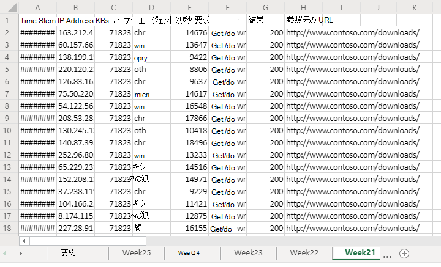
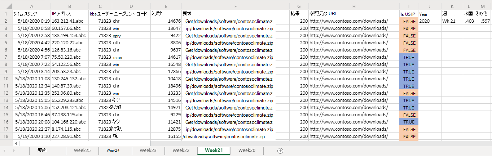
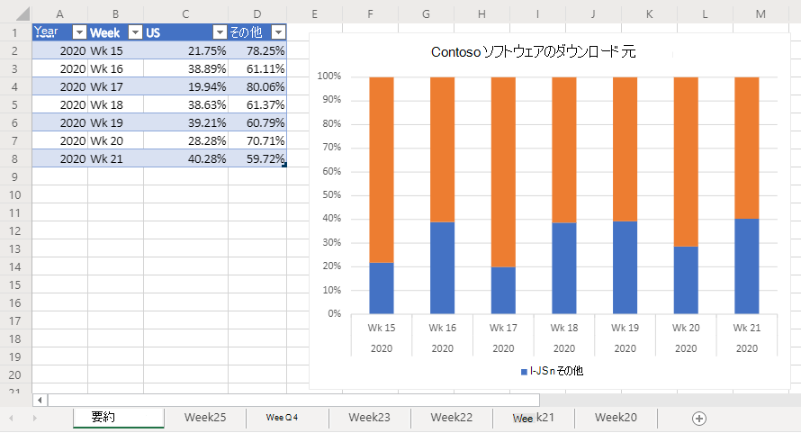

# <a name="office-scripts-sample-scenario-analyze-web-downloads"></a><span data-ttu-id="4bccf-103">Office スクリプトサンプルシナリオ: web ダウンロードを分析する</span><span class="sxs-lookup"><span data-stu-id="4bccf-103">Office Scripts sample scenario: Analyze web downloads</span></span>

<span data-ttu-id="4bccf-104">このシナリオでは、企業の web サイトからダウンロードレポートを分析する作業を行っています。</span><span class="sxs-lookup"><span data-stu-id="4bccf-104">In this scenario, you're tasked with analyzing download reports from your company's website.</span></span> <span data-ttu-id="4bccf-105">この分析の目的は、web トラフィックが米国または世界の他の場所から送られてくるかどうかを判断することです。</span><span class="sxs-lookup"><span data-stu-id="4bccf-105">The goal of this analysis is to determine if the web traffic is coming from the United States or elsewhere in the world.</span></span>

<span data-ttu-id="4bccf-106">仕事仲間がブックに生データをアップロードします。</span><span class="sxs-lookup"><span data-stu-id="4bccf-106">Your colleagues upload the raw data to your workbook.</span></span> <span data-ttu-id="4bccf-107">各週のデータセットには、独自のワークシートがあります。</span><span class="sxs-lookup"><span data-stu-id="4bccf-107">Each week's set of data has its own worksheet.</span></span> <span data-ttu-id="4bccf-108">また、週単位の傾向を示す表とグラフを含む**サマリー**ワークシートもあります。</span><span class="sxs-lookup"><span data-stu-id="4bccf-108">There is also the **Summary** worksheet with a table and chart that shows week-over-week trends.</span></span>

<span data-ttu-id="4bccf-109">作業中のワークシートのデータを週単位でダウンロードするスクリプトを開発します。</span><span class="sxs-lookup"><span data-stu-id="4bccf-109">You'll develop a script that analyzes weekly downloads data in the active worksheet.</span></span> <span data-ttu-id="4bccf-110">各ダウンロードに関連付けられている IP アドレスを解析し、それが US からのものであるかどうかを判断します。</span><span class="sxs-lookup"><span data-stu-id="4bccf-110">It will parse the IP address associated with each download and determine whether or not it came from the US.</span></span> <span data-ttu-id="4bccf-111">答えは、ワークシートのブール値 ("TRUE" または "FALSE") として挿入され、それらのセルに条件付き書式が適用されます。</span><span class="sxs-lookup"><span data-stu-id="4bccf-111">The answer will be inserted in the worksheet as a boolean value ("TRUE" or "FALSE") and conditional formatting will be applied to those cells.</span></span> <span data-ttu-id="4bccf-112">IP アドレスの場所の結果がワークシートに合計され、サマリーテーブルにコピーされます。</span><span class="sxs-lookup"><span data-stu-id="4bccf-112">The IP address location results will be totaled on the worksheet and copied to the summary table.</span></span>

## <a name="scripting-skills-covered"></a><span data-ttu-id="4bccf-113">スクリプト作成スキルの説明</span><span class="sxs-lookup"><span data-stu-id="4bccf-113">Scripting skills covered</span></span>

- <span data-ttu-id="4bccf-114">テキストの解析</span><span class="sxs-lookup"><span data-stu-id="4bccf-114">Text parsing</span></span>
- <span data-ttu-id="4bccf-115">スクリプト内の subfunctions</span><span class="sxs-lookup"><span data-stu-id="4bccf-115">Subfunctions in scripts</span></span>
- <span data-ttu-id="4bccf-116">条件付き書式</span><span class="sxs-lookup"><span data-stu-id="4bccf-116">Conditional formatting</span></span>
- <span data-ttu-id="4bccf-117">テーブル</span><span class="sxs-lookup"><span data-stu-id="4bccf-117">Tables</span></span>

## <a name="demo-video"></a><span data-ttu-id="4bccf-118">デモビデオ</span><span class="sxs-lookup"><span data-stu-id="4bccf-118">Demo video</span></span>

<span data-ttu-id="4bccf-119">このサンプルは、2020年2月に、Office アドインの開発者コミュニティコールの一部として使用されています。</span><span class="sxs-lookup"><span data-stu-id="4bccf-119">This sample was demoed as part of the Office Add-ins developer community call for February 2020.</span></span>

> [!VIDEO https://www.youtube.com/embed/vPEqbb7t6-Y?start=154]

## <a name="setup-instructions"></a><span data-ttu-id="4bccf-120">セットアップの手順</span><span class="sxs-lookup"><span data-stu-id="4bccf-120">Setup instructions</span></span>

1. <span data-ttu-id="4bccf-121"><a href="analyze-web-downloads.xlsx">Analyze-web-downloads</a>を OneDrive にダウンロードします。</span><span class="sxs-lookup"><span data-stu-id="4bccf-121">Download <a href="analyze-web-downloads.xlsx">analyze-web-downloads.xlsx</a> to your OneDrive.</span></span>

2. <span data-ttu-id="4bccf-122">Web 用の Excel でブックを開きます。</span><span class="sxs-lookup"><span data-stu-id="4bccf-122">Open the workbook with Excel for the web.</span></span>

3. <span data-ttu-id="4bccf-123">[**自動化**] タブで、**コードエディター**を開きます。</span><span class="sxs-lookup"><span data-stu-id="4bccf-123">Under the **Automate** tab, open the **Code Editor**.</span></span>

4. <span data-ttu-id="4bccf-124">[**コードエディター** ] 作業ウィンドウで、[**新しいスクリプト**] をクリックし、次のスクリプトをエディターに貼り付けます。</span><span class="sxs-lookup"><span data-stu-id="4bccf-124">In the **Code Editor** task pane, press **New Script** and paste the following script into the editor.</span></span>

    ```TypeScript
      async function main(context: Excel.RequestContext) {
        let currentWorksheet = context.workbook.worksheets
          .getActiveWorksheet();
        // Get the values of the active range of the active worksheet.
        let logRange = currentWorksheet.getUsedRange().load("values");

        // Get the Summary worksheet and table.
        let summaryWorksheet = context.workbook.worksheets.getItem("Summary");
        let summaryTable = context.workbook.tables.getItem("Table1");

        // Get the range that will contain TRUE/FALSE if the IP address is from the United States (US).
        let isUSColumn = logRange
          .getLastColumn()
          .getOffsetRange(0, 1)
          .load("address");

        // Get the values of all the US IP addresses.
        let ipRange = context.workbook.worksheets
          .getItem("USIPAddresses")
          .getUsedRange()
          .load("values");
        await context.sync();

        // Remove the first row.
        let topRow = logRange.values.shift();

        // Create a new array to contain the boolean representing if this is a US IP address.
        let newCol = [[]];

        // Go through each row in worksheet and add Boolean.
        for (let i = 0; i < logRange.values.length; i++) {
          let curRowIP = logRange.values[i][1];
          if (findIP(ipRange.values, ipAddressToInteger(curRowIP)) > 0) {
            newCol.push([true]);
          } else {
            newCol.push([false]);
          }
        }

        // Remove the empty column header and add proper heading.
        newCol.shift();
        newCol.unshift(["Is US IP"]);

        // Write the result to the spreadsheet.
        isUSColumn.values = newCol;
        addSummaryData();
        applyConditionalFormatting();
        currentWorksheet.getUsedRange().format.autofitColumns();

        // Get the calculated summary data.
        let summaryRange = currentWorksheet.getRange("J2:M2").load("values");
        await context.sync();

        // Add the corresponding row to the summary table.
        summaryTable.rows.add(null, summaryRange.values);

        // Function to apply conditional formatting to the new column.
        function applyConditionalFormatting() {
          // Add conditional formatting to the new column.
          let conditionalFormatTrue = isUSColumn.conditionalFormats.add(
            Excel.ConditionalFormatType.cellValue
          );
          let conditionalFormatFalse = isUSColumn.conditionalFormats.add(
            Excel.ConditionalFormatType.cellValue
          );
          // Set TRUE to light blue and FALSE to light orange.
          conditionalFormatTrue.cellValue.format.fill.color = "#8FA8DB";
          conditionalFormatTrue.cellValue.rule = {
            formula1: "=TRUE",
            operator: "EqualTo"
          };
          conditionalFormatFalse.cellValue.format.fill.color = "#F8CCAD";
          conditionalFormatFalse.cellValue.rule = {
            formula1: "=FALSE",
            operator: "EqualTo"
          };
        }

        // Adds the summary data to the current sheet and to the summary table.
        function addSummaryData() {
          // Add a summary row and table.
          let summaryHeader = [["Year", "Week", "US", "Other"]];
          let countTrueFormula =
            "=COUNTIF(" + isUSColumn.address + ', "=TRUE")/' + (newCol.length - 1);
          let countFalseFormula =
            "=COUNTIF(" + isUSColumn.address + ', "=FALSE")/' + (newCol.length - 1);

          let summaryContent = [
            [
              '=TEXT(A2,"YYYY")',
              '=TEXTJOIN(" ", FALSE, "Wk", WEEKNUM(A2))',
              countTrueFormula,
              countFalseFormula
            ]
          ];
          let summaryHeaderRow = context.workbook.worksheets
            .getActiveWorksheet()
            .getRange("J1:M1");
          let summaryContentRow = context.workbook.worksheets
            .getActiveWorksheet()
            .getRange("J2:M2");
          summaryHeaderRow.values = summaryHeader;
          summaryContentRow.values = summaryContent;
          let formats = [[".000", ".000"]];
          summaryContentRow
            .getOffsetRange(0, 2)
            .getResizedRange(0, -2).numberFormat = formats;
        }
      }

      // Translate an IP address into an integer.
      function ipAddressToInteger(ipAddress: string) {
        // Split the IP address into octets.
        let octets = ipAddress.split(".");

        // Create a number for each octet and do the math to create the integer value of the IP address.
        let fullNum =
          // Define an arbitrary number for the last octet.
          111 +
          parseInt(octets[2]) * 256 +
          parseInt(octets[1]) * 65536 +
          parseInt(octets[0]) * 16777216;
        return fullNum;
      }

      // Return the row number where the ip address is found.
      function findIP(ipLookupTable: number[][], n: number) {
        for (let i = 0; i < ipLookupTable.length; i++) {
          if (ipLookupTable[i][0] <= n && ipLookupTable[i][1] >= n) {
            return i;
          }
        }
        return -1;
      }
    ```

5. <span data-ttu-id="4bccf-125">スクリプトの名前を変更して**Web ダウンロードを分析**し、保存します。</span><span class="sxs-lookup"><span data-stu-id="4bccf-125">Rename the script to **Analyze Web Downloads** and save it.</span></span>

## <a name="running-the-script"></a><span data-ttu-id="4bccf-126">スクリプトを実行する</span><span class="sxs-lookup"><span data-stu-id="4bccf-126">Running the script</span></span>

<span data-ttu-id="4bccf-127">任意の**\*週**のワークシートに移動し、[Web 用の**ダウンロードの分析**] スクリプトを実行します。</span><span class="sxs-lookup"><span data-stu-id="4bccf-127">Navigate to any of the **Week\*\*** worksheets and run the **Analyze Web Downloads** script.</span></span> <span data-ttu-id="4bccf-128">このスクリプトは、現在のシートに条件付き書式と場所のラベルを適用します。</span><span class="sxs-lookup"><span data-stu-id="4bccf-128">The script will apply the conditional formatting and location labelling on the current sheet.</span></span> <span data-ttu-id="4bccf-129">**サマリー**ワークシートも更新されます。</span><span class="sxs-lookup"><span data-stu-id="4bccf-129">It will also update the **Summary** worksheet.</span></span>

### <a name="before-running-the-script"></a><span data-ttu-id="4bccf-130">スクリプトを実行する前に</span><span class="sxs-lookup"><span data-stu-id="4bccf-130">Before running the script</span></span>



### <a name="after-running-the-script"></a><span data-ttu-id="4bccf-132">スクリプトを実行した後</span><span class="sxs-lookup"><span data-stu-id="4bccf-132">After running the script</span></span>




