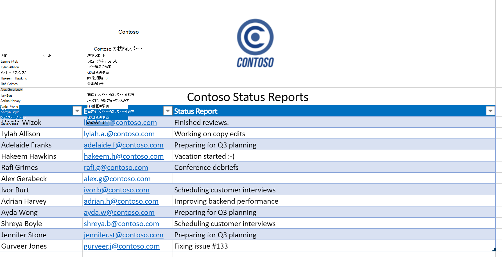
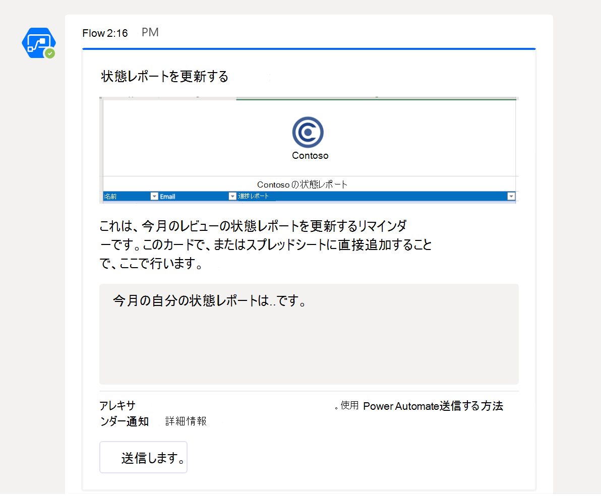

# <a name="office-scripts-sample-scenario-automated-task-reminders"></a>Office スクリプトのサンプルシナリオ: 自動化されたタスクの事前通知

このシナリオでは、プロジェクトを管理しています。 毎月、従業員の状態を追跡するには、Excel ワークシートを使用します。 そのような場合、アラーム処理を自動化することを決定したので、ユーザーに状態を記入するように通知する必要があります。

状態フィールドが不足しているメッセージユーザーへの電力自動化フローを作成し、その応答をスプレッドシートに適用します。 これを行うには、ブックの操作を処理するためのスクリプトを作成します。 最初のスクリプトは、空の状態のユーザーのリストを取得し、2番目のスクリプトは、右側の行にステータス文字列を追加します。 また、 [Teams のアダプティブカード](/microsoftteams/platform/task-modules-and-cards/what-are-cards) を使用して、従業員が通知から直接状態を入力できるようにします。

## <a name="scripting-skills-covered"></a>スクリプト作成スキルの説明

- パワー自動化でフローを作成する
- スクリプトにデータを渡す
- スクリプトからデータを返す
- Teams のアダプティブカード
- テーブル

## <a name="prerequisites"></a>前提条件

このシナリオでは、 [Power オートメーション](https://flow.microsoft.com) と [Microsoft Teams](https://www.microsoft.com/microsoft-365/microsoft-teams/group-chat-software)を使用します。 Office スクリプトの開発に使用するアカウントに両方が関連付けられている必要があります。 Microsoft 開発者向けサブスクリプションに無料でアクセスし、これらのアプリケーションについて学習して作業するには、 [microsoft 365 開発者プログラム](https://developer.microsoft.com/microsoft-365/dev-program)に参加することを検討してください。

## <a name="setup-instructions"></a>セットアップの手順

1. OneDrive に <a href="task-reminders.xlsx">task-reminders.xlsx</a> をダウンロードします。

2. Web 上の Excel でブックを開きます。

3. [ **自動化** ] タブで、 **コードエディター** を開きます。

4. 最初に、すべての従業員に対して、スプレッドシートから不足している状態レポートを取得するためのスクリプトが必要です。 [ **コードエディター** ] 作業ウィンドウで、[ **新しいスクリプト** ] をクリックし、次のスクリプトをエディターに貼り付けます。

    ```typescript
    /**
     * This script looks for missing status reports in a project management table.
     *
     * @returns An array of Employee objects (containing their names and emails).
     */
    function main(workbook: ExcelScript.Workbook): Employee[] {
      // Get the first worksheet and the first table on that worksheet.
      let sheet = workbook.getFirstWorksheet()
      let table = sheet.getTables()[0];

      // Give the column indices names matching their expected content.
      const NAME_INDEX = 0;
      const EMAIL_INDEX = 1;
      const STATUS_REPORT_INDEX = 2;

      // Get the data for the whole table.
      let bodyRangeValues = table.getRangeBetweenHeaderAndTotal().getValues();

      // Create the array of Employee objects to return.
      let people: Employee[] = [];

      // Loop through the table and check each row for completion.
      for (let i = 0; i < bodyRangeValues.length; i++) {
        let row = bodyRangeValues[i];
        if (row[STATUS_REPORT_INDEX] === "") {
          // Save the email to return.
          people.push({ name: row[NAME_INDEX].toString(), email: row[EMAIL_INDEX].toString() });
        }
      }

      // Log the array to verify we're getting the right rows.
      console.log(people);

      // Return the array of Employees.
      return people;
    }

    /**
     * An interface representing an employee.
     * An array of Employees will be returned from the script
     * for the Power Automate flow.
     */
    interface Employee {
      name: string;
      email: string;
    }
    ```

5. 「 **Get People**」という名前のスクリプトを保存します。

6. 次に、進捗レポートカードを処理し、新しい情報をスプレッドシートに格納するための2番目のスクリプトが必要です。 [ **コードエディター** ] 作業ウィンドウで、[ **新しいスクリプト** ] をクリックし、次のスクリプトをエディターに貼り付けます。

    ```typescript
    /**
     * This script applies the results of a Teams Adaptive Card about
     * a status update to a project management table.
     *
     * @param senderEmail - The email address of the employee updating their status.
     * @param statusReportResponse - The employee's status report.
     */
    function main(workbook: ExcelScript.Workbook,
      senderEmail: string,
      statusReportResponse: string) {

      // Get the first worksheet and the first table in that worksheet.
      let sheet = workbook.getFirstWorksheet();
      let table = sheet.getTables()[0];

      // Give the column indices names matching their expected content.
      const NAME_INDEX = 0;
      const EMAIL_INDEX = 1;
      const STATUS_REPORT_INDEX = 2;

      // Get the range and data for the whole table.
      let bodyRange = table.getRangeBetweenHeaderAndTotal();
      let tableRowCount = bodyRange.getRowCount();
      let bodyRangeValues = bodyRange.getValues();

      // Create a flag to denote success.
      let statusAdded = false;

      // Loop through the table and check each row for a matching email address.
      for (let i = 0; i < tableRowCount && !statusAdded; i++) {
        let row = bodyRangeValues[i];

        // Check if the row's email address matches.
        if (row[EMAIL_INDEX] === senderEmail) {
          // Add the Teams Adaptive Card response to the table.
          bodyRange.getCell(i, STATUS_REPORT_INDEX).setValues([
            [statusReportResponse]
          ]);
          statusAdded = true;
        }
      }

      // If successful, log the status update.
      if (statusAdded) {
        console.log(
          `Successfully added status report for ${senderEmail} containing: ${statusReportResponse}`
        );
      }
    }
    ```

7. **Save Status** という名前でスクリプトを保存します。

8. 次に、フローを作成する必要があります。 [電源自動化](https://flow.microsoft.com/)を開きます。

    > [!TIP]
    > 以前にフローを作成していない場合は、チュートリアル「 [Power オートメーションを使用したスクリプトの使用を開始](../../tutorials/excel-power-automate-manual.md) する」を参照して、基本事項を確認してください。

9. 新しい **インスタントフロー** を作成します。

10. [オプションから **フローを手動でトリガーする** ] を選択し、[ **作成**] をクリックします。

11. このフローでは、すべての従業員に空の状態フィールドを取得するために、 **Get People** スクリプトを呼び出す必要があります。 [ **新しい手順** ] をクリックし、[ **Excel Online (Business)**] を選択します。 **[アクション]** の下から、**[スクリプトの実行 (プレビュー)]** を選択します。 フローステップに対して次のエントリを指定します。

    - **場所**: OneDrive for Business
    - **ドキュメント ライブラリ**: OneDrive
    - **ファイル**: task-reminders.xlsx *(ファイルブラウザーから選択)*
    - **スクリプト**: ユーザーを取得する

    

12. 次に、このフローは、スクリプトから返される配列内の各従業員を処理する必要があります。 [ **新規作成** ] をクリックして、[ **Teams ユーザーにアダプティブカードを送信** し、応答を待つ] を選択します。

13. [ **受信者** ] フィールドでは、動的コンテンツから **電子メール** を追加します (選択範囲には Excel ロゴが表示されます)。 **電子メール** を追加すると、**各ブロックに適用** されるフローステップが囲まれます。 これは、アレイが電力自動化によって反復処理されることを意味します。

14. アダプティブカードを送信するには、 **メッセージ** としてカードの JSON を提供する必要があります。 [アダプティブカードデザイナー](https://adaptivecards.io/designer/)を使用して、カスタムカードを作成できます。 この例では、次の JSON を使用します。  

    ```json
    {
      "$schema": "http://adaptivecards.io/schemas/adaptive-card.json",
      "type": "AdaptiveCard",
      "version": "1.0",
      "body": [
        {
          "type": "TextBlock",
          "size": "Medium",
          "weight": "Bolder",
          "text": "Update your Status Report"
        },
        {
          "type": "Image",
          "altText": "",
          "url": "https://i.imgur.com/f5RcuF3.png"
        },
        {
          "type": "TextBlock",
          "text": "This is a reminder to update your status report for this month's review. You can do so right here in this card, or by adding it directly to the spreadsheet.",
          "wrap": true
        },
        {
          "type": "Input.Text",
          "placeholder": "My status report for this month is...",
          "id": "response",
          "isMultiline": true
        }
      ],
      "actions": [
        {
          "type": "Action.Submit",
          "title": "Submit",
          "id": "submit"
        }
      ]
    }
    ```

15. 残りのフィールドに、次のように入力します。

    - **メッセージの更新**: 進捗レポートを提出していただきありがとうございます。 応答が正常にスプレッドシートに追加されました。
    - **カードを更新する必要があり** ます。はい

16. [ **各ブロックに適用** ] で、[ **Teams ユーザーにアダプティブカードを投稿** し、応答を待機する] の下にある [アクションの **追加**] をクリックします。 [ **Excel Online (Business)**] を選択します。 **[アクション]** の下から、**[スクリプトの実行 (プレビュー)]** を選択します。 フローステップに対して次のエントリを指定します。

    - **場所**: OneDrive for Business
    - **ドキュメント ライブラリ**: OneDrive
    - **ファイル**: task-reminders.xlsx *(ファイルブラウザーから選択)*
    - **スクリプト**: 状態の保存
    - **senderEmail**: 電子メール *(Excel の動的コンテンツ)*
    - **Statusreportresponse**: Response *(Teams からの動的コンテンツ)*

    

17. フローを保存します。

## <a name="running-the-flow"></a>フローの実行

フローをテストするには、空の状態の表の行が Teams アカウントに関連付けられた電子メールアドレスを使用していることを確認してください (テスト中は、自分の電子メールアドレスを使用する必要があります)。

フローデザイナーで [ **テスト** ] を選択するか、[ **自分** のフロー] ページからフローを実行することができます。 フローを開始し、必要な接続の使用を承諾した後、Teams を通じて省電力処理カードを受信する必要があります。 カードで [状態] フィールドに入力すると、フローは続行され、指定した状態でスプレッドシートが更新されます。

### <a name="before-running-the-flow"></a>フローを実行する前に



### <a name="receiving-the-adaptive-card"></a>アダプティブカードの受信



### <a name="after-running-the-flow"></a>フローの実行後


