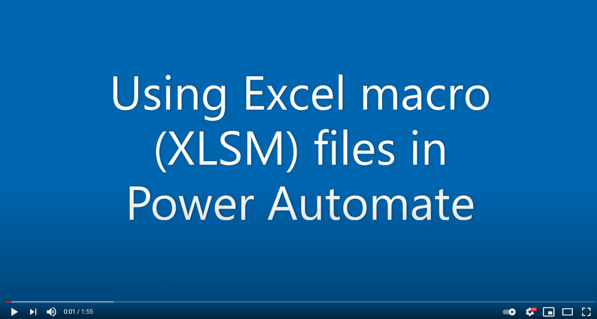

# Power Automate フローでマクロ ファイルを使用する方法

[Power Automate フローは](https://flow.microsoft.com/)[、Excel](https://flow.microsoft.com/connectors/shared_excelonlinebusiness/excel-online-business/)ファイルを他の組織データや Teams、Outlook、SharePoint などのアプリに接続するのに役立つ Excel コネクタを提供します。

ただし、ファイル ドロップダウンでマクロ ファイルを選択できない (次のスクリーンショットの例を参照)。

:::image type="content" source="../images/no-xlsm.png" alt-text="マクロ ファイルが選択されない状態を示す Power Automate Run スクリプト アクション。表示されるエラーは、'File' が必要です。":::

この問題を回避する方法の 1 つは、次のスクリーンショットに示すように、"ファイル メタデータの取得" アクション (OneDrive または SharePoint) を含め、"スクリプトの実行" アクションで ID プロパティを使用することです。

:::image type="content" source="../images/xlsm-in-pa.png" alt-text="選択したマクロ ファイルとスクリプトの実行エラーを示す Power Automate Run スクリプト アクション。":::

> [!NOTE]
> 一部の XLSM (特に、ActiveX/フォーム コントロールを含む) は、Excel オンライン コネクタでは機能しない場合があります。 ソリューションを展開する前に必ずテストしてください。

