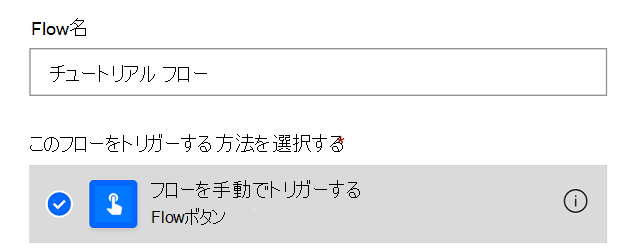
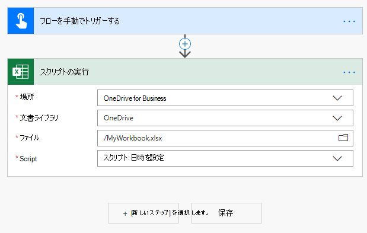
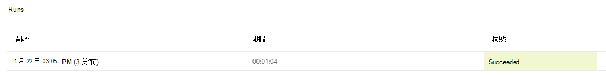

# <a name="call-scripts-from-a-manual-power-automate-flow-preview"></a><span data-ttu-id="7a662-103">手動 Power Automation フローからスクリプトを呼び出す (プレビュー)</span><span class="sxs-lookup"><span data-stu-id="7a662-103">Call scripts from a manual Power Automate flow (preview)</span></span>

<span data-ttu-id="7a662-104">このチュートリアルでは、[Power Automate](https://flow.microsoft.com)を使用して、Excel on the web 用の Office スクリプトを実行する方法について説明します。</span><span class="sxs-lookup"><span data-stu-id="7a662-104">This tutorial teaches you how to run an Office Script for Excel on the web through [Power Automate](https://flow.microsoft.com).</span></span> <span data-ttu-id="7a662-105">現在の時刻で 2 つのセルの値を更新するスクリプトを作成します。</span><span class="sxs-lookup"><span data-stu-id="7a662-105">You'll make a script that updates the values of two cells with the current time.</span></span> <span data-ttu-id="7a662-106">次に、このスクリプトを手動でトリガーした Power Automate フローに接続し、Power Automate のボタンを押したときにいつでもこのスクリプトが実行されるようにします。</span><span class="sxs-lookup"><span data-stu-id="7a662-106">You'll then connect that script to a manually triggered Power Automate flow, so that the script is run whenever a button in Power Automate is pressed.</span></span> <span data-ttu-id="7a662-107">基本的なパターンを理解したら、フローを拡大して他のアプリケーションを含めることができ、毎日のワークフローの自動化を進めることが可能です。</span><span class="sxs-lookup"><span data-stu-id="7a662-107">Once you understand the basic pattern, you can expand the flow to include other applications and automate more of your daily workflow.</span></span>

> [!TIP]
> <span data-ttu-id="7a662-108">Office スクリプトを初めて使用する場合は、チュートリアルの「[Excel on the web で Office スクリプトを記録、編集、作成する](excel-tutorial.md)」から始めることをお勧めします。</span><span class="sxs-lookup"><span data-stu-id="7a662-108">If you are new to Office Scripts, we recommend starting with the [Record, edit, and create Office Scripts in Excel on the web](excel-tutorial.md) tutorial.</span></span> <span data-ttu-id="7a662-109">[Office スクリプトは TypeScript を使用](../overview/code-editor-environment.md)します。このチュートリアルは、JavaScript や TypeScript について初級から中級レベルの知識を持つユーザーを対象としています。</span><span class="sxs-lookup"><span data-stu-id="7a662-109">[Office Scripts use TypeScript](../overview/code-editor-environment.md) and this tutorial is intended for people with beginner to intermediate-level knowledge of JavaScript or TypeScript.</span></span> <span data-ttu-id="7a662-110">JavaScript を使い慣れていない場合は、「[Mozilla の JavaScript チュートリアル](https://developer.mozilla.org/docs/Web/JavaScript/Guide/Introduction)」から始めることをお勧めします。</span><span class="sxs-lookup"><span data-stu-id="7a662-110">If you're new to JavaScript, we recommend starting with the [Mozilla JavaScript tutorial](https://developer.mozilla.org/docs/Web/JavaScript/Guide/Introduction).</span></span>

## <a name="prerequisites"></a><span data-ttu-id="7a662-111">前提条件</span><span class="sxs-lookup"><span data-stu-id="7a662-111">Prerequisites</span></span>

[!INCLUDE [Tutorial prerequisites](../includes/power-automate-tutorial-prerequisites.md)]

## <a name="prepare-the-workbook"></a><span data-ttu-id="7a662-112">ブックを準備する</span><span class="sxs-lookup"><span data-stu-id="7a662-112">Prepare the workbook</span></span>

<span data-ttu-id="7a662-113">Power Automate は、`Workbook.getActiveWorksheet` のような相対参照を使用して、ブックのワークブック コンポーネントにアクセスすることはできません。</span><span class="sxs-lookup"><span data-stu-id="7a662-113">Power Automate can't use relative references like `Workbook.getActiveWorksheet` to access workbook components.</span></span> <span data-ttu-id="7a662-114">したがって、Power Automate が参照できる、名前が統一されたワークブックとワークシートが必要です。</span><span class="sxs-lookup"><span data-stu-id="7a662-114">So, we need a workbook and worksheet with consistent names that Power Automate can reference.</span></span>

1. <span data-ttu-id="7a662-115">**MyWorkbook** という名前の新しいブックを作成します。</span><span class="sxs-lookup"><span data-stu-id="7a662-115">Create a new workbook named **MyWorkbook**.</span></span>

2. <span data-ttu-id="7a662-116">**MyWorkbook** というワークブック内に、**TutorialWorksheet** という名前のワークシートを作成します。</span><span class="sxs-lookup"><span data-stu-id="7a662-116">In the **MyWorkbook** workbook, create a worksheet called **TutorialWorksheet**.</span></span>

## <a name="create-an-office-script"></a><span data-ttu-id="7a662-117">オフィス スクリプトを作成する</span><span class="sxs-lookup"><span data-stu-id="7a662-117">Create an Office Script</span></span>

1. <span data-ttu-id="7a662-118">**[オートメーション]** タブに移動して **[コード エディター]** を選択します。</span><span class="sxs-lookup"><span data-stu-id="7a662-118">Go to the **Automate** tab and select **Code Editor**.</span></span>

2. <span data-ttu-id="7a662-119">**[新しいスクリプト]** を選択します。</span><span class="sxs-lookup"><span data-stu-id="7a662-119">Select **New Script**.</span></span>

3. <span data-ttu-id="7a662-120">既定のスクリプトを次のスクリプトに置き換えます。</span><span class="sxs-lookup"><span data-stu-id="7a662-120">Replace the default script with the following script.</span></span> <span data-ttu-id="7a662-121">このスクリプトは、**TutorialWorksheet** というワークシートの最初の 2 つのセルに現在の日付と時刻を追加します。</span><span class="sxs-lookup"><span data-stu-id="7a662-121">This script adds the current date and time to the first two cells of the **TutorialWorksheet** worksheet.</span></span>

    ```TypeScript
    function main(workbook: ExcelScript.Workbook) {
      // Get the "TutorialWorksheet" worksheet from the workbook.
      let worksheet = workbook.getWorksheet("TutorialWorksheet");

      // Get the cells at A1 and B1.
      let dateRange = worksheet.getRange("A1");
      let timeRange = worksheet.getRange("B1");

      // Get the current date and time using the JavaScript Date object.
      let date = new Date(Date.now());

      // Add the date string to A1.
      dateRange.setValue(date.toLocaleDateString());

      // Add the time string to B1.
      timeRange.setValue(date.toLocaleTimeString());
    }
    ```

4. <span data-ttu-id="7a662-122">スクリプトの名前を **[日付と時刻の設定]** に変更します。</span><span class="sxs-lookup"><span data-stu-id="7a662-122">Rename the script to **Set date and time**.</span></span> <span data-ttu-id="7a662-123">スクリプト名を押して変更します。</span><span class="sxs-lookup"><span data-stu-id="7a662-123">Press the script name to change it.</span></span>

5. <span data-ttu-id="7a662-124">スクリプトを保存するには **[スクリプトの保存]** を押します。</span><span class="sxs-lookup"><span data-stu-id="7a662-124">Save the script by pressing **Save Script**.</span></span>

## <a name="create-an-automated-workflow-with-power-automate"></a><span data-ttu-id="7a662-125">Power Automate を使用して自動化されたワークフローを作成する</span><span class="sxs-lookup"><span data-stu-id="7a662-125">Create an automated workflow with Power Automate</span></span>

1. <span data-ttu-id="7a662-126">[「Power Automate のサイト」](https://flow.microsoft.com)にサインインします。</span><span class="sxs-lookup"><span data-stu-id="7a662-126">Sign in to the [Power Automate site](https://flow.microsoft.com).</span></span>

2. <span data-ttu-id="7a662-127">画面の左側に表示されるメニューで、**[作成]** を押します。</span><span class="sxs-lookup"><span data-stu-id="7a662-127">In the menu that's displayed on the left side of the screen, press **Create**.</span></span> <span data-ttu-id="7a662-128">これにより、新しいワークフローを作成する方法の一覧を表示できます。</span><span class="sxs-lookup"><span data-stu-id="7a662-128">This brings you to list of ways to create new workflows.</span></span>

    ![Power Automate の [作成] ボタン。](../images/power-automate-tutorial-1.png)

3. <span data-ttu-id="7a662-130">**[白紙から初める]** セクションで、**[インスタント フロー]** を選択します。</span><span class="sxs-lookup"><span data-stu-id="7a662-130">In the **Start from blank** section, select **Instant flow**.</span></span> <span data-ttu-id="7a662-131">これで、手動でアクティベートされたワークフローが作成されます。</span><span class="sxs-lookup"><span data-stu-id="7a662-131">This creates a manually activated workflow.</span></span>

    ![新しいワークフローを作成するための [クイックフロー] オプション。](../images/power-automate-tutorial-2.png)

4. <span data-ttu-id="7a662-133">表示されたダイアログ ウィンドウで、フローの名前を **[フロー名]** テキスト ボックスに入力し、**[フローをトリガーする方法の選択]** 内のオプションの一覧から **[手動でフローをトリガーする]** を選択し、**[作成]** を押します。</span><span class="sxs-lookup"><span data-stu-id="7a662-133">In the dialog window that appears, enter a name for your flow in the **Flow name** text box, select **Manually trigger a flow** from the list of options under **Choose how to trigger the flow**, and press **Create**.</span></span>

    

    <span data-ttu-id="7a662-135">手動でトリガーするフローは、いくつかあるフローの種類のうちの 1 つです。</span><span class="sxs-lookup"><span data-stu-id="7a662-135">Note that a manually triggered flow is just one of many types of flows.</span></span> <span data-ttu-id="7a662-136">次のチュートリアルでは、メールを受信したときに自動的に実行されるフローを作成します。</span><span class="sxs-lookup"><span data-stu-id="7a662-136">In the next tutorial, you'll make a flow that automatically runs when you receive an email.</span></span>

5. <span data-ttu-id="7a662-137">**[新しいステップ]** を押します。</span><span class="sxs-lookup"><span data-stu-id="7a662-137">Press **New step**.</span></span>

6. <span data-ttu-id="7a662-138">**[標準]** タブを選択し、**Excel Online (ビジネス)** を選択します。</span><span class="sxs-lookup"><span data-stu-id="7a662-138">Select the **Standard** tab, then select **Excel Online (Business)**.</span></span>

    

7. <span data-ttu-id="7a662-140">**[アクション]** の下から、**[スクリプトの実行 (プレビュー)]** を選択します。</span><span class="sxs-lookup"><span data-stu-id="7a662-140">Under **Actions**, select **Run script (preview)**.</span></span>

    

8. <span data-ttu-id="7a662-142">次に、フロー ステップで使用するブックおよびスクリプトを選択します。</span><span class="sxs-lookup"><span data-stu-id="7a662-142">Next, you'll select the workbook and script to use in the flow step.</span></span> <span data-ttu-id="7a662-143">このチュートリアルでは、OneDrive に作成したブックを使用しますが、OneDrive サイトまたは SharePoint サイトでは任意のブックを使用できます。</span><span class="sxs-lookup"><span data-stu-id="7a662-143">For the tutorial, you'll use the workbook you created in your OneDrive, but you could use any workbook in a OneDrive or SharePoint site.</span></span> <span data-ttu-id="7a662-144">**スクリプトの実行** コネクタには、次の設定を指定します。</span><span class="sxs-lookup"><span data-stu-id="7a662-144">Specify the following settings for the **Run script** connector:</span></span>

    - <span data-ttu-id="7a662-145">**場所**: OneDrive for Business</span><span class="sxs-lookup"><span data-stu-id="7a662-145">**Location**: OneDrive for Business</span></span>
    - <span data-ttu-id="7a662-146">**ドキュメント ライブラリ**: OneDrive</span><span class="sxs-lookup"><span data-stu-id="7a662-146">**Document Library**: OneDrive</span></span>
    - <span data-ttu-id="7a662-147">**ファイル**: MyWorkbook.xlsx *(ファイル ブラウザーを使用して選択されています)*</span><span class="sxs-lookup"><span data-stu-id="7a662-147">**File**: MyWorkbook.xlsx *(Chosen through the file browser)*</span></span>
    - <span data-ttu-id="7a662-148">**スクリプト**: 日時を設定</span><span class="sxs-lookup"><span data-stu-id="7a662-148">**Script**: Set date and time</span></span>

    

9. <span data-ttu-id="7a662-150">**[保存]** を押します。</span><span class="sxs-lookup"><span data-stu-id="7a662-150">Press **Save**.</span></span>

<span data-ttu-id="7a662-151">これで、フローは Power Automate で実行できるようになりました。</span><span class="sxs-lookup"><span data-stu-id="7a662-151">Your flow is now ready to be run through Power Automate.</span></span> <span data-ttu-id="7a662-152">フロー エディターの **[テスト]** ボタンを使用してテストするか、チュートリアルの残りの手順に従って、フロー コレクションからフローを実行できます。</span><span class="sxs-lookup"><span data-stu-id="7a662-152">You can test it using the **Test** button in the flow editor or follow the remaining tutorial steps to run the flow from your flow collection.</span></span>

## <a name="run-the-script-through-power-automate"></a><span data-ttu-id="7a662-153">Power Automate でスクリプトを実行する</span><span class="sxs-lookup"><span data-stu-id="7a662-153">Run the script through Power Automate</span></span>

1. <span data-ttu-id="7a662-154">Power Automate のメイン ページで、**[自分のフロー]** を選択します。</span><span class="sxs-lookup"><span data-stu-id="7a662-154">From the main Power Automate page, select **My flows**.</span></span>

    ![Power Automate の [自分のフロー] ボタン。](../images/power-automate-tutorial-7.png)

2. <span data-ttu-id="7a662-156">**[自分のフロー]** タブに表示されているフローの一覧から、**[自分のチュートリアル フロー]** を選択すると、以前に作成したフローの詳細が表示されます。</span><span class="sxs-lookup"><span data-stu-id="7a662-156">Select **My tutorial flow** from the list of flows displayed in the **My flows** tab. This shows the details of the flow we previously created.</span></span>

3. <span data-ttu-id="7a662-157">**[実行]** を押します。</span><span class="sxs-lookup"><span data-stu-id="7a662-157">Press **Run**.</span></span>

    ![Power Automate の [実行] ボタン。](../images/power-automate-tutorial-8.png)

4. <span data-ttu-id="7a662-159">フローを実行するための作業ウィンドウが表示されます。</span><span class="sxs-lookup"><span data-stu-id="7a662-159">A task pane will appear for running the flow.</span></span> <span data-ttu-id="7a662-160">Excel Online への **サインイン** を要求された場合は、**[続ける]** を押します。</span><span class="sxs-lookup"><span data-stu-id="7a662-160">If you are asked to **Sign in** to Excel Online, do so by pressing **Continue**.</span></span>

5. <span data-ttu-id="7a662-161">**[フローの実行]** を押します。</span><span class="sxs-lookup"><span data-stu-id="7a662-161">Press **Run flow**.</span></span> <span data-ttu-id="7a662-162">これにより、関連する Office スクリプトを実行するフローが実行されます。</span><span class="sxs-lookup"><span data-stu-id="7a662-162">This runs the flow, which runs the related Office Script.</span></span>

6. <span data-ttu-id="7a662-163">**[完了]** を押します。</span><span class="sxs-lookup"><span data-stu-id="7a662-163">Press **Done**.</span></span> <span data-ttu-id="7a662-164">それに応じて **[実行]** セクションが更新されます。</span><span class="sxs-lookup"><span data-stu-id="7a662-164">You should see the **Runs** section update accordingly.</span></span>

7. <span data-ttu-id="7a662-165">ページを更新して、Power Automate の結果を表示します。</span><span class="sxs-lookup"><span data-stu-id="7a662-165">Refresh the page to see the results of the Power Automate.</span></span> <span data-ttu-id="7a662-166">成功した場合は、ワークブックに移動して、更新されたセルを確認します。</span><span class="sxs-lookup"><span data-stu-id="7a662-166">If it succeeded, go to the workbook to see the updated cells.</span></span> <span data-ttu-id="7a662-167">エラーが発生した場合は、フローの設定を確認し、もう一度実行します。</span><span class="sxs-lookup"><span data-stu-id="7a662-167">If it failed, verify the flow's settings and run it a second time.</span></span>

    

## <a name="next-steps"></a><span data-ttu-id="7a662-169">次の手順</span><span class="sxs-lookup"><span data-stu-id="7a662-169">Next steps</span></span>

<span data-ttu-id="7a662-170">[「自動で実行される Power Automate フロー内で、データをスクリプトに渡す」](excel-power-automate-trigger.md)のチュートリアルを完了します。</span><span class="sxs-lookup"><span data-stu-id="7a662-170">Complete the [Pass data to scripts in an automatically-run Power Automate flow](excel-power-automate-trigger.md) tutorial.</span></span> <span data-ttu-id="7a662-171">このコースでは、ワークフロー サービスから Office スクリプトにデータを渡す方法と、特定のイベントが発生したときに Power Automate フローを実行する方法について説明します。</span><span class="sxs-lookup"><span data-stu-id="7a662-171">It teaches you how to pass data from a workflow service to your Office Script and run the Power Automate flow when certain events occur.</span></span>
