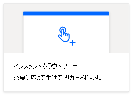

# <a name="start-using-scripts-with-power-automate-preview"></a><span data-ttu-id="4766d-103">Power 自動でのスクリプトの使用を開始する (プレビュー)</span><span class="sxs-lookup"><span data-stu-id="4766d-103">Start using scripts with Power Automate (preview)</span></span>

<span data-ttu-id="4766d-104">このチュートリアルでは、 [Power オートメーション](https://flow.microsoft.com)を使用して web 上で Excel の Office スクリプトを実行する方法について説明します。</span><span class="sxs-lookup"><span data-stu-id="4766d-104">This tutorial teaches you how to run an Office Script for Excel on the web through [Power Automate](https://flow.microsoft.com).</span></span>

## <a name="prerequisites"></a><span data-ttu-id="4766d-105">前提条件</span><span class="sxs-lookup"><span data-stu-id="4766d-105">Prerequisites</span></span>

[!INCLUDE [Tutorial prerequisites](../includes/tutorial-prerequisites.md)]

> [!IMPORTANT]
> <span data-ttu-id="4766d-106">このチュートリアルでは、「web チュートリアルでの[Excel での Office スクリプトの記録、編集、および作成」](excel-tutorial.md)を完了していることを前提としています。</span><span class="sxs-lookup"><span data-stu-id="4766d-106">This tutorial assumes you have completed the [Record, edit, and create Office Scripts in Excel on the web](excel-tutorial.md) tutorial.</span></span>

## <a name="prepare-the-workbook"></a><span data-ttu-id="4766d-107">ブックの準備</span><span class="sxs-lookup"><span data-stu-id="4766d-107">Prepare the workbook</span></span>

<span data-ttu-id="4766d-108">Power オートメーションは `Workbook.getActiveWorksheet` 、ブックコンポーネントへのアクセスなどの相対参照を使用できません。</span><span class="sxs-lookup"><span data-stu-id="4766d-108">Power Automate can't use relative references like `Workbook.getActiveWorksheet` to access workbook components.</span></span> <span data-ttu-id="4766d-109">そのため、Power オートメーションが参照できる、一貫した名前を持つブックとワークシートが必要です。</span><span class="sxs-lookup"><span data-stu-id="4766d-109">So, we need a workbook and worksheet with consistent names that Power Automate can reference.</span></span>

1. <span data-ttu-id="4766d-110">**Myworkbook**という名前の新しいブックを作成します。</span><span class="sxs-lookup"><span data-stu-id="4766d-110">Create a new workbook named **MyWorkbook**.</span></span>

2. <span data-ttu-id="4766d-111">**Myworkbook**ブックで、 **TutorialWorksheet**という名前のワークシートを作成します。</span><span class="sxs-lookup"><span data-stu-id="4766d-111">In the **MyWorkbook** workbook, create a worksheet called **TutorialWorksheet**.</span></span>

## <a name="create-an-office-script"></a><span data-ttu-id="4766d-112">Office スクリプトを作成する</span><span class="sxs-lookup"><span data-stu-id="4766d-112">Create an Office Script</span></span>

1. <span data-ttu-id="4766d-113">[**自動化**] タブに移動して、[**コードエディター**] を選択します。</span><span class="sxs-lookup"><span data-stu-id="4766d-113">Go to the **Automate** tab and select **Code Editor**.</span></span>

2. <span data-ttu-id="4766d-114">[**新しいスクリプト**] を選択します。</span><span class="sxs-lookup"><span data-stu-id="4766d-114">Select **New Script**.</span></span>

3. <span data-ttu-id="4766d-115">既定のスクリプトを次のスクリプトに置き換えます。</span><span class="sxs-lookup"><span data-stu-id="4766d-115">Replace the default script with the following script.</span></span> <span data-ttu-id="4766d-116">このスクリプトは、 **TutorialWorksheet**ワークシートの最初の2つのセルに現在の日付と時刻を追加します。</span><span class="sxs-lookup"><span data-stu-id="4766d-116">This script adds the current date and time to the first two cells of the **TutorialWorksheet** worksheet.</span></span>

    ```TypeScript
    function main(workbook: ExcelScript.Workbook) {
      // Get the "TutorialWorksheet" worksheet from the workbook.
      let worksheet = workbook.getWorksheet("TutorialWorksheet");

      // Get the cells at A1 and B1.
      let dateRange = worksheet.getRange("A1");
      let timeRange = worksheet.getRange("B1");

      // Get the current date and time using the JavaScript Date object.
      let date = new Date(Date.now());

      // Add the date string to A1.
      dateRange.setValue(date.toLocaleDateString());

      // Add the time string to B1.
      timeRange.setValue(date.toLocaleTimeString());
    }
    ```

4. <span data-ttu-id="4766d-117">スクリプトの名前を変更し**て、日付と時刻を設定**します。</span><span class="sxs-lookup"><span data-stu-id="4766d-117">Rename the script to **Set date and time**.</span></span> <span data-ttu-id="4766d-118">スクリプト名を押して変更します。</span><span class="sxs-lookup"><span data-stu-id="4766d-118">Press the script name to change it.</span></span>

5. <span data-ttu-id="4766d-119">[**保存スクリプト**を押してスクリプトを保存します。</span><span class="sxs-lookup"><span data-stu-id="4766d-119">Save the script by pressing **Save Script**.</span></span>

## <a name="create-an-automated-workflow-with-power-automate"></a><span data-ttu-id="4766d-120">Power 自動化を使用して自動化されたワークフローを作成する</span><span class="sxs-lookup"><span data-stu-id="4766d-120">Create an automated workflow with Power Automate</span></span>

1. <span data-ttu-id="4766d-121">[パワー自動化プレビューサイト](https://flow.microsoft.com)にサインインします。</span><span class="sxs-lookup"><span data-stu-id="4766d-121">Sign in to the [Power Automate preview site](https://flow.microsoft.com).</span></span>

2. <span data-ttu-id="4766d-122">画面の左側に表示されるメニューで、[**作成**] を押します。</span><span class="sxs-lookup"><span data-stu-id="4766d-122">In the menu that's displayed on the left side of the screen, press **Create**.</span></span> <span data-ttu-id="4766d-123">これにより、新しいワークフローを作成する方法の一覧が表示されます。</span><span class="sxs-lookup"><span data-stu-id="4766d-123">This brings you to list of ways to create new workflows.</span></span>

    ![パワー自動化の [作成] ボタン。](../images/power-automate-tutorial-1.png)

3. <span data-ttu-id="4766d-125">[**空白から開始**] セクションで、[**インスタントフロー**] を選択します。</span><span class="sxs-lookup"><span data-stu-id="4766d-125">In the **Start from blank** section, select **Instant flow**.</span></span> <span data-ttu-id="4766d-126">これにより、手動でアクティブ化したワークフローが作成されます。</span><span class="sxs-lookup"><span data-stu-id="4766d-126">This creates a manually activated workflow.</span></span>

    

4. <span data-ttu-id="4766d-128">表示されるダイアログウィンドウで、[**フロー名**] テキストボックスにフローの名前を入力し、[フロー**の開始方法を選択**してください] で、オプションの一覧から [**フローを手動でトリガー**する] を選択して、[**作成**] をクリックします。</span><span class="sxs-lookup"><span data-stu-id="4766d-128">In the dialog window that appears, enter a name for your flow in the **Flow name** text box, select **Manually trigger a flow** from the list of options under **Choose how to trigger the flow**, and press **Create**.</span></span>

    

5. <span data-ttu-id="4766d-130">**新しい手順**を押します。</span><span class="sxs-lookup"><span data-stu-id="4766d-130">Press **New step**.</span></span>

6. <span data-ttu-id="4766d-131">[**標準**] タブを選択し、[ **Excel Online (Business)**] を選択します。</span><span class="sxs-lookup"><span data-stu-id="4766d-131">Select the **Standard** tab, then select **Excel Online (Business)**.</span></span>

    

7. <span data-ttu-id="4766d-133">[**アクション**] で、[**スクリプトを実行する (プレビュー)**] を選択します。</span><span class="sxs-lookup"><span data-stu-id="4766d-133">Under **Actions**, select **Run script (preview)**.</span></span>

    

8. <span data-ttu-id="4766d-135">**実行スクリプト**コネクタについて、次の設定を指定します。</span><span class="sxs-lookup"><span data-stu-id="4766d-135">Specify the following settings for the **Run script** connector:</span></span>

    - <span data-ttu-id="4766d-136">**場所**: OneDrive for business</span><span class="sxs-lookup"><span data-stu-id="4766d-136">**Location**: OneDrive for Business</span></span>
    - <span data-ttu-id="4766d-137">**ドキュメントライブラリ**: OneDrive</span><span class="sxs-lookup"><span data-stu-id="4766d-137">**Document Library**: OneDrive</span></span>
    - <span data-ttu-id="4766d-138">**ファイル**: MyWorkbook.xlsx</span><span class="sxs-lookup"><span data-stu-id="4766d-138">**File**: MyWorkbook.xlsx</span></span>
    - <span data-ttu-id="4766d-139">**スクリプト**: 日付と時刻を設定する</span><span class="sxs-lookup"><span data-stu-id="4766d-139">**Script**: Set date and time</span></span>

    

9. <span data-ttu-id="4766d-141">[**保存**します。</span><span class="sxs-lookup"><span data-stu-id="4766d-141">Press **Save**.</span></span>

<span data-ttu-id="4766d-142">これで、電力の自動化を通じてフローを実行する準備が整いました。</span><span class="sxs-lookup"><span data-stu-id="4766d-142">Your flow is now ready to be run through Power Automate.</span></span> <span data-ttu-id="4766d-143">フローエディターの [**テスト**] ボタンを使用してテストするか、チュートリアルの残りの手順に従ってフローコレクションからフローを実行することができます。</span><span class="sxs-lookup"><span data-stu-id="4766d-143">You can test it using the **Test** button in the flow editor or follow the remaining tutorial steps to run the flow from your flow collection.</span></span>

## <a name="run-the-script-through-power-automate"></a><span data-ttu-id="4766d-144">電源自動化を使用してスクリプトを実行する</span><span class="sxs-lookup"><span data-stu-id="4766d-144">Run the script through Power Automate</span></span>

1. <span data-ttu-id="4766d-145">[メインパワーの自動化] ページで、[**マイフロー**] を選択します。</span><span class="sxs-lookup"><span data-stu-id="4766d-145">From the main Power Automate page, select **My flows**.</span></span>

    ![パワー自動化の [マイフロー] ボタン。](../images/power-automate-tutorial-7.png)

2. <span data-ttu-id="4766d-147">[ **My** flow] タブに表示されるフローの一覧から [ **my チュートリアルフロー** ] を選択します。これで、以前に作成したフローの詳細が表示されます。</span><span class="sxs-lookup"><span data-stu-id="4766d-147">Select **My tutorial flow** from the list of flows displayed in the **My flows** tab. This shows the details of the flow we previously created.</span></span>

3. <span data-ttu-id="4766d-148">**Run**を押します。</span><span class="sxs-lookup"><span data-stu-id="4766d-148">Press **Run**.</span></span>

    ![電源自動化の [実行] ボタン。](../images/power-automate-tutorial-8.png)

4. <span data-ttu-id="4766d-150">フローを実行するための作業ウィンドウが表示されます。</span><span class="sxs-lookup"><span data-stu-id="4766d-150">A task pane will appear for running the flow.</span></span> <span data-ttu-id="4766d-151">Excel Online に**サインイン**するように求めるメッセージが表示されたら、[**続行**] を押します。</span><span class="sxs-lookup"><span data-stu-id="4766d-151">If you are asked to **Sign in** to Excel Online, do so by pressing **Continue**.</span></span>

5. <span data-ttu-id="4766d-152">**Run flow**を押します。</span><span class="sxs-lookup"><span data-stu-id="4766d-152">Press **Run flow**.</span></span> <span data-ttu-id="4766d-153">これにより、関連する Office スクリプトが実行されるフローが実行されます。</span><span class="sxs-lookup"><span data-stu-id="4766d-153">This runs the flow, which runs the related Office Script.</span></span>

6. <span data-ttu-id="4766d-154">[**完了**します。</span><span class="sxs-lookup"><span data-stu-id="4766d-154">Press **Done**.</span></span> <span data-ttu-id="4766d-155">それに応じて、「**実行**」セクションの更新が表示されます。</span><span class="sxs-lookup"><span data-stu-id="4766d-155">You should see the **Runs** section update accordingly.</span></span>

7. <span data-ttu-id="4766d-156">ページを更新して、電力自動化の結果を表示します。</span><span class="sxs-lookup"><span data-stu-id="4766d-156">Refresh the page to see the results of the Power Automate.</span></span> <span data-ttu-id="4766d-157">成功した場合は、ブックに移動して、更新されたセルを表示します。</span><span class="sxs-lookup"><span data-stu-id="4766d-157">If it succeeded, go to the workbook to see the updated cells.</span></span> <span data-ttu-id="4766d-158">失敗した場合は、フローの設定を確認し、2回目に実行します。</span><span class="sxs-lookup"><span data-stu-id="4766d-158">If it failed, verify the flow's settings and run it a second time.</span></span>

    

## <a name="next-steps"></a><span data-ttu-id="4766d-160">次の手順</span><span class="sxs-lookup"><span data-stu-id="4766d-160">Next steps</span></span>

<span data-ttu-id="4766d-161">[自動電源自動化フローに関するチュートリアルを使用して、自動実行スクリプトを](excel-power-automate-trigger.md)完了します。</span><span class="sxs-lookup"><span data-stu-id="4766d-161">Complete the [Automatically run scripts with automated Power Automate flows](excel-power-automate-trigger.md) tutorial.</span></span> <span data-ttu-id="4766d-162">この章では、ワークフローサービスから Office スクリプトにデータを渡す方法について説明します。</span><span class="sxs-lookup"><span data-stu-id="4766d-162">It teaches you how to pass data from a workflow service to your Office Script.</span></span>
