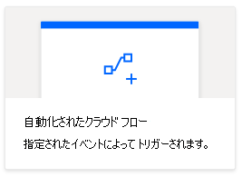
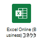
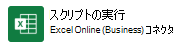
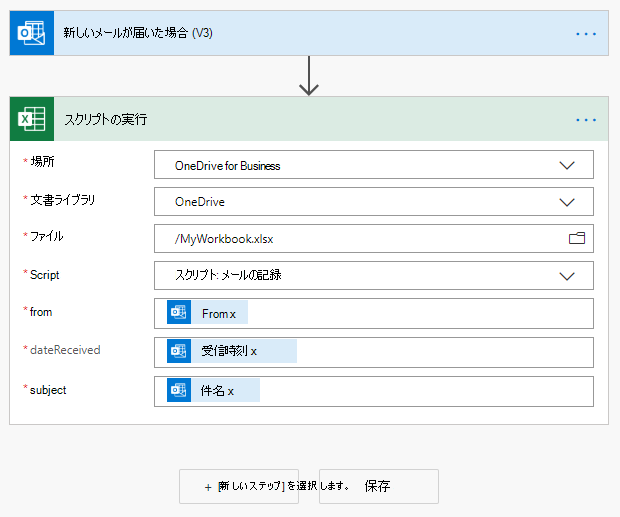
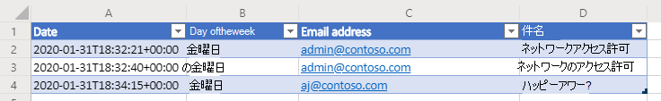
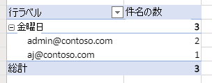

# <a name="pass-data-to-scripts-in-an-automatically-run-power-automate-flow-preview"></a>自動で実行される Power Automate フロー内で、データをスクリプトに渡す(プレビュー)

このチュートリアルでは、自動化された [Power Automate](https://flow.microsoft.com) ワークフローを使用して、Excel on the web 用の Office スクリプトを実行する方法について説明します。 スクリプトは、メールを受信したときに自動的に実行されます。また、Excel ブック内のメールから情報を記録します。 別のアプリケーションから Office スクリプトにデータを渡すことができるようになると、自動プロセスの柔軟性と自由性が大きく向上します。

> [!TIP]
> Office スクリプトを初めて使用する場合は、チュートリアルの「[Excel on the web で Office スクリプトを記録、編集、作成する](excel-tutorial.md)」から始めることをお勧めします。 Power Automate を初めて使用する場合は、チュートリアルの「[手動 Power Automate フローからスクリプトを呼び出す](excel-power-automate-manual.md)」から始めることを勧めします。 [Office スクリプトは TypeScript を使用](../overview/code-editor-environment.md)します。このチュートリアルは、JavaScript や TypeScript について初級から中級レベルの知識を持つユーザーを対象としています。 JavaScript を使い慣れていない場合は、「[Mozilla の JavaScript チュートリアル](https://developer.mozilla.org/docs/Web/JavaScript/Guide/Introduction)」から始めることをお勧めします。

## <a name="prerequisites"></a>前提条件

[!INCLUDE [Tutorial prerequisites](../includes/power-automate-tutorial-prerequisites.md)]

## <a name="prepare-the-workbook"></a>ブックを準備する

Power Automate は、`Workbook.getActiveWorksheet`のような[相対参照](../develop/power-automate-integration.md#avoid-using-relative-references)を使用して、ブック コンポーネントにアクセスすることはできません。 したがって、Power Automate が参照できるように、名前が統一されたブックとワークシートが必要です。

1. **MyWorkbook** という名前の新しいブックを作成します。

2. **[オートメーション]** タブに移動して **[コード エディター]** を選択します。

3. **[新しいスクリプト]** を選択します。

4. 既存のコードを次のスクリプトで置き換え、**[実行]** を押します。 これにより、統一されたワークシート、テーブル、ピボットテーブルの名前でブックが設定されます。

    ```TypeScript
    function main(workbook: ExcelScript.Workbook) {
      // Add a new worksheet to store our email table
      let emailsSheet = workbook.addWorksheet("Emails");

      // Add data and create a table
      emailsSheet.getRange("A1:D1").setValues([
        ["Date", "Day of the week", "Email address", "Subject"]
      ]);
      let newTable = workbook.addTable(emailsSheet.getRange("A1:D2"), true);
      newTable.setName("EmailTable");

      // Add a new PivotTable to a new worksheet
      let pivotWorksheet = workbook.addWorksheet("Subjects");
      let newPivotTable = workbook.addPivotTable("Pivot", "EmailTable", pivotWorksheet.getRange("A3:C20"));

      // Setup the pivot hierarchies
      newPivotTable.addRowHierarchy(newPivotTable.getHierarchy("Day of the week"));
      newPivotTable.addRowHierarchy(newPivotTable.getHierarchy("Email address"));
      newPivotTable.addDataHierarchy(newPivotTable.getHierarchy("Subject"));
    }
    ```

## <a name="create-an-office-script"></a>Office スクリプトを作成する

メールから情報をログに記録するスクリプトを作成してみましょう。 最も多くのメールを受信する曜日と、そのメールを送信する固有の送信者の数について知る必要があります。 ブックには、**[日付]**、**[曜日]**、**[メールアドレス]**、**[件名]** の列を含むテーブルがあります。 また、ワークシートには、 **[曜日]** と **メールアドレス** (行階層)にピボットしている、ピボットテーブルがあります。 一意の **[件名]** の数は、表示されている集計情報（データ階層）です。 メール テーブルを更新した後に、スクリプトがピボットテーブルを更新するようにします。

1. **[コード エディター]** 内で、**[新しいスクリプト]** を選択します。

2. このチュートリアルの後半で作成するフローでは、受信した各メールに関するスクリプト情報を送信します。 スクリプトは、`main`関数のパラメーターを使用して、その入力を受け付ける必要があります。 既定のスクリプトを次のスクリプトに置き換えます。

    ```TypeScript
    function main(
      workbook: ExcelScript.Workbook,
      from: string,
      dateReceived: string,
      subject: string) {

    }
    ```

3. スクリプトには、ブックのテーブルとピボットテーブルにアクセスする必要があります。 `{` を開いた後、次のコードをスクリプトの本文に追加 します。

    ```TypeScript
    // Get the email table.
    let emailWorksheet = workbook.getWorksheet("Emails");
    let table = emailWorksheet.getTable("EmailTable");
  
    // Get the PivotTable.
    let pivotTableWorksheet = workbook.getWorksheet("Subjects");
    let pivotTable = pivotTableWorksheet.getPivotTable("Pivot");
    ```

4. `dateReceived` パラメーターのタイプは `string` です。 それを [`Date` オブジェクト](../develop/javascript-objects.md#date)に変換して、簡単に曜日を取得できるようにしましょう。 その後、日の数値をより読みやすいバージョンにマッピングする必要があります。 `}` を閉じる前に、スクリプトの最後に次のコードを追加します。

    ```TypeScript
      // Parse the received date string to determine the day of the week.
      let emailDate = new Date(dateReceived);
      let dayName = emailDate.toLocaleDateString("en-US", { weekday: 'long' });
    ```

5. `subject` 文字列には、"RE:" という返信タグを含めることができます。 同じスレッドのメールがテーブルに対して同じ件名になるよう、文字列からそれを削除します。 `}` を閉じる前に、スクリプトの最後に次のコードを追加します。

    ```TypeScript
    // Remove the reply tag from the email subject to group emails on the same thread.
    let subjectText = subject.replace("Re: ", "");
    subjectText = subjectText.replace("RE: ", "");
    ```

6. これでメールのデータがお好みの書式に設定されたので、メール テーブルに行を追加しましょう。 `}` を閉じる前に、スクリプトの最後に次のコードを追加します。

    ```TypeScript
    // Add the parsed text to the table.
    table.addRow(-1, [dateReceived, dayName, from, subjectText]);
    ```

7. 最後に、ピボットテーブルを更新されていることを確認しましょう。 `}` を閉じる前に、スクリプトの最後に次のコードを追加します。

    ```TypeScript
    // Refresh the PivotTable to include the new row.
    pivotTable.refresh();
    ```

8. スクリプトの名前を **[メールを記録]** に変更し、**[スクリプトの保存]** を押します。

これで、スクリプトは Power Automate ワークフローで使用できるようになりました。 次のようにスクリプトが表示されます。

```TypeScript
function main(
  workbook: ExcelScript.Workbook,
  from: string,
  dateReceived: string,
  subject: string) {
  // Get the email table.
  let emailWorksheet = workbook.getWorksheet("Emails");
  let table = emailWorksheet.getTable("EmailTable");

  // Get the PivotTable.
  let pivotTableWorksheet = workbook.getWorksheet("Subjects");
  let pivotTable = pivotTableWorksheet.getPivotTable("Pivot");

  // Parse the received date string to determine the day of the week.
  let emailDate = new Date(dateReceived);
  let dayName = emailDate.toLocaleDateString("en-US", { weekday: 'long' });

  // Remove the reply tag from the email subject to group emails on the same thread.
  let subjectText = subject.replace("Re: ", "");
  subjectText = subjectText.replace("RE: ", "");

  // Add the parsed text to the table.
  table.addRow(-1, [dateReceived, dayName, from, subjectText]);

  // Refresh the PivotTable to include the new row.
  pivotTable.refresh();
}
```

## <a name="create-an-automated-workflow-with-power-automate"></a>Power Automate を使用して自動化されたワークフローを作成する

1. [「Power Automate のサイト」](https://flow.microsoft.com)にサインインします。

2. 画面の左側に表示されるメニューで、**[作成]** を押します。 これにより、新しいワークフローを作成する方法の一覧を表示できます。

    ![Power Automate の [作成] ボタン。](../images/power-automate-tutorial-1.png)

3. **[白紙から初める]** セクションで、**[自動フロー]** を選択します。 これにより、メールの受信などのイベントによってトリガーされるワークフローが作成されます。

    

4. ダイアログ ウインドウが表示されたら、**[フロー名]** のテキスト ボックスに、フローの名前を入力します。 次に、**[フローのトリガーを選択]** の下のオプションの一覧から、**[新しいメールが届いたとき]** を選択します。 検索ボックスを使用して、オプションを検索することが必要になる場合があります。 最後に、**[作成]** を押します。

    ![Power Automate の [自動フローの作成]ウィンドウの一部で、”新しいメールが届きました” オプションが表示されます。](../images/power-automate-params-tutorial-2.png)

    > [!NOTE]
    > このチュートリアルでは、Outlook を使用します。 代わりに、お好きなメール サービスを自由に使用することもできますが、一部のオプションは異なる場合があります。

5. **[新しいステップ]** を押します。

6. **[標準]** タブを選択し、**Excel Online (ビジネス)** を選択します。

    

7. **[アクション]** の下から、**[スクリプトの実行 (プレビュー)]** を選択します。

    

8. 次に、フロー ステップで使用するブック、スクリプト、およびスクリプトの入力引数を選択します。 このチュートリアルでは、OneDrive に作成したブックを使用しますが、OneDrive サイトまたは SharePoint サイトでは任意のブックを使用できます。 **スクリプトの実行**コネクタには、次の設定を指定します。

    - **場所**: OneDrive for Business
    - **ドキュメント ライブラリ**: OneDrive
    - **ファイル**: MyWorkbook.xlsx
    - **スクリプト**: メールの記録
    - **から**: *(Outlook の動的コンテンツ)*
    - **dateReceived**: 受信時刻 *(Outlook の動的コンテンツ)*
    - **件名**: 件名 *(Outlook の動的コンテンツ)*

    *スクリプトのパラメーターは、スクリプトが選択された後にのみ表示されるので、注意してください。*

    

9. **[保存]** を押します。

フローが有効になります。 Outlook でメールを受信するたびに、スクリプトが自動的に実行されます。

## <a name="manage-the-script-in-power-automate"></a>Power Automate でスクリプトを管理する

1. Power Automate のメイン ページで、**[自分のフロー]** を選択します。

    ![Power Automate の [自分のフロー] ボタン。](../images/power-automate-tutorial-7.png)

2. フローを選択します。 ここでは、実行履歴を表示することができます。 ページを更新するか、**[すべての実行]** を更新するボタンを押して、履歴を更新することができます。 フローは、メールを受信するとすぐにトリガーされます。 メッセージを送信してフローをテストします。

フローがトリガーされて、スクリプトが正常に実行されると、ブックのテーブルとピボットテーブルの更新が表示されます。





## <a name="next-steps"></a>次の手順

Office スクリプトを Power Automate に接続する方法に関する詳細については、 [「Power Automate で Office スクリプトを実行する」](../develop/power-automate-integration.md)を参照してください。

[「自動タスク リマインダーのサンプル シナリオ」](../resources/scenarios/task-reminders.md)では、Office スクリプトと Power Automate を Teams アダプティブ カードと組み合わせる方法についても説明します。
