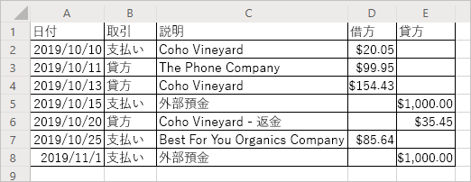

# <a name="read-workbook-data-with-office-scripts-in-excel-on-the-web"></a>Excel on the web で Office スクリプトを使用してブックのデータを読み取る

このチュートリアルでは、Excel on the web 用の Office スクリプトを使用してブックのデータを読み取る方法について説明します。 口座取引明細書の書式設定を行う新しいスクリプトを作成し、明細書のデータを標準化します。 データのクリーンアップの一環として、スクリプトは取引セルの値を読み取り、それぞれの値に簡単な数式を適用し、導き出された回答をブックに書き込みます。 ブックからデータを読み取ることで、スクリプト内の意思決定プロセスの一部を自動化することができます。

> [!TIP]
> Office スクリプトを初めて使用する場合は、チュートリアルの「[Excel on the web で Office スクリプトを記録、編集、作成する](excel-tutorial.md)」から始めることをお勧めします。 [Office スクリプトは TypeScript を使用](../overview/code-editor-environment.md)します。このチュートリアルは、JavaScript や TypeScript について初級から中級レベルの知識を持つユーザーを対象としています。 JavaScript を使い慣れていない場合は、[Mozilla の JavaScript チュートリアル](https://developer.mozilla.org/docs/Web/JavaScript/Guide/Introduction)から始めることをお勧めします。

## <a name="prerequisites"></a>前提条件

[!INCLUDE [Tutorial prerequisites](../includes/tutorial-prerequisites.md)]

## <a name="read-a-cell"></a>セルを読み取る。

操作レコーダーで作成したスクリプトは、ブックに情報を書き込む操作のみを実行できます。 コード エディターを使用すると、ブックのデータを読み取ることも可能なスクリプトの編集と作成ができます。

データを読み取り、読み取った内容に基づいて動作するスクリプトを作成しましょう。 今回は、サンプルの銀行取引明細書を使用します。 この明細書は、支払いと貸方がまとまった明細書です。 残念ながら、残高の変化が異なる仕方で報告されています。 支払い明細では、収入を負の貸方として記録し、支出を負の借方として記録しています。 貸方明細ではその逆になっています。

チュートリアルの残りの部分で、スクリプトを使用してこのデータを正規化します。 まず、ブックからデータを読み取る方法について説明します。

1. チュートリアルの残りの部分で使用したブックに新しいワークシートを作成します。
2. 次のデータをコピーし、新しいワークシートのセル **A1** から始まるセル範囲に貼り付けます。

    |日付 |取引 |説明 |借方 |貸方 |
    |:--|:--|:--|:--|:--|
    |2019/10/10 |支払い |Coho Vineyard |-20.05 | |
    |2019/10/11 |貸方 |The Phone Company |99.95 | |
    |2019/10/13 |貸方 |Coho Vineyard |154.43 | |
    |2019/10/15 |支払い |外部預金 | |1000 |
    |2019/10/20 |貸方 |Coho Vineyard - 返金 | |-35.45 |
    |2019/10/25 |支払い |Best For You Organics Company | -85.64 | |
    |2019/11/01 |支払い |外部預金 | |1000 |

3. **[コード エディター]** を開き、**[新しいスクリプト]** を選択します。
4. 書式設定をクリーンアップします。 これは財務ドキュメントなので、**[借方]** 列と **[貸方]** 列の数値の書式設定を変更して、値がドル金額として表示されるようにします。 さらに、列幅をデータに合わせます。

    スクリプトの内容を次のコードで置き換えます。

    ```TypeScript
    function main(workbook: ExcelScript.Workbook) {
        // Get the current worksheet.
        let selectedSheet = workbook.getActiveWorksheet();

        // Format the range to display numerical dollar amounts.
        selectedSheet.getRange("D2:E8").setNumberFormat("$#,##0.00");

        // Fit the width of all the used columns to the data.
        selectedSheet.getUsedRange().getFormat().autofitColumns();
    }
    ```

5. では、いずれかの数値列の値を読み取ってみましょう。 次のコードをスクリプトの最後 (末尾の `}` の前) に追加します。

    ```TypeScript
    // Get the value of cell D2.
    let range = selectedSheet.getRange("D2");
    console.log(range.getValues());
    ```

6. スクリプトを実行します。
7. コンソールに `[Array[1]]` が表示されます。 範囲は 2 次元のデータ配列であるため、これは数値ではありません。 この 2 次元の範囲は、コンソールに直接ログ記録されます。 コード エディターを使用すると、この配列の内容を表示できます。
8. 2 次元の配列がコンソールにログ記録すると、各行の下に列の値がグループ化されます。 青い三角形を押して、配列のログを展開します。
9. 新たに表示された青い三角形を押して、配列の第 2 レベルを展開します。 次のように表示されるはずです。

    

## <a name="modify-the-value-of-a-cell"></a>セルの値を変更する

データを読み取れたので、そのデータを使用してブックを変更しましょう。 セル **D2** の値を、`Math.abs` 関数を使用して正の値にします。 [Math](https://developer.mozilla.org/docs/web/javascript/reference/global_objects/math) オブジェクトには、スクリプトでアクセスできる多くの関数が含まれています。 `Math` および他の組み込みオブジェクトの詳細については、「[Office スクリプトでの組み込みの JavaScript オブジェクトの使用](../develop/javascript-objects.md)」を参照してください。

1. 次のコードをスクリプトの最後に追加します。

    ```TypeScript
    // Run the `Math.abs` function with the value at D2 and apply that value back to D2.
    let positiveValue = Math.abs(range.getValue());
    range.setValue(positiveValue);
    ```

    `getValue` と `setValue` を使用していることに注意してください。 これらの方法は、1 つのセルで使用できます。 複数のセル範囲を処理する場合は、`getValues` と `setValues` を使用します。

2. セル **D2** の値が正の値になります。

## <a name="modify-the-values-of-a-column"></a>列の値を変更する

1 つのセルの読み取り方法と書き込み方法がわかったので、スクリプトを一般化して、**[借方]** 列と **[貸方]** 列全体を操作できるようにしましょう。

1. 1 つのセルにのみ影響するコード (前述の絶対値コード) を削除します。すると、スクリプトは次のようになります。

    ```TypeScript
    function main(workbook: ExcelScript.Workbook) {
        // Get the current worksheet.
        let selectedSheet = workbook.getActiveWorksheet();

        // Format the range to display numerical dollar amounts.
        selectedSheet.getRange("D2:E8").setNumberFormat("$#,##0.00");

        // Fit the width of all the used columns to the data.
        selectedSheet.getUsedRange().getFormat().autofitColumns();
    }
    ```

2. 最後の 2 つの列の行を反復処理するループをスクリプトの最後に追加します。 スクリプトにより、各セルの値が現在の値の絶対値に設定されます。

    セルの位置を定義する配列は 0 から始まることにご注意ください。 したがって、セル **A1** は `range[0][0]` になります。

    ```TypeScript
    // Get the values of the used range.
    let range = selectedSheet.getUsedRange();
    let rangeValues = range.getValues();

    // Iterate over the fourth and fifth columns and set their values to their absolute value.
    let rowCount = range.getRowCount();
    for (let i = 1; i < rowCount; i++) {
        // The column at index 3 is column "4" in the worksheet.
        if (rangeValues[i][3] != 0) {
            let positiveValue = Math.abs(rangeValues[i][3]);
            selectedSheet.getCell(i, 3).setValue(positiveValue);
        }

        // The column at index 4 is column "5" in the worksheet.
        if (rangeValues[i][4] != 0) {
            let positiveValue = Math.abs(rangeValues[i][4]);
            selectedSheet.getCell(i, 4).setValue(positiveValue);
        }
    }
    ```

    スクリプトのこの部分は、いくつかの重要なタスクを実行します。 まず、指定された範囲の値と行数を取得します。 これにより、値が表示され、いつ停止すればよいかを確認できます。 次に、指定された範囲を反復処理し、**[借方]** 列と **[貸方]** 列の各セルをチェックします。 最後に、セルの値が 0 ではない場合、その値が絶対値で置き換えられます。 0 は使用しないので、空のセルはそのままにしておきます。

3. スクリプトを実行します。

    銀行取引明細書は次のように表示されるはずです。

    

## <a name="next-steps"></a>次の手順

コード エディターを開き、「[Excel on the web での Office スクリプトのサンプル スクリプト](../resources/excel-samples.md)」をいくつか試してみます。 Office スクリプトの作成について詳しくは、「[Excel on the web での Office スクリプトのスクリプトの基本事項](../develop/scripting-fundamentals.md)」も参照してください。

次の一連の Office スクリプトのチュートリアルでは、Power Automate を使用した Office スクリプトの使用法について説明します。 2 つのプラットフォームを組み合わせる利点の詳細については、「[Power Automate を使用した Office スクリプトの実行](../develop/power-automate-integration.md) または [手動による Power Automate フローからのスクリプトの呼び出し](excel-power-automate-manual.md) チュートリアルを試して、Office スクリプトを使用した Power Automate フローを作成する」を参照してください。
