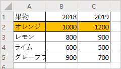
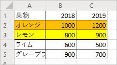
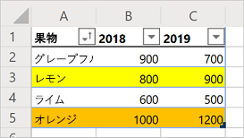

# <a name="record-edit-and-create-office-scripts-in-excel-on-the-web"></a><span data-ttu-id="9ff6c-103">Excel on the web で Office スクリプトを記録、編集、作成する</span><span class="sxs-lookup"><span data-stu-id="9ff6c-103">Record, edit, and create Office Scripts in Excel on the web</span></span>

<span data-ttu-id="9ff6c-104">このチュートリアルでは、Excel on the web の Office スクリプトの基本となる記録、編集、書き込みについて説明します。</span><span class="sxs-lookup"><span data-stu-id="9ff6c-104">This tutorial will teach you the basics of recording, editing, and writing an Office Script for Excel on the web.</span></span>

## <a name="prerequisites"></a><span data-ttu-id="9ff6c-105">前提条件</span><span class="sxs-lookup"><span data-stu-id="9ff6c-105">Prerequisites</span></span>

[!INCLUDE [Preview note](../includes/preview-note.md)]

<span data-ttu-id="9ff6c-106">このチュートリアルを開始するには、Office スクリプトへのアクセスが必要です。これには次のものが必要です。</span><span class="sxs-lookup"><span data-stu-id="9ff6c-106">Before starting this tutorial, you'll need access to Office Scripts, which requires the following:</span></span>

- <span data-ttu-id="9ff6c-107">[Excel on the web](https://www.office.com/launch/excel)。</span><span class="sxs-lookup"><span data-stu-id="9ff6c-107">[Excel on the web](https://www.office.com/launch/excel).</span></span>
- <span data-ttu-id="9ff6c-108">[組織に対して Office スクリプトを許可する](https://support.office.com/article/office-scripts-settings-in-m365-19d3c51a-6ca2-40ab-978d-60fa49554dcf)よう管理者に依頼します。これにより、リボンに **[自動化]** タブが追加されます。</span><span class="sxs-lookup"><span data-stu-id="9ff6c-108">Ask your administrator to [enable Office Scripts for your organization](https://support.office.com/article/office-scripts-settings-in-m365-19d3c51a-6ca2-40ab-978d-60fa49554dcf), which adds the **Automate** tab to the ribbon.</span></span>

> [!IMPORTANT]
> <span data-ttu-id="9ff6c-109">このチュートリアルは、JavaScript や TypeScript について初級から中級レベルの知識を持つユーザーを対象としています。</span><span class="sxs-lookup"><span data-stu-id="9ff6c-109">This tutorial is intended for people with beginner to intermediate-level knowledge of JavaScript or TypeScript.</span></span> <span data-ttu-id="9ff6c-110">JavaScript を使い慣れていない場合は、[Mozilla の JavaScript チュートリアル](https://developer.mozilla.org/docs/Web/JavaScript/Guide/Introduction)をご覧になることをお勧めします。</span><span class="sxs-lookup"><span data-stu-id="9ff6c-110">If you're new to JavaScript, we recommend reviewing the [Mozilla JavaScript tutorial](https://developer.mozilla.org/docs/Web/JavaScript/Guide/Introduction).</span></span> <span data-ttu-id="9ff6c-111">スクリプト環境の詳細については、「[Excel on the web の Office スクリプト](../overview/excel.md)」を参照してください。</span><span class="sxs-lookup"><span data-stu-id="9ff6c-111">Visit [Office Scripts in Excel on the web](../overview/excel.md) to learn more about the script environment.</span></span>

## <a name="add-data-and-record-a-basic-script"></a><span data-ttu-id="9ff6c-112">データを追加し、基本スクリプトを記録する</span><span class="sxs-lookup"><span data-stu-id="9ff6c-112">Add data and record a basic script</span></span>

<span data-ttu-id="9ff6c-113">まず、いくらかのデータと、最初の小さなスクリプトが必要です。</span><span class="sxs-lookup"><span data-stu-id="9ff6c-113">First, we'll need some data and a small starting script.</span></span>

1. <span data-ttu-id="9ff6c-114">Excel for the Web で新しいブックを作成します。</span><span class="sxs-lookup"><span data-stu-id="9ff6c-114">Create a new workbook in Excel for the Web.</span></span>
2. <span data-ttu-id="9ff6c-115">次の果物売上データをコピーし、ワークシートのセル **A1** から始まるセル範囲に貼り付けます。</span><span class="sxs-lookup"><span data-stu-id="9ff6c-115">Copy the following fruit sales data and paste it into the worksheet, starting at cell **A1**.</span></span>

    |<span data-ttu-id="9ff6c-116">果物</span><span class="sxs-lookup"><span data-stu-id="9ff6c-116">Fruit</span></span> |<span data-ttu-id="9ff6c-117">2018</span><span class="sxs-lookup"><span data-stu-id="9ff6c-117">2018</span></span> |<span data-ttu-id="9ff6c-118">2019</span><span class="sxs-lookup"><span data-stu-id="9ff6c-118">2019</span></span> |
    |:---|:---|:---|
    |<span data-ttu-id="9ff6c-119">オレンジ</span><span class="sxs-lookup"><span data-stu-id="9ff6c-119">Oranges</span></span> |<span data-ttu-id="9ff6c-120">1000</span><span class="sxs-lookup"><span data-stu-id="9ff6c-120">1000</span></span> |<span data-ttu-id="9ff6c-121">1200</span><span class="sxs-lookup"><span data-stu-id="9ff6c-121">1200</span></span> |
    |<span data-ttu-id="9ff6c-122">レモン</span><span class="sxs-lookup"><span data-stu-id="9ff6c-122">Lemons</span></span> |<span data-ttu-id="9ff6c-123">800</span><span class="sxs-lookup"><span data-stu-id="9ff6c-123">800</span></span> |<span data-ttu-id="9ff6c-124">900</span><span class="sxs-lookup"><span data-stu-id="9ff6c-124">900</span></span> |
    |<span data-ttu-id="9ff6c-125">ライム</span><span class="sxs-lookup"><span data-stu-id="9ff6c-125">Limes</span></span> |<span data-ttu-id="9ff6c-126">600</span><span class="sxs-lookup"><span data-stu-id="9ff6c-126">600</span></span> |<span data-ttu-id="9ff6c-127">500</span><span class="sxs-lookup"><span data-stu-id="9ff6c-127">500</span></span> |
    |<span data-ttu-id="9ff6c-128">グレープフルーツ</span><span class="sxs-lookup"><span data-stu-id="9ff6c-128">Grapefruits</span></span> |<span data-ttu-id="9ff6c-129">900</span><span class="sxs-lookup"><span data-stu-id="9ff6c-129">900</span></span> |<span data-ttu-id="9ff6c-130">700</span><span class="sxs-lookup"><span data-stu-id="9ff6c-130">700</span></span> |

3. <span data-ttu-id="9ff6c-131">**[自動化]** タブを開きます。**[自動化]** タブが表示されていない場合は、ドロップダウン矢印を押して、リボンのオーバーフローを確認します。</span><span class="sxs-lookup"><span data-stu-id="9ff6c-131">Open the **Automate** tab. If you do not see the **Automate** tab, check the ribbon overflow by pressing the drop-down arrow.</span></span>
4. <span data-ttu-id="9ff6c-132">**[Record Actions](操作を記録する)** ボタンを押します。</span><span class="sxs-lookup"><span data-stu-id="9ff6c-132">Press the **Record Actions** button.</span></span>
5. <span data-ttu-id="9ff6c-133">セル **A2:C2** ("オレンジ" 行) を選択し、塗りつぶしの色をオレンジ色に設定します。</span><span class="sxs-lookup"><span data-stu-id="9ff6c-133">Select cells **A2:C2** (the "Oranges" row) and set the fill color to orange.</span></span>
6. <span data-ttu-id="9ff6c-134">**[停止]** ボタンを押して、記録を停止します。</span><span class="sxs-lookup"><span data-stu-id="9ff6c-134">Stop the recording by pressing the **Stop** button.</span></span>
7. <span data-ttu-id="9ff6c-135">**[スクリプト名]** フィールドに覚えやすい名前を入力します。</span><span class="sxs-lookup"><span data-stu-id="9ff6c-135">Fill in the **Script Name** field with a memorable name.</span></span>
8. <span data-ttu-id="9ff6c-136">*オプション:* **[説明]** フィールドにわかりやすい説明を入力します。</span><span class="sxs-lookup"><span data-stu-id="9ff6c-136">*Optional:* Fill in the **Description** field with a meaningful description.</span></span> <span data-ttu-id="9ff6c-137">このフィールドは、スクリプトの動作に関するコンテキストを提供するために使用します。</span><span class="sxs-lookup"><span data-stu-id="9ff6c-137">This is used to provide context as to what the script does.</span></span> <span data-ttu-id="9ff6c-138">このチュートリアルでは、「テーブルの色コード行」を使用できます。</span><span class="sxs-lookup"><span data-stu-id="9ff6c-138">For the tutorial, you can use "Color-codes rows of a table".</span></span>

   > [!TIP]
   > <span data-ttu-id="9ff6c-139">スクリプトの説明は、**[スクリプトの詳細]** ウィンドウで後から編集できます。これは、コード エディターの **[...]** メニューの下にあります。</span><span class="sxs-lookup"><span data-stu-id="9ff6c-139">You can edit a script's description later from the **Script Details** pane, which is located under the Code Editor's **...** menu.</span></span>

9. <span data-ttu-id="9ff6c-140">**[保存]** ボタンを押して、スクリプトを保存します。</span><span class="sxs-lookup"><span data-stu-id="9ff6c-140">Save the script by pressing the **Save** button.</span></span>

    <span data-ttu-id="9ff6c-141">ワークシートは次のようになります (色が違っていても問題ありません)。</span><span class="sxs-lookup"><span data-stu-id="9ff6c-141">Your worksheet should look like this (don't worry if the color is different):</span></span>

    

## <a name="edit-an-existing-script"></a><span data-ttu-id="9ff6c-143">既存のスクリプトを編集する</span><span class="sxs-lookup"><span data-stu-id="9ff6c-143">Edit an existing script</span></span>

<span data-ttu-id="9ff6c-144">前のスクリプトでは、"オレンジ" の行がオレンジ色になります。</span><span class="sxs-lookup"><span data-stu-id="9ff6c-144">The previous script colored the "Oranges" row to be orange.</span></span> <span data-ttu-id="9ff6c-145">"レモン" の行に黄色を追加しましょう。</span><span class="sxs-lookup"><span data-stu-id="9ff6c-145">Let's add a yellow row for the "Lemons".</span></span>

1. <span data-ttu-id="9ff6c-146">**[自動化]** タブを開きます。</span><span class="sxs-lookup"><span data-stu-id="9ff6c-146">Open the **Automate** tab.</span></span>
2. <span data-ttu-id="9ff6c-147">**[コード エディター]** ボタンを押します。</span><span class="sxs-lookup"><span data-stu-id="9ff6c-147">Press the **Code Editor** button.</span></span>
3. <span data-ttu-id="9ff6c-148">前のセクションで記録したスクリプトを開きます。</span><span class="sxs-lookup"><span data-stu-id="9ff6c-148">Open the script you recorded in the previous section.</span></span> <span data-ttu-id="9ff6c-149">次のようなコードが表示されるはずです。</span><span class="sxs-lookup"><span data-stu-id="9ff6c-149">You should see something similar to this code:</span></span>

    ```TypeScript
    async function main(context: Excel.RequestContext) {
      // Set fill color to FFC000 for range Sheet1!A2:C2
      let workbook = context.workbook;
      let worksheets = workbook.worksheets;
      let selectedSheet = worksheets.getActiveWorksheet();
      selectedSheet.getRange("A2:C2").format.fill.color = "FFC000";
    }
    ```

    <span data-ttu-id="9ff6c-150">このコードは、ブックのワークシート コレクションに最初にアクセスして、現在のワークシートを取得します。</span><span class="sxs-lookup"><span data-stu-id="9ff6c-150">This code gets the current worksheet by first accessing the workbook's worksheet collection.</span></span> <span data-ttu-id="9ff6c-151">次に、**A2:C2** の範囲の塗りつぶしの色を設定します。</span><span class="sxs-lookup"><span data-stu-id="9ff6c-151">Then, it sets the fill color of the range **A2:C2**.</span></span>

    <span data-ttu-id="9ff6c-152">範囲は、Excel on the web の Office スクリプトの基本となる部分です。</span><span class="sxs-lookup"><span data-stu-id="9ff6c-152">Ranges are a fundamental part of Office Scripts in Excel on the web.</span></span> <span data-ttu-id="9ff6c-153">範囲とは、隣接するセルからなる四角形のブロックで、値、数式、書式設定が含まれます。</span><span class="sxs-lookup"><span data-stu-id="9ff6c-153">A range is a contiguous, rectangular block of cells that contains values, formula, and formatting.</span></span> <span data-ttu-id="9ff6c-154">範囲はセルの基本構造であり、スクリプト タスクの大部分は範囲を指定することにより実行します。</span><span class="sxs-lookup"><span data-stu-id="9ff6c-154">They are the basic structure of cells through which you'll perform most of your scripting tasks.</span></span>

4. <span data-ttu-id="9ff6c-155">次の行をスクリプトの最後 (`color` の設定箇所と末尾の `}` の間) に追加します。</span><span class="sxs-lookup"><span data-stu-id="9ff6c-155">Add the following line to the end of the script (between where the `color` is set and the closing `}`):</span></span>

    ```TypeScript
    selectedSheet.getRange("A3:C3").format.fill.color = "yellow";
    ```

5. <span data-ttu-id="9ff6c-156">**[実行]** を押して、スクリプトをテストします。</span><span class="sxs-lookup"><span data-stu-id="9ff6c-156">Test the script by pressing **Run**.</span></span> <span data-ttu-id="9ff6c-157">ブックは次のように表示されるはずです。</span><span class="sxs-lookup"><span data-stu-id="9ff6c-157">Your workbook should now look like this:</span></span>

    

## <a name="create-a-table"></a><span data-ttu-id="9ff6c-159">テーブルを作成する</span><span class="sxs-lookup"><span data-stu-id="9ff6c-159">Create a table</span></span>

<span data-ttu-id="9ff6c-160">この果物売上データをテーブルに変換しましょう。</span><span class="sxs-lookup"><span data-stu-id="9ff6c-160">Let's convert this fruit sales data into a table.</span></span> <span data-ttu-id="9ff6c-161">プロセス全体でスクリプトを使用します。</span><span class="sxs-lookup"><span data-stu-id="9ff6c-161">We'll use our script for the entire process.</span></span>

1. <span data-ttu-id="9ff6c-162">次の行をスクリプトの最後 (末尾の `}` の前) に追加します。</span><span class="sxs-lookup"><span data-stu-id="9ff6c-162">Add the following line to the end of the script (before the closing `}`):</span></span>

    ```TypeScript
    let table = selectedSheet.tables.add("A1:C5", true);
    ```

2. <span data-ttu-id="9ff6c-163">この呼び出しは `Table` オブジェクトを返します。</span><span class="sxs-lookup"><span data-stu-id="9ff6c-163">That call returns a `Table` object.</span></span> <span data-ttu-id="9ff6c-164">そのテーブルを使用して、データを並べ替えましょう。</span><span class="sxs-lookup"><span data-stu-id="9ff6c-164">Let's use that table to sort the data.</span></span> <span data-ttu-id="9ff6c-165">"果物" 列の値に基づいて、データを昇順で並べ替えます。</span><span class="sxs-lookup"><span data-stu-id="9ff6c-165">We'll sort the data in ascending order based on the values in the "Fruit" column.</span></span> <span data-ttu-id="9ff6c-166">次の行を、テーブル作成の後に追加します。</span><span class="sxs-lookup"><span data-stu-id="9ff6c-166">Add the following line after the table creation:</span></span>

    ```TypeScript
    table.sort.apply([{ key: 0, ascending: true }]);
    ```

    <span data-ttu-id="9ff6c-167">スクリプトは次のようになります。</span><span class="sxs-lookup"><span data-stu-id="9ff6c-167">Your script should look like this:</span></span>

    ```TypeScript
    async function main(context: Excel.RequestContext) {
      // Set fill color to FFC000 for range Sheet1!A2:C2
      let workbook = context.workbook;
      let worksheets = workbook.worksheets;
      let selectedSheet = worksheets.getActiveWorksheet();
      selectedSheet.getRange("A2:C2").format.fill.color = "FFC000";
      selectedSheet.getRange("A3:C3").format.fill.color = "yellow";
      let table = selectedSheet.tables.add("A1:C5", true);
      table.sort.apply([{ key: 0, ascending: true }]);
    }
    ```

    <span data-ttu-id="9ff6c-168">テーブルには `TableSort` オブジェクトがあり、`Table.sort` プロパティを使用してアクセスできます。</span><span class="sxs-lookup"><span data-stu-id="9ff6c-168">Tables have a `TableSort` object, accessed through the `Table.sort` property.</span></span> <span data-ttu-id="9ff6c-169">そのオブジェクトに並べ替え条件を適用できます。</span><span class="sxs-lookup"><span data-stu-id="9ff6c-169">You can apply sorting criteria to that object.</span></span> <span data-ttu-id="9ff6c-170">`apply` メソッドは、`SortField` オブジェクトの配列を受け取ります。</span><span class="sxs-lookup"><span data-stu-id="9ff6c-170">The `apply` method takes in an array of `SortField` objects.</span></span> <span data-ttu-id="9ff6c-171">今回は、並べ替え条件が 1 つだけなので、`SortField` を 1 つだけ使用します。</span><span class="sxs-lookup"><span data-stu-id="9ff6c-171">In this case, we only have one sorting criteria, so we only use one `SortField`.</span></span> <span data-ttu-id="9ff6c-172">`key: 0` は、並べ替えを定義する値を含む列を "0" (テーブルの 1 列目。この例では **A**) に設定します。</span><span class="sxs-lookup"><span data-stu-id="9ff6c-172">`key: 0` sets the column with the sort-defining values to "0" (which is the first column on the table, **A** in this case).</span></span> <span data-ttu-id="9ff6c-173">`ascending: true` は、昇順 (降順ではなく) にデータを並べ替えます。</span><span class="sxs-lookup"><span data-stu-id="9ff6c-173">`ascending: true` sorts the data in ascending order (instead of descending order).</span></span>

3. <span data-ttu-id="9ff6c-174">スクリプトを実行します。</span><span class="sxs-lookup"><span data-stu-id="9ff6c-174">Run the script.</span></span> <span data-ttu-id="9ff6c-175">テーブルが次のように表示されます。</span><span class="sxs-lookup"><span data-stu-id="9ff6c-175">You should see a table like this:</span></span>

    

    > [!NOTE]
    > <span data-ttu-id="9ff6c-177">スクリプトを再実行すると、エラーが表示されます。</span><span class="sxs-lookup"><span data-stu-id="9ff6c-177">If you re-run the script, you'll get an error.</span></span> <span data-ttu-id="9ff6c-178">これは、テーブルの上に別のテーブルを重ねて作成することはできないためです。</span><span class="sxs-lookup"><span data-stu-id="9ff6c-178">This is because you cannot create a table on top of another table.</span></span> <span data-ttu-id="9ff6c-179">ただし、別のワークシートやブックでスクリプトを実行することはできます。</span><span class="sxs-lookup"><span data-stu-id="9ff6c-179">However, you can run the script on a different worksheet or workbook.</span></span>

### <a name="re-run-the-script"></a><span data-ttu-id="9ff6c-180">スクリプトを再実行する</span><span class="sxs-lookup"><span data-stu-id="9ff6c-180">Re-run the script</span></span>

1. <span data-ttu-id="9ff6c-181">現在のブックに新しいワークシートを作成します。</span><span class="sxs-lookup"><span data-stu-id="9ff6c-181">Create a new worksheet in the current workbook.</span></span>
2. <span data-ttu-id="9ff6c-182">このチュートリアルの最初にある果物のデータをコピーし、新しいワークシートのセル **A1** から始まるセル範囲に貼り付けます。</span><span class="sxs-lookup"><span data-stu-id="9ff6c-182">Copy the fruit data from the beginning of the tutorial and paste it into the new worksheet, starting at cell **A1**.</span></span>
3. <span data-ttu-id="9ff6c-183">スクリプトを実行します。</span><span class="sxs-lookup"><span data-stu-id="9ff6c-183">Run the script.</span></span>

## <a name="next-steps"></a><span data-ttu-id="9ff6c-184">次の手順</span><span class="sxs-lookup"><span data-stu-id="9ff6c-184">Next steps</span></span>

<span data-ttu-id="9ff6c-185">チュートリアルの「[Excel on the web で Office スクリプトを使用してブックのデータを読み取る](excel-read-tutorial.md)」を完了します。</span><span class="sxs-lookup"><span data-stu-id="9ff6c-185">Complete the [Read workbook data with Office Scripts in Excel on the web](excel-read-tutorial.md) tutorial.</span></span> <span data-ttu-id="9ff6c-186">このチュートリアルでは、Office スクリプトを使用してブックのデータを読み取る方法について説明します。</span><span class="sxs-lookup"><span data-stu-id="9ff6c-186">It teaches you how to read data from a workbook with an Office Script.</span></span>
